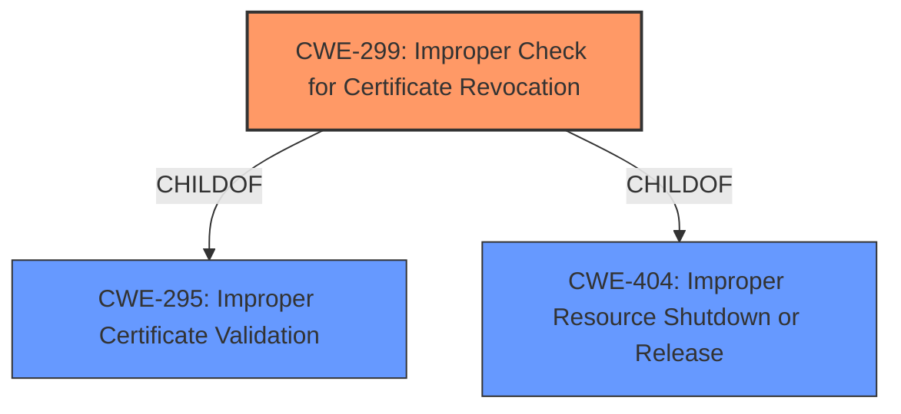

# Final Resolution for CVE-2022-21170

# Summary
| CWE ID | CWE Name | Confidence | CWE Abstraction Level | CWE Vulnerability Mapping Label | CWE-Vulnerability Mapping Notes |
|---|---|---|---|---|---|
| CWE-299 | Improper Check for Certificate Revocation | 1.0 | Base | Primary | Allowed |

## Evidence and Confidence

*   **Confidence Score:** 1.0
*   **Evidence Strength:** HIGH

## Relationship Analysis
The primary relationship that influenced my decision was the parent-child relationship between CWE-295 (Improper Certificate Validation) and CWE-299 (**Improper Check for Certificate Revocation**). Since the vulnerability description explicitly mentioned certificate revocation, I chose the more specific CWE-299 over the broader CWE-295. I also considered the potential for CWE-370 (Missing Check for Certificate Revocation after Initial Check) but lacked sufficient evidence to confirm that the vulnerability involved missing *subsequent* checks. The base level of CWE-299 is also optimal for root cause analysis.

## Vulnerability Chain
The vulnerability chain starts with the **ROOTCAUSE**: **improper check for certificate revocation** (CWE-299). This allows an attacker to perform a man-in-the-middle attack, leading to eavesdropping on encrypted communication. The lack of proper revocation checking is the direct **weakness** that enables the attack.

## Summary of Analysis
My analysis strongly supports the initial classification of CWE-299 (**Improper Check for Certificate Revocation**) as the primary CWE. This decision is based on the following:

*   **Direct Evidence:** The vulnerability description explicitly states "**Improper check for certificate revocation**" as the root cause. The CVE summary confirms this.
*   **Content Matching:** The description of CWE-299 directly matches the **weakness** described in the vulnerability: "The product does not check or incorrectly checks the revocation status of a certificate, which may cause it to use a certificate that has been compromised."
*   **Relationship Analysis:** While considering related CWEs like CWE-295, I chose CWE-299 due to its higher specificity.
*   **Mapping Guidance:** MITRE mapping guidance for CWE-299 indicates it is ALLOWED.

The analysis provided explicitly mentions the improper check for certificate revocation: *"The vulnerability description explicitly states "Improper check for certificate revocation" as the root cause of the vulnerability."*

The chosen CWE is at the optimal level of specificity because it directly addresses the **rootcause** described in the vulnerability. While other CWEs like CWE-295 are related, they are less specific. I am confident in this classification due to the strong evidence and direct match with the CWE description.