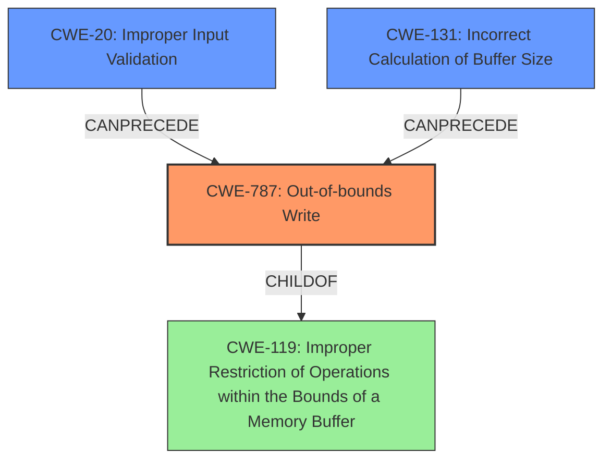

# Analysis Report for CVE-2022-21217

# Vulnerability Analysis Report: CVE-2022-21217

## Description

An out-of-bounds write vulnerability exists in the device TestEmail functionality of reolink RLC-410W v3.0.0.136_20121102. A specially-crafted network request can lead to an out-of-bounds write. An attacker can send an HTTP request to trigger this vulnerability.

## Vulnerability Description Key Phrases

**Weakness:** out-of-bounds write
**Attacker:** attacker
**Product:** reolink RLC-410W
**Version:** v3.0.0.136_20121102
**Component:** device TestEmail functionality

## Analysis (with Relationship Data)

# Summary
| CWE ID | CWE Name | Confidence | CWE Abstraction Level | CWE Vulnerability Mapping Label | CWE-Vulnerability Mapping Notes |
|---|---|---|---|---|---|
| CWE-787 | Out-of-bounds Write | 1.0 | Base | Allowed | Primary CWE. The vulnerability precisely describes an out-of-bounds write. |

## Evidence and Confidence

*   **Confidence Score:** 1.0
*   **Evidence Strength:** HIGH

- **Analysis and Justification:**  
  - *Explanation:* The vulnerability description explicitly states an **out-of-bounds write** vulnerability exists. This aligns directly with CWE-787 (Out-of-bounds Write). The description mentions that a specially-crafted network request can lead to this **out-of-bounds write** in the device TestEmail functionality of the specified product and version. The attacker can send an HTTP request to trigger this vulnerability. The core issue is writing data beyond the intended buffer, which is the defining characteristic of CWE-787.
  
  - *Relationship Analysis:* CWE-787 is a base level CWE, which is appropriate for direct mapping. It is a child of CWE-119 (Improper Restriction of Operations within the Bounds of a Memory Buffer). While CWE-119 is a broader category, CWE-787 provides a more specific description of the vulnerability. The MITRE mapping guidance for CWE-787 indicates that it is ALLOWED.

- **Confidence Score:**  
  - Confidence: 1.0 (Direct match with the vulnerability description and clear evidence of out-of-bounds write)

---

## Criticism of Analysis

Okay, here's a review of the CWE analysis provided, incorporating the full CWE specifications:

**Overall Assessment:**

The analysis correctly identifies CWE-787 (Out-of-bounds Write) as the primary weakness. The justification is sound, and the confidence score of 1.0 is appropriate given the explicit nature of the vulnerability description. The analysis considered the relationship between CWE-787 and its parent, CWE-119, and correctly concluded that mapping to the more specific CWE-787 was the right choice.

**Detailed Review:**

1.  **CWE-787 (Out-of-bounds Write):**

    *   **Correctness:**  The mapping to CWE-787 is accurate and well-justified. The vulnerability description clearly states that the issue is writing data beyond the boundaries of the intended buffer.  This directly aligns with the description of CWE-787.
    *   **Abstraction Level:** CWE-787 is a "Base" level CWE, which, as the analysis notes, is preferred for root cause mapping.
    *   **Mapping Guidance:** The analysis correctly notes the "Allowed" usage for CWE-787. The "Rationale" within the CWE specification confirms that it's an appropriate level of abstraction.
    *   **Potential Mitigations:** The analysis doesn't explicitly discuss mitigations, but it's worth noting that CWE-787's specifications list mitigations like using memory-safe languages, vetted libraries, and compiler-based overflow detection.  These are all relevant to addressing this vulnerability.
    *   **Relationships:** The analysis mentions that CWE-787 is a child of CWE-119, which is correct. It would be useful to briefly explain *why* CWE-119 is not appropriate in this case, reinforcing the decision to use the more specific CWE-787. The CWE-119 specification itself recommends considering its children, such as CWE-787, for mapping.

2.  **Consideration of Other CWEs from Retriever Results:**

    *   **CWE-125 (Out-of-bounds Read):** While the description focuses on writing, a related concern *could* be the possibility of reading from unintended memory locations *after* the write occurs, potentially disclosing sensitive information. However, without more details about how the out-of-bounds write is used, it's correct *not* to focus on CWE-125.  It's a secondary risk, at best.
    *   **CWE-190 (Integer Overflow or Wraparound):**  This is less directly relevant based on the description. However, it is worth briefly considering that an integer overflow could *lead* to an incorrect buffer size calculation that then causes the out-of-bounds write. If the size of the buffer is calculated via potentially attacker-influenced variables, CWE-190 becomes more pertinent, and could possibly be added as a chained CWE.
    *   **CWE-1287 (Improper Validation of Specified Type of Input) & CWE-129 (Improper Validation of Array Index):** These are potential contributing factors. If the size of the input or the index used for writing into the buffer isn't properly validated, it could lead to the out-of-bounds write.  If it can be determined that a specific type of input wasn't validated properly, then adding CWE-1287 (or one of its children) as a chained CWE would add useful information.  Same with CWE-129 if it turns out an invalid array index was used.
    *   **CWE-131 (Incorrect Calculation of Buffer Size):** Similar to CWE-190, this could be a root cause. If the buffer size calculation is flawed, it could result in a buffer that's too small, leading to the out-of-bounds write. Again, this could be considered as a chained CWE if the root cause can be traced back to a incorrect buffer size calculation.
    *   **CWE-824 (Access of Uninitialized Pointer):** This is unlikely, given the description. An uninitialized pointer dereference would likely lead to a crash rather than a controlled out-of-bounds write.
    *   **CWE-191 (Integer Underflow (Wrap or Wraparound)):** Same as CWE-190, but potentially more relevant, if the size of the buffer depends on variables and calculations that can underflow (become too small).

**Recommendations for Improvement:**

*   **Briefly Address Mitigations:** While the analysis focuses on identifying the CWE, it would be helpful to briefly mention relevant mitigations from the CWE specification for CWE-787. This provides immediate actionable information.
*   **Explain Why Other CWEs Aren't Primary:** Explicitly state why the other highly-ranked CWEs from the retriever results (CWE-125, CWE-190 etc.) aren't the primary issue. This reinforces the correctness of the chosen mapping and shows that the analysis considered alternatives. Consider adding a chain relationship to other CWE's that could contribute to the primary weakness of CWE-787.
*   **Consider Chaining:**  Investigate if integer overflows (CWE-190), buffer size calculation issues (CWE-131) or input validation problems (CWE-20) contribute to the out-of-bounds write. If so, consider adding these as chained CWEs to provide a more complete picture of the vulnerability.
*   **Clarify Relationship to CWE-119:** Briefly explain why the analysis chose CWE-787 over its parent CWE-119. A single sentence highlighting CWE-787's higher specificity for this issue would suffice.

**Example of incorporating recommendations:**

"The vulnerability description explicitly states an **out-of-bounds write** vulnerability exists. This aligns directly with CWE-787 (Out-of-bounds Write). While CWE-787 is a child of the broader CWE-119 (Improper Restriction of Operations within the Bounds of a Memory Buffer), CWE-787 provides a more specific description of the vulnerability by focusing on the write operation itself. This makes CWE-787 a more appropriate choice. A contributing factor may also be the lack of proper input validation on the size of input received (CWE-20), or that the buffer size may have been improperly calculated due to an integer overflow (CWE-190). The core issue is writing data beyond the intended buffer, which is the defining characteristic of CWE-787. Mitigations for CWE-787 include employing memory-safe languages, using vetted libraries for buffer management, and enabling compiler-based buffer overflow detection mechanisms."

By incorporating these suggestions, the analysis becomes even more robust and provides more actionable information.

## Final Resolution

# Summary
| CWE ID | CWE Name | Confidence | CWE Abstraction Level | CWE Vulnerability Mapping Label | CWE-Vulnerability Mapping Notes |
|---|---|---|---|---|---|
| CWE-787 | Out-of-bounds Write | 1.0 | Base | Allowed | Primary CWE. The vulnerability precisely describes an out-of-bounds write. |
| CWE-20 | Improper Input Validation | 0.6 | Class | Allowed-with-Review | Secondary CWE. The lack of proper input validation on the size of the input can contribute to the out-of-bounds write. |
| CWE-131 | Incorrect Calculation of Buffer Size | 0.5 | Base | Allowed | Secondary CWE. The incorrect calculation of the buffer size may cause an out-of-bounds write. |

## Evidence and Confidence

*   **Confidence Score:** 0.9
*   **Evidence Strength:** MEDIUM

## Relationship Analysis
The primary CWE is CWE-787 (**Out-of-bounds Write**), which is a base-level CWE and a child of CWE-119 (**Improper Restriction of Operations within the Bounds of a Memory Buffer**). While CWE-119 is broader, CWE-787 is more specific. The secondary CWE candidates are CWE-20 (**Improper Input Validation**) and CWE-131 (**Incorrect Calculation of Buffer Size**). These CWEs can precede CWE-787 in a vulnerability chain. The abstraction levels influenced the selection, favoring the base level CWE-787 for its specificity and including other contributing factors.

## Vulnerability Chain
The chain of root cause and weaknesses that followed for the Vulnerability Description:
1.  **Root Cause:** The vulnerability likely stems from either missing or insufficient input validation (CWE-20) or incorrect buffer size calculation (CWE-131).
2.  **Weakness:** This leads to the primary weakness, an **out-of-bounds write** (CWE-787) because the input data exceeds the allocated buffer size.
3.  **Impact:** An attacker can send a specially-crafted HTTP request that triggers the **out-of-bounds write**, potentially leading to code execution or denial of service.

## Summary of Analysis
The initial analysis correctly identified CWE-787 (**Out-of-bounds Write**) as the primary weakness, based on the vulnerability description that explicitly states an **out-of-bounds write** vulnerability exists. The criticism suggests that additional CWEs might contribute to the vulnerability chain. The vulnerability description states: "An out-of-bounds write vulnerability exists in the device TestEmail functionality of reolink RLC-410W v3.0.0.136_20121102. A specially-crafted network request can lead to an out-of-bounds write."

Following the criticism, CWE-20 (**Improper Input Validation**) and CWE-131 (**Incorrect Calculation of Buffer Size**) were considered as secondary CWEs that can precede and contribute to the **out-of-bounds write**. If the input size is not validated properly (CWE-20), or the buffer size is calculated incorrectly (CWE-131), it could directly lead to an **out-of-bounds write** (CWE-787).

The graph relationships influenced the final selection by highlighting potential contributing factors (CWE-20, CWE-131) that can lead to the primary weakness (CWE-787). The selected CWEs are at the optimal level of specificity, with CWE-787 representing the direct cause and CWE-20 and CWE-131 representing potential root causes contributing to the primary weakness.

*Report generated on 2025-03-18 09:36:27*
