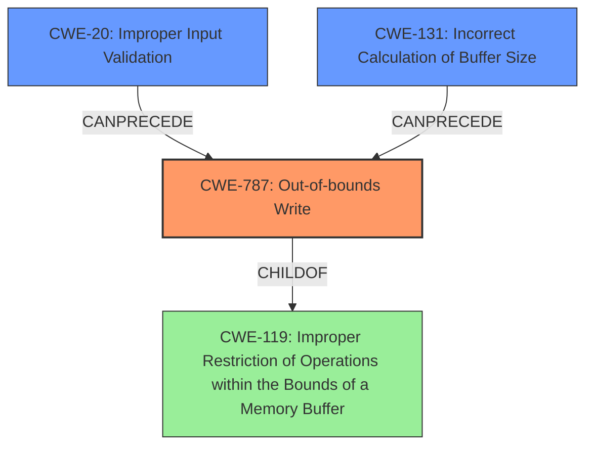

# Final Resolution for CVE-2022-21217

# Summary
| CWE ID | CWE Name | Confidence | CWE Abstraction Level | CWE Vulnerability Mapping Label | CWE-Vulnerability Mapping Notes |
|---|---|---|---|---|---|
| CWE-787 | Out-of-bounds Write | 1.0 | Base | Allowed | Primary CWE. The vulnerability precisely describes an out-of-bounds write. |
| CWE-20 | Improper Input Validation | 0.6 | Class | Allowed-with-Review | Secondary CWE. The lack of proper input validation on the size of the input can contribute to the out-of-bounds write. |
| CWE-131 | Incorrect Calculation of Buffer Size | 0.5 | Base | Allowed | Secondary CWE. The incorrect calculation of the buffer size may cause an out-of-bounds write. |

## Evidence and Confidence

*   **Confidence Score:** 0.9
*   **Evidence Strength:** MEDIUM

## Relationship Analysis
The primary CWE is CWE-787 (**Out-of-bounds Write**), which is a base-level CWE and a child of CWE-119 (**Improper Restriction of Operations within the Bounds of a Memory Buffer**). While CWE-119 is broader, CWE-787 is more specific. The secondary CWE candidates are CWE-20 (**Improper Input Validation**) and CWE-131 (**Incorrect Calculation of Buffer Size**). These CWEs can precede CWE-787 in a vulnerability chain. The abstraction levels influenced the selection, favoring the base level CWE-787 for its specificity and including other contributing factors.

## Vulnerability Chain
The chain of root cause and weaknesses that followed for the Vulnerability Description:
1.  **Root Cause:** The vulnerability likely stems from either missing or insufficient input validation (CWE-20) or incorrect buffer size calculation (CWE-131).
2.  **Weakness:** This leads to the primary weakness, an **out-of-bounds write** (CWE-787) because the input data exceeds the allocated buffer size.
3.  **Impact:** An attacker can send a specially-crafted HTTP request that triggers the **out-of-bounds write**, potentially leading to code execution or denial of service.

## Summary of Analysis
The initial analysis correctly identified CWE-787 (**Out-of-bounds Write**) as the primary weakness, based on the vulnerability description that explicitly states an **out-of-bounds write** vulnerability exists. The criticism suggests that additional CWEs might contribute to the vulnerability chain. The vulnerability description states: "An out-of-bounds write vulnerability exists in the device TestEmail functionality of reolink RLC-410W v3.0.0.136_20121102. A specially-crafted network request can lead to an out-of-bounds write."

Following the criticism, CWE-20 (**Improper Input Validation**) and CWE-131 (**Incorrect Calculation of Buffer Size**) were considered as secondary CWEs that can precede and contribute to the **out-of-bounds write**. If the input size is not validated properly (CWE-20), or the buffer size is calculated incorrectly (CWE-131), it could directly lead to an **out-of-bounds write** (CWE-787).

The graph relationships influenced the final selection by highlighting potential contributing factors (CWE-20, CWE-131) that can lead to the primary weakness (CWE-787). The selected CWEs are at the optimal level of specificity, with CWE-787 representing the direct cause and CWE-20 and CWE-131 representing potential root causes contributing to the primary weakness.