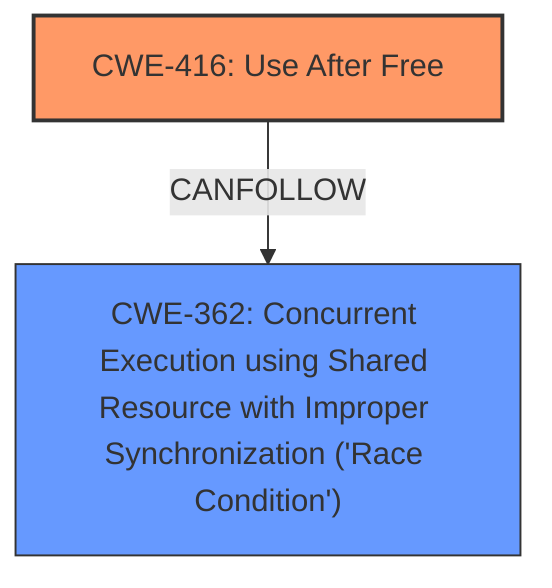

# Final Resolution for CVE-2022-2156

# Summary
| CWE ID | CWE Name | Confidence | CWE Abstraction Level | CWE Vulnerability Mapping Label | CWE-Vulnerability Mapping Notes |
|---|---|---|---|---|---|
| CWE-416 | Use After Free | 1.0 | Variant | Allowed | **Primary CWE**. Root cause is explicitly stated as "use after free." Mitigation includes using memory-safe languages or nulling pointers after freeing. Could potentially be chained after CWE-120 or CWE-123 if a buffer overflow or write-what-where is present, or CWE-362 if concurrent Javascript execution is the cause. |
| CWE-362 | Concurrent Execution using Shared Resource with Improper Synchronization ('Race Condition') | 0.4 | Class | Allowed-with-Review | Secondary candidate. The attack vector is a crafted HTML page, which could involve concurrent Javascript execution. Thus, a race condition could be a potential cause. |

## Evidence and Confidence

*   **Confidence Score:** 0.9
*   **Evidence Strength:** MEDIUM

## Relationship Analysis
The primary relationship influencing the decision is the direct match between the vulnerability description and **CWE-416 (Use After Free)**. The "CanFollow" relationships of **CWE-416** suggest potential subsequent weaknesses, specifically **CWE-362 (Race Condition)**, which is considered because the vulnerability is triggered by a crafted HTML page, potentially involving concurrent JavaScript execution. **CWE-416** is a Variant, which is an appropriate level of specificity.

## Vulnerability Chain
The vulnerability chain starts with the **ROOTCAUSE**, a **Use After Free (CWE-416)**. The crafted HTML page triggers the use of freed memory, potentially leading to heap corruption. If concurrent Javascript execution exists, **CWE-362** could contribute to the vulnerability chain, creating a race condition that exacerbates the **Use After Free**.

## Summary of Analysis
The initial analysis correctly identified **CWE-416 (Use After Free)** as the primary weakness. The criticism suggested considering potential chaining relationships, which led to the inclusion of **CWE-362 (Race Condition)** as a secondary candidate due to the nature of the attack vector (crafted HTML page).

The decision to include **CWE-362** is based on the following:
*   The vulnerability description mentions a crafted HTML page as the trigger.
*   HTML pages can involve concurrent JavaScript execution.
*   **CWE-416** has a "CanFollow" relationship with **CWE-362**.

The selected CWEs are at the optimal level of specificity because **CWE-416** directly describes the **ROOTCAUSE**, and **CWE-362** provides additional context related to potential concurrent execution. The confidence score is slightly reduced because **CWE-362** is only a potential contributor, not a confirmed one based on the current evidence.

The final determination is based on the provided evidence and relationship analysis, resulting in a classification that reflects both the explicit **ROOTCAUSE** and the potential contributing factors.