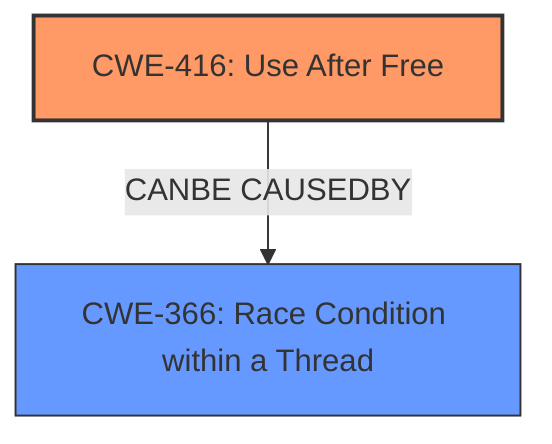

# Final Resolution for CVE-2022-2163

# Summary
| CWE ID | CWE Name | Confidence | CWE Abstraction Level | CWE Vulnerability Mapping Label | CWE-Vulnerability Mapping Notes |
|---|---|---|---|---|---|
| **CWE-416** | **Use After Free** | 0.9 | Variant | Primary | Allowed |
| **CWE-366** | **Race Condition within a Thread** | 0.3 | Base | Secondary Candidate | Allowed | Possible underlying cause of the **CWE-416** |

## Evidence and Confidence

*   **Confidence Score:** 0.9
*   **Evidence Strength:** MEDIUM

## Relationship Analysis

The primary relationship considered is whether **CWE-366** (Race Condition within a Thread) could be a contributing factor to **CWE-416** (Use After Free). While the vulnerability description explicitly mentions "use after free," the possibility of a race condition leading to this **weakness** cannot be entirely ruled out based on the provided information. The absence of explicit mention lowers the confidence, but the general prevalence of race conditions in concurrent programming justifies considering it as a secondary candidate. We reviewed the parent-child relationship and other peer relationships, and determined that CWE-416 is the most specific suitable primary weakness.

## Vulnerability Chain

The vulnerability chain starts with a potential **ROOTCAUSE** of a **race condition** (**CWE-366**). This **race condition** could lead to memory being freed while another thread is still using it. The direct consequence is a **use-after-free** vulnerability (**CWE-416**), where the program attempts to access memory that has already been freed. This, as indicated by the CVE description, can lead to heap corruption and potentially arbitrary code execution if exploited via a malicious extension.

## Summary of Analysis

The initial analysis correctly identified **CWE-416** as the primary **weakness**. The criticism suggested exploring **CWE-366** as a possible underlying cause, which is a reasonable consideration.

The decision to maintain **CWE-416** as the primary **CWE** is based on the explicit mention of "use after free" in the vulnerability description: "Use after free in Cast UI and Toolbar in Google Chrome prior to 103.0.5060.134 allowed an attacker...to potentially exploit heap corruption via UI interaction."

The inclusion of **CWE-366** as a secondary candidate acknowledges the possibility of a race condition contributing to the **use-after-free** condition. However, without further evidence, it remains a speculative but plausible contributing factor.

The selected CWEs are at the optimal level of specificity, with **CWE-416** being a Variant and **CWE-366** being a Base **CWE**.