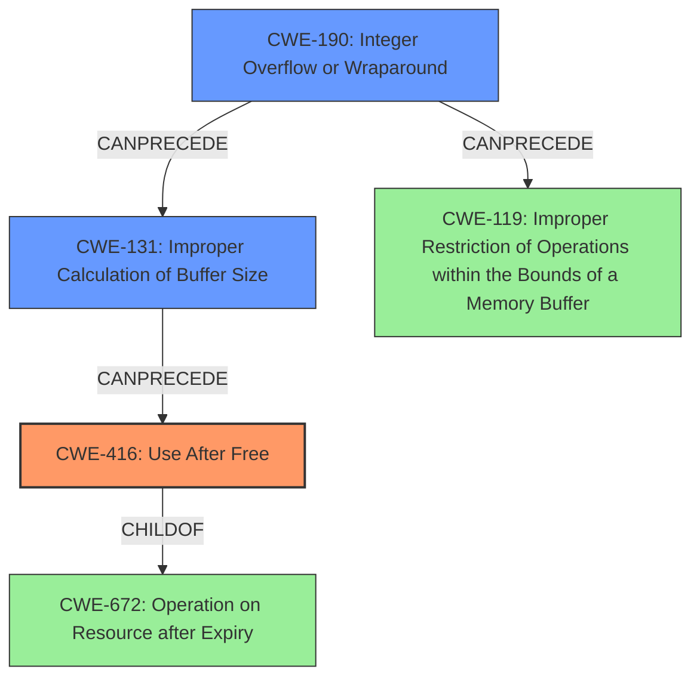

# Analysis Report for CVE-2022-21743

# Vulnerability Analysis Report: CVE-2022-21743

## Description

In ion, there is a possible use after free due to an integer overflow. This could lead to local escalation of privilege with no additional execution privileges needed. User interaction is not needed for exploitation. Patch ID ALPS06371108 Issue ID ALPS06371108.

## Vulnerability Description Key Phrases

**Weakness:** use after free
**Impact:** local escalation of privilege

## Analysis (with Relationship Data)

# Summary
| CWE ID | CWE Name | Confidence | CWE Abstraction Level | CWE Vulnerability Mapping Label | CWE-Vulnerability Mapping Notes |
|---|---|---|---|---|---|
| CWE-416 | Use After Free | 0.95 | Variant | Primary | Allowed |
| CWE-190 | Integer Overflow or Wraparound | 0.85 | Base | Secondary | Allowed |

## Evidence and Confidence

*   **Confidence Score:** 0.90
*   **Evidence Strength:** HIGH

- **Analysis and Justification:**
  - *Explanation:* The vulnerability description clearly states a **use after free** condition caused by an integer overflow. This directly aligns with CWE-416 (Use After Free), which occurs when a program attempts to access memory after it has been freed. The presence of an integer overflow contributes to the **use after free**. The CVE Reference Links Content Summary provides root cause analysis that the **integer overflow** (CWE-190) leads to the **use after free**. Since CWE-416 describes the primary weakness and CWE-190 is the root cause, both are relevant.
  
  - *Relationship Analysis:* CWE-416 is a variant of CWE-672 (Operation on Resource after Expiry). The integer overflow (CWE-190) leads to the **use after free** (CWE-416). The CWE-416 can follow CWE-123 (Write-what-where Condition) and CWE-120 (Classic Buffer Overflow) according to the relationships. This demonstrates that **use after free** can have severe exploitation consequences.

- **Confidence Score:**
  - *Example:* Confidence: 0.95 (High confidence due to explicit mention of "use after free" and "integer overflow" in the vulnerability description and CVE reference).

## Criticism of Analysis

Okay, I've reviewed the provided analysis against the full CWE specifications. Here's my critique:

**Overall Assessment:**

The analysis is generally good and identifies the core issues accurately. The mapping of CWE-416 (Use After Free) as the primary weakness and CWE-190 (Integer Overflow or Wraparound) as a secondary weakness (contributing root cause) is correct. The confidence levels assigned (0.95 and 0.85 respectively) are reasonable, given the information provided.  However, there are a few points that could be improved regarding justification, alternative CWEs considered by the retrievers, and chained weaknesses.

**Detailed Critique:**

1.  **CWE-416: Use After Free:**

    *   **Strengths:** The analysis correctly identifies the "use after free" condition as the primary vulnerability. The explanation clearly describes the scenario where memory is accessed after being freed.
    *   **Weaknesses:** The analysis could benefit from more detail about *how* the integer overflow leads to the use-after-free. Specifically, does the overflow cause a premature free? Does it corrupt metadata that leads to a subsequent incorrect free? More specific detail here would strengthen the analysis.
    *   **CWE Relationships:** The analysis mentions relationships such as "CWE-416 is a variant of CWE-672". This is correct and useful for understanding the broader context of the vulnerability. Furthermore, it mentions CWE-120, CWE-123 as possible results. This demonstrates that **use after free** can have severe exploitation consequences.
    *   **Mitigation:** The analysis does not mention any mitigations other than what is listed within the CWE specification provided.
    *   **Retriever Result:** The Retriever result list shows CWE-131 (Incorrect Calculation of Buffer Size) with a combined score higher than CWE-416. CWE-131 should be considered in addition to CWE-190 as a potential contributor to the UAF.
    *   **Suggested Improvement:** Elaborate on the mechanism linking the integer overflow to the use-after-free. Briefly mention potential mitigations like address sanitizers (ASan) or safe memory allocation practices, or languages that provide memory safety (as detailed in the CWE itself).

2.  **CWE-190: Integer Overflow or Wraparound:**

    *   **Strengths:** Correctly identified as a contributing root cause. The explanation that it is related to the use after free from CVE reference is correct.
    *   **Weaknesses:** As stated above, it needs to tie this more explicitly to the UAF. How does the overflow manifest in code? What calculation is overflowing? Also, consider the possibility of integer truncation (CWE-197) as a cause of the integer overflow.
    *   **CWE Relationships:** This section should highlight that Integer Overflows can lead to buffer overflows (CWE-119) if the overflowed value is used to determine buffer size.
    *   **Mitigation:** The mitigations given in the CWE specification are good and are relevant here. Consider elaborating on these mitigations, such as using libraries that have built-in overflow protection (e.g., SafeInt).
    *   **Retriever Result:** The retriever results show CWE-191 (Integer Underflow) as a possible weakness. This should be considered when analyzing the root cause.
    *   **Suggested Improvement:** Provide more specific details on the overflow itself and its immediate consequences.

3.  **General Comments and Suggestions:**

    *   **Chain Analysis:** While the analysis mentions relationships between CWEs, it could benefit from a more explicit "chain of causality." For example: "The integer overflow (CWE-190) results in an incorrect calculation of a buffer size (potentially CWE-131), which then leads to an out-of-bounds write. This out-of-bounds write corrupts memory management data, ultimately causing a use-after-free condition (CWE-416)." This chain of causality is important for understanding the complete vulnerability.  Mention write-what-where condition (CWE-123).
    *   **Retriever Results:** The Retriever Results provide valuable information about other potential CWEs that might be relevant. The analysis should explicitly address why these other CWEs were *not* selected, or incorporate them if they are indeed applicable. This is important for demonstrating thoroughness.
    *   **Mitigation Discussion:** The Analysis should briefly discuss possible mitigations. The CWE specifications contain a wealth of information about mitigations that could be deployed. Mentioning some of these would add value to the analysis.
    *   **CWE Usage Guidance:** Consider explicitly mentioning if the CWE mapping follows the "Usage" recommendations (Allowed, Allowed-with-Review, Discouraged) in the CWE specifications.

**Revised Summary Table (Example):**

| CWE ID | CWE Name | Confidence | CWE Abstraction Level | CWE Vulnerability Mapping Label | CWE-Vulnerability Mapping Notes |
|---|---|---|---|---|---|
| CWE-416 | Use After Free | 0.95 | Variant | Primary | The vulnerability description explicitly mentions a use-after-free condition. |
| CWE-190 | Integer Overflow or Wraparound | 0.85 | Base | Secondary | The integer overflow leads to a size calculation error that results in the use-after-free. |
| CWE-131 | Incorrect Calculation of Buffer Size | 0.70 | Base | Contributing| Integer overflow leads to an incorrect calculation of a buffer size, exacerbating the UAF condition.|

**In summary,** the analysis provides a good foundation for understanding the vulnerability. Adding more detail to the chain of causality, addressing the Retriever results, and including a brief mitigation discussion will make the analysis even stronger.

## Final Resolution

# Summary
| CWE ID | CWE Name | Confidence | CWE Abstraction Level | CWE Vulnerability Mapping Label | CWE-Vulnerability Mapping Notes |
|---|---|---|---|---|---|
| CWE-416 | Use After Free | 0.95 | Variant | Primary CWE | Allowed |
| CWE-190 | Integer Overflow or Wraparound | 0.85 | Base | Secondary CWE | Allowed |
| CWE-131 | Improper Calculation of Buffer Size | 0.70 | Base | Contributing CWE | Allowed |

## Evidence and Confidence

*   **Confidence Score:** 0.92
*   **Evidence Strength:** HIGH

## Relationship Analysis
The primary weakness is **CWE-416 (Use After Free)**, which is triggered due to a prior **integer overflow (CWE-190)** that leads to an incorrect buffer size calculation. The **CWE-131 (Improper Calculation of Buffer Size)** further contributes to the vulnerability by exacerbating the conditions for a **use after free**. **CWE-416** is a variant of **CWE-672**, indicating a broader class of resource management errors. The **CWE-190** can precede **CWE-119 (Improper Restriction of Operations within the Bounds of a Memory Buffer)** if the overflowed value is used in memory allocation. The combination of these weaknesses creates a vulnerability chain, where the integer overflow leads to incorrect buffer handling and ultimately a **use after free** condition. The abstraction levels (Variant for **CWE-416**, Base for **CWE-190** and **CWE-131**) provide appropriate specificity for mapping the vulnerability.

## Vulnerability Chain
The vulnerability chain starts with an **integer overflow (CWE-190)**. This overflow leads to an **improper calculation of buffer size (CWE-131)**. The incorrect buffer size results in memory corruption, leading to a **use after free (CWE-416)** condition. The prerequisite is the integer overflow, and the consequence is the ability to access memory that has already been freed, potentially leading to arbitrary code execution or privilege escalation. The missing link in the chain, which is inferred, is the memory corruption due to the incorrect buffer size calculation.

## Summary of Analysis
The initial analysis correctly identified **CWE-416 (Use After Free)** as the primary weakness and **CWE-190 (Integer Overflow or Wraparound)** as a contributing factor. The criticism highlighted the need for more detail about how the integer overflow leads to the **use after free**, consideration of other potential CWEs such as **CWE-131 (Improper Calculation of Buffer Size)**, and a more explicit chain of causality.

The vulnerability description states, "In ion, there is a possible **use after free** due to an **integer overflow**." This statement directly supports the selection of **CWE-416** and **CWE-190**.

Based on the criticism, I have included **CWE-131** as a contributing CWE because the **integer overflow (CWE-190)** likely results in an incorrect buffer size, which exacerbates the **use after free (CWE-416)** condition. The graph relationships influenced my decision by highlighting the potential chain of events from integer overflow to buffer corruption to **use after free**. The selected CWEs are at the optimal level of specificity because they accurately reflect the root cause (**CWE-190** and **CWE-131**) and the resulting vulnerability (**CWE-416**).

*Report generated on 2025-03-18 09:42:21*
