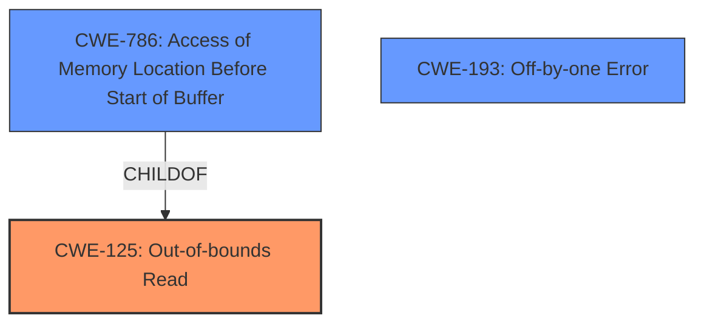

# Final Resolution for CVE-2022-2175

# Summary
| CWE ID | CWE Name | Confidence | CWE Abstraction Level | CWE Vulnerability Mapping Label | CWE-Vulnerability Mapping Notes |
|---|---|---|---|---|---|
| CWE-125 | CWE-125: Out-of-bounds Read | 0.95 | Base | Primary | Allowed |
| CWE-786 | CWE-786: Access of Memory Location Before Start of Buffer | 0.6 | Base | Secondary Candidate | Allowed |
| CWE-193 | CWE-193: Off-by-one Error | 0.3 | Base | Secondary Candidate | Allowed; Possible contributing factor if negative position value calculation is off by one. |

## Evidence and Confidence

*   **Confidence Score:** 0.85
*   **Evidence Strength:** MEDIUM

## Relationship Analysis
The primary relationship influencing the decision is the parent-child relationship between CWE-786 (Access of Memory Location Before Start of Buffer) and CWE-125 (Out-of-bounds Read). Since the description explicitly mentions negative values leading to reads *before* the buffer, CWE-786 is a relevant secondary candidate. The low confidence in CWE-193 stems from the lack of direct evidence linking an off-by-one error to the vulnerability. The abstraction levels (all Base) are appropriate for root cause analysis.

## Vulnerability Chain
The vulnerability chain starts with the input of a negative value for the command line position. This negative value leads to **CWE-786 (Access of Memory Location Before Start of Buffer)**, a buffer under-read. This then results in **CWE-125 (Out-of-bounds Read)**, specifically a read before the intended buffer. If there is an off-by-one error in the calculation of this negative value, then **CWE-193 (Off-by-one Error)** would be a factor too. The impact is a potential crash or information disclosure.

## Summary of Analysis
The initial analysis correctly identified **CWE-125 (Out-of-bounds Read)** as the primary issue. The criticism raised valid points about the specificity of the out-of-bounds read and the uncertainty surrounding **CWE-193 (Off-by-one Error)**.

The graph relationships influenced the final decision by highlighting the connection between **CWE-786 (Access of Memory Location Before Start of Buffer)** and **CWE-125 (Out-of-bounds Read)**. Since the vulnerability description mentions *negative* values, incorporating CWE-786 provides a more accurate and specific classification.

The final selection reflects the optimal level of specificity based on the available evidence. **CWE-125 (Out-of-bounds Read)** remains the primary weakness, while **CWE-786 (Access of Memory Location Before Start of Buffer)** provides additional context. **CWE-193 (Off-by-one Error)** is a possible contributing factor, but with low confidence due to lack of direct evidence.

The vulnerability description states: "A negative value for the command line position can lead to an **out-of-bounds read** when inserting the result of an expression onto the command line." This statement is the key piece of evidence supporting **CWE-125 (Out-of-bounds Read)** and, more specifically, **CWE-786 (Access of Memory Location Before Start of Buffer)**.