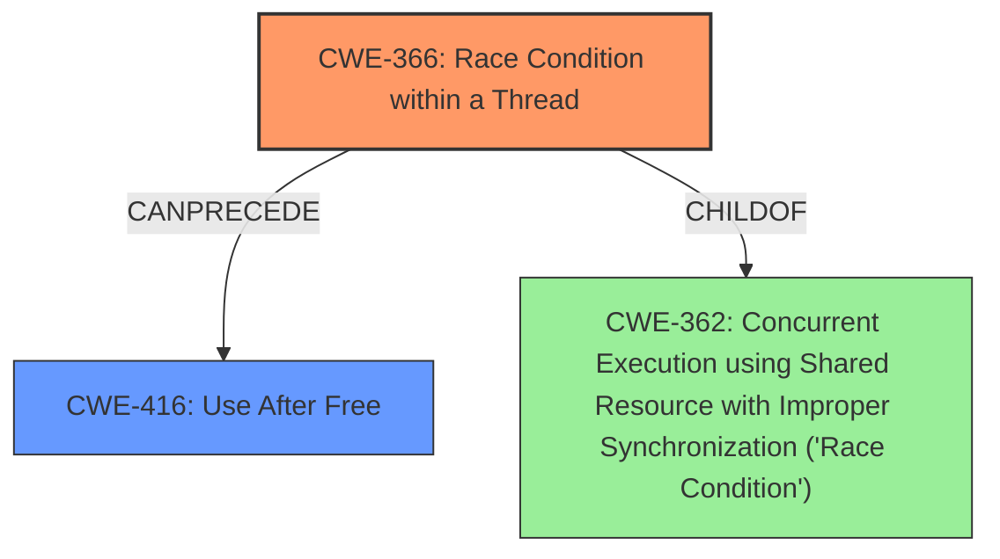

# Final Resolution for CVE-2022-21774

# Summary
| CWE ID | CWE Name | Confidence | CWE Abstraction Level | CWE Vulnerability Mapping Label | CWE-Vulnerability Mapping Notes |
|---|---|---|---|---|---|
| CWE-366 | Race Condition within a Thread | 0.90 | Base | Allowed | This CWE directly addresses the **race condition** within a thread, which is the root cause of the vulnerability. |
| CWE-416 | **Use After Free** | 0.90 | Variant | Allowed | This CWE describes the **use-after-free** condition, which is the weakness resulting from the **race condition**. |

## Evidence and Confidence

*   **Confidence Score:** 0.90
*   **Evidence Strength:** HIGH

## Relationship Analysis
The primary relationship is that the **race condition** (CWE-366) leads to the **use-after-free** (CWE-416). CWE-366 is a Base-level CWE, providing a good level of specificity. CWE-416 is a Variant, which accurately reflects the specific type of memory safety violation.
CWE-366 is a child of CWE-362. The choice of CWE-366 provides a more specific classification than CWE-362.

## Vulnerability Chain
The vulnerability chain starts with a **race condition** within a thread (CWE-366). This **race condition** allows one thread to free memory that another thread is still using. When the second thread attempts to access the freed memory, a **use-after-free** (CWE-416) occurs, potentially leading to arbitrary code execution or a denial of service.
  - The root cause is CWE-366, and the impact is CWE-416.

## Summary of Analysis
The initial analysis correctly identified CWE-362 and CWE-416. The criticism suggested refining CWE-362 to a more specific Base-level CWE. Given the context of the vulnerability occurring within the TEEI driver and involving threads, CWE-366 (Race Condition within a Thread) is a more precise classification.

The evidence from the vulnerability description states: "In TEEI driver, there is a possible **use after free** due to a **race condition**." This directly supports the selection of CWE-366 and CWE-416.

The relationship analysis confirms that CWE-366 can precede CWE-416, creating a vulnerability chain. The abstraction levels are appropriate, with CWE-366 at the Base level and CWE-416 at the Variant level.

The selection of CWE-366 over CWE-362 provides a more specific and accurate representation of the root cause, as the **race condition** occurs within a thread. This decision is further supported by the CWE descriptions and their mapping guidance.

Adding mitigations from the CWE specifications improves the analysis by providing actionable steps to address the vulnerability.

The final classification is based on the provided evidence, relationship analysis, and mapping guidance, resulting in a confident and well-justified decision.