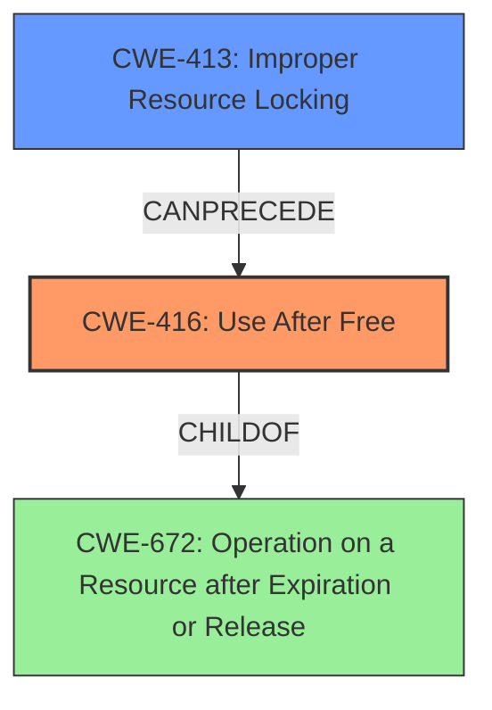

# Final Resolution for CVE-2022-21775

# Summary
| CWE ID | CWE Name | Confidence | CWE Abstraction Level | CWE Vulnerability Mapping Label | CWE-Vulnerability Mapping Notes |
|---|---|---|---|---|---|
| CWE-416 | Use After Free | 1.0 | Variant | Allowed | Primary CWE |
| CWE-413 | Improper Resource Locking | 0.8 | Base | Allowed | Secondary Candidate |

## Evidence and Confidence

*   **Confidence Score:** 0.95
*   **Evidence Strength:** HIGH

## Relationship Analysis
The primary relationship is the potential for **CWE-413 (Improper Resource Locking)** to precede **CWE-416 (Use After Free)**. **CWE-416 (Use After Free)** is a variant of **CWE-672 (Operation on a Resource after Expiration or Release)**, representing the specific case where freed memory is accessed. The base CWE, **CWE-413 (Improper Resource Locking)**, contributes to creating the conditions where memory can be prematurely freed, leading to the use-after-free. The abstraction levels are appropriate, with **CWE-416 (Use After Free)** being a variant and **CWE-413 (Improper Resource Locking)** being a base.

## Vulnerability Chain
The vulnerability chain starts with **CWE-413 (Improper Resource Locking)**, which allows for concurrent access to shared resources. This lack of proper locking can lead to a race condition where a resource is freed by one thread while another thread still holds a reference to it. This leads directly to **CWE-416 (Use After Free)** when the second thread attempts to access the now-freed memory, resulting in a local escalation of privilege.

## Summary of Analysis
The initial analysis and the criticism are both very strong. The vulnerability description explicitly mentions a "**use after free**" condition caused by improper locking. The selection of **CWE-416 (Use After Free)** as the primary **WEAKNESS** is justified as it directly describes the core issue. **CWE-413 (Improper Resource Locking)** is a valid secondary **WEAKNESS**, as the vulnerability description specifically states that the use-after-free is due to improper locking.

The relationship analysis confirms that **CWE-413 (Improper Resource Locking)** can indeed lead to **CWE-416 (Use After Free)**. The abstraction levels of the selected CWEs are appropriate.

The evidence provided in the vulnerability description ("In sched driver, there is a possible use after free due to improper locking.") and the retriever scores support this classification.

The final decision is to classify this vulnerability as **CWE-416 (Use After Free)**, with **CWE-413 (Improper Resource Locking)** as a contributing factor. This is at the optimal level of specificity because **CWE-416 (Use After Free)** directly describes the vulnerability, and **CWE-413 (Improper Resource Locking)** explains the **ROOTCAUSE**.