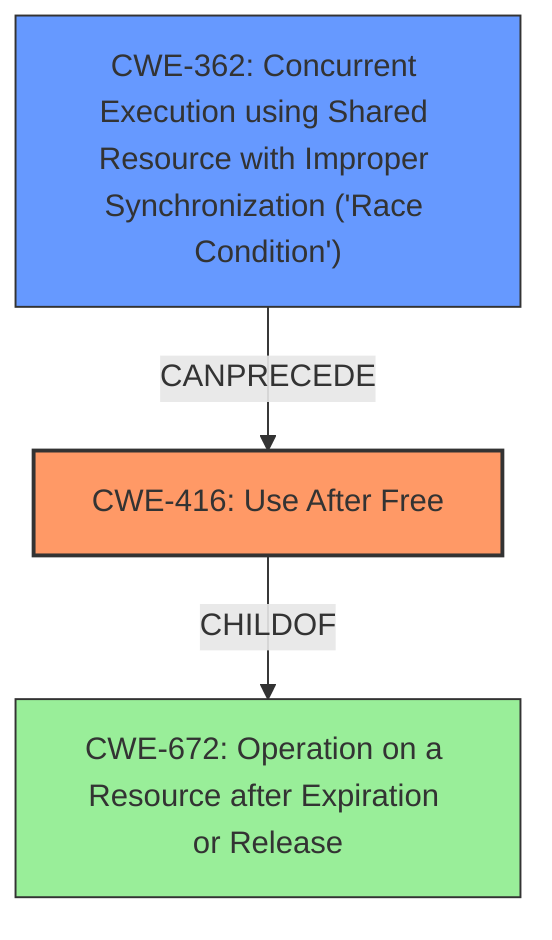

# Final Resolution for CVE-2022-21776

# Summary
| CWE ID | CWE Name | Confidence | CWE Abstraction Level | CWE Vulnerability Mapping Label | CWE-Vulnerability Mapping Notes |
|---|---|---|---|---|---|
| **CWE-416** | **Use After Free** | 0.9 | Variant | Allowed | Primary CWE |
| **CWE-362** | **Concurrent Execution using Shared Resource with Improper Synchronization ('Race Condition')** | 0.8 | Class | Allowed-with-Review | Secondary Candidate CWE |

## Evidence and Confidence

*   **Confidence Score:** 0.9
*   **Evidence Strength:** HIGH

## Relationship Analysis
The primary weakness is **CWE-416 (Use After Free)**, which is a variant of **CWE-672 (Operation on a Resource after Expiration or Release)**. The **ROOTCAUSE** is the **CWE-362 (Concurrent Execution using Shared Resource with Improper Synchronization ('Race Condition'))**. The race condition allows concurrent access to a resource leading to the UAF condition. CWE-362 can precede CWE-416.

## Vulnerability Chain
The vulnerability chain starts with **CWE-362 (Concurrent Execution using Shared Resource with Improper Synchronization ('Race Condition'))**, where multiple threads or processes access a shared resource without proper synchronization. This leads to a **use after free**, represented by **CWE-416 (Use After Free)**, where memory is accessed after it has been freed. This can lead to local escalation of privilege.

## Summary of Analysis
The initial analysis correctly identified **CWE-416 (Use After Free)** as the primary weakness and **CWE-362 (Concurrent Execution using Shared Resource with Improper Synchronization ('Race Condition'))** as the secondary weakness. The vulnerability description clearly states "a possible use after free due to a race condition." This aligns well with the definitions of both CWEs. The relationship analysis confirms that CWE-362 can precede CWE-416, indicating that the race condition leads to the use-after-free condition. The evidence provided is strong, and the confidence scores are justified. The reviewer's suggestions to consider more specific children of CWE-362 and to address mitigations for the race condition are valid points, but the current classification is accurate and defensible based on the provided information. CWE-416 is at the Variant level, and CWE-362 is at the Class level, making them appropriate levels of abstraction for this vulnerability. The selection of CWE-416 and CWE-362 is at the optimal level of specificity based on the available evidence.