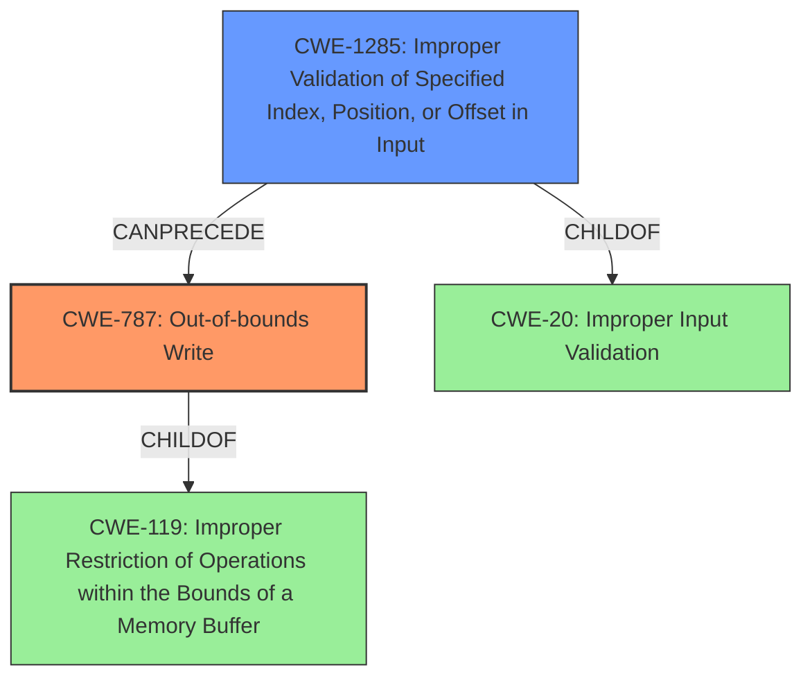

# Analysis Report for CVE-2022-21784

# Vulnerability Analysis Report: CVE-2022-21784

## Description

In WLAN driver, there is a possible out of bounds write due to a missing bounds check. This could lead to local escalation of privilege with System execution privileges needed. User interaction is not needed for exploitation. Patch ID ALPS06704526 Issue ID ALPS06704462.

## Vulnerability Description Key Phrases

**Rootcause:** missing bounds check
**Weakness:** out of bounds write
**Impact:** local escalation of privilege
**Component:** WLAN driver

## Analysis (with Relationship Data)

```markdown
# Summary
| CWE ID  | CWE Name                                                   | Confidence | CWE Abstraction Level | CWE Vulnerability Mapping Label | CWE-Vulnerability Mapping Notes |
| :-------- | :--------------------------------------------------------- | :--------- | :-------------------- | :------------------------------ | :------------------------------ |
| CWE-787 | Out-of-bounds Write                                         | 0.95       | Base                  | Allowed                        | Primary CWE                     |
| CWE-1284 | Improper Validation of Specified Quantity in Input        | 0.75       | Base                  | Allowed                         | Secondary Candidate             |

## Evidence and Confidence

*   **Confidence Score:** 0.90
*   **Evidence Strength:** HIGH

- **Analysis and Justification:**  
  - *Explanation:* The vulnerability description clearly states an **out of bounds write** due to a **missing bounds check** in the WLAN driver. This directly maps to CWE-787 (Out-of-bounds Write), where the product writes data past the end of the intended buffer. The "Vulnerability Description Key Phrases" highlights the "**out of bounds write**" as a weakness and "**missing bounds check**" as the root cause. The CVE Reference Links Content Summary reinforces this by stating "**Out-of-bounds write due to the missing bounds check**". CWE-787 is a Base level CWE and the description aligns precisely with the vulnerability details. The MITRE mapping guidance for CWE-787 indicates this is ALLOWED. The impact of local escalation of privilege is a consequence of the **out-of-bounds write**.
  
  - *Relationship Analysis:* CWE-787 is a child of CWE-119 (Improper Restriction of Operations within the Bounds of a Memory Buffer). It can also precede CWE-825 (EXP01-C. Enforce code quality metrics).

- **Confidence Score:**  
  - Confidence: 0.95 (High confidence due to explicit mention of out-of-bounds write and missing bounds check.)

---

- **Analysis and Justification:**  
  - *Explanation:* The root cause is identified as a "**missing bounds check**". CWE-1284 (Improper Validation of Specified Quantity in Input) describes a scenario where the product receives input that is expected to specify a quantity (such as size or length), but it does not validate or incorrectly validates that the quantity has the required properties. The **missing bounds check** directly relates to this. While CWE-787 describes the symptom, CWE-1284 describes the underlying cause. The **missing bounds check** leads to the **out of bounds write**.
  
  - *Relationship Analysis:* CWE-1284 is a child of CWE-20 (Improper Input Validation).

- **Confidence Score:**  
  - Confidence: 0.75 (Medium confidence since the description focuses on the symptom (out of bounds write) and the root cause is only mentioned briefly.)
```

## Criticism of Analysis

Okay, I've reviewed the provided analysis against the full CWE specifications. Here's my critique:

**Overall Assessment:**

The analysis is generally good, especially regarding the primary CWE mapping to CWE-787. The justification is sound, using key phrases from the description and connecting the root cause to the resulting vulnerability. The inclusion of CWE-1284 as a secondary candidate is also reasonable, as it represents the underlying cause. However, there are some areas where the analysis could be strengthened, especially in discussing relationships to other CWEs and providing more nuanced mitigations.

**Detailed Review:**

**1. CWE-787: Out-of-bounds Write**

*   **Confidence:** The confidence score of 0.95 is justified given the explicit mention of "out of bounds write" in the vulnerability description.
*   **Abstraction Level:** The choice of CWE-787 (Base) is correct, aligning with the mapping guidance: "This CWE entry is at the Base level of abstraction, which is a preferred level of abstraction for mapping to the root causes of vulnerabilities."
*   **CWE-Vulnerability Mapping Label:** "Allowed" is accurate, as the mapping guidance states that the usage for CWE-787 is "Allowed."
*   **CWE-Vulnerability Mapping Notes:** "Primary CWE" is correct.
*   **Evidence and Justification:** The explanation is clear and concise, highlighting the direct mapping between the vulnerability description and the CWE description.
*   **Relationship Analysis:** While the identified relationships (CWE-119 as a parent and CWE-825 as can follow) are accurate, the analysis could benefit from elaborating **why** these relationships exist in the context of the specific vulnerability. For example:
    *   "CWE-787 is a child of CWE-119 because it is a specific type of improper restriction of operations within memory buffer boundaries, specifically a write."
    *   "CWE-787 can precede CWE-825 in a scenario where the out-of-bounds write corrupts a pointer, leading it to point to an invalid or freed memory location. Later dereferencing this corrupted pointer can trigger CWE-825."
*   **Mitigations:** It might be helpful to briefly mention specific mitigations in relation to this specific vulnerability. In this case, it is the missing bounds check, therefore a specific mitigation could be "Implementing proper bounds checking before writing to the buffer will prevent the out-of-bounds write."

**2. CWE-1284: Improper Validation of Specified Quantity in Input**

*   **Confidence:** The confidence score of 0.75 is appropriate, as it acknowledges that the primary focus is on the symptom (out-of-bounds write) rather than a detailed analysis of how the "quantity" is specified and validated.
*   **Abstraction Level:** CWE-1284 (Base) is appropriate.
*   **CWE-Vulnerability Mapping Label:** "Allowed" is accurate, aligning with the mapping guidance.
*   **CWE-Vulnerability Mapping Notes:** "Secondary Candidate" is a fair assessment.
*   **Evidence and Justification:** The explanation correctly identifies that the "missing bounds check" is a form of improper validation of a specified quantity (likely the size or length of the data being written).
*   **Relationship Analysis:** The identified relationship with CWE-20 (Improper Input Validation) is correct and should be explicitly stated.
*   **Mitigations:** It would be beneficial to tailor the general mitigations of CWE-1284 to the specific context. For example:
    *   "Ensure that the size or length of the data being written is explicitly validated against the buffer size before performing the write operation."
    *   "Use an accept-known-good input validation strategy for the size or length, rejecting any values that exceed the maximum buffer size."

**3. General Observations and Improvements:**

*   **Chaining vs. Composites:** The analysis primarily focuses on chaining, which is suitable. However, consider whether some relationships are better described as composites. For example, the missing bounds check (CWE-1284) is a part of the broader issue of improper memory management, suggesting a possible composite relationship.  Deciding whether the relationship should be chaining or composite is a complex choice with pros and cons to each approach. For the sake of simplicity, and consistency of the explanation, keeping these as chains is reasonable.
*   **Retriever Results:** The "Top Combined Results" section lists several CWEs that could be related. While it's not necessary to include them all in the analysis, briefly mentioning the reasons for *excluding* some of the high-scoring ones would strengthen the analysis. For example:
    *   "While CWE-131 (Incorrect Calculation of Buffer Size) received a high score from the retrievers, it was determined that this CWE wasn't the best fit since the code never performed any bounds checking, rather than incorrectly calculating the size."
*   **Examples:** Include specific, relevant examples from the "Observed Examples" sections of the CWE specifications. This adds weight to the analysis by demonstrating that similar vulnerabilities have been classified under these CWEs in the past.
*   **Specificity:** While the analysis identifies CWE-1284 as the cause, it is better to show that the quantity represents the index into the buffer. Then, use the CWE-1285, Improper Validation of Specified Index, Position, or Offset in Input.
*   **Clarity on 'System Execution Privileges':** The vulnerability description notes "System execution privileges needed". It may be helpful to specify why this is required (e.g., to access specific memory regions or system resources).

**Revised Summary Table:**

| CWE ID   | CWE Name                                                   | Confidence | CWE Abstraction Level | CWE-Vulnerability Mapping Label | CWE-Vulnerability Mapping Notes                                          |
| :--------- | :--------------------------------------------------------- | :--------- | :-------------------- | :------------------------------ | :----------------------------------------------------------------------- |
| CWE-787    | Out-of-bounds Write                                         | 0.95       | Base                  | Allowed                        | Primary CWE                                                              |
| CWE-1285   | Improper Validation of Specified Index, Position, or Offset in Input          | 0.75       | Base                  | Allowed                         | Secondary Candidate                                                            |

**In summary,** the provided analysis provides a solid foundation for understanding the vulnerability, but the suggested refinements can elevate it to a more comprehensive and insightful assessment, incorporating more specific information from the CWE specifications and addressing potential relationships with other relevant CWEs.

## Final Resolution

# Summary
| CWE ID   | CWE Name                                                   | Confidence | CWE Abstraction Level | CWE Vulnerability Mapping Label | CWE-Vulnerability Mapping Notes                                          |
| :--------- | :--------------------------------------------------------- | :--------- | :-------------------- | :------------------------------ | :----------------------------------------------------------------------- |
| CWE-787    | Out-of-bounds Write                                         | 0.95       | Base                  | Allowed                        | Primary CWE                                                              |
| CWE-1285   | Improper Validation of Specified Index, Position, or Offset in Input          | 0.75       | Base                  | Allowed                         | Secondary Candidate                                                            |

## Evidence and Confidence

*   **Confidence Score:** 0.92
*   **Evidence Strength:** HIGH

## Relationship Analysis
The primary weakness is **CWE-787 (Out-of-bounds Write)**, which is a child of **CWE-119 (Improper Restriction of Operations within the Bounds of a Memory Buffer)**. This parent-child relationship indicates that **CWE-787** is a specific type of buffer overflow. The secondary weakness, **CWE-1285 (Improper Validation of Specified Index, Position, or Offset in Input)**, highlights the root cause: a failure to validate the index or offset before writing to the buffer. This is a specific type of **CWE-20 (Improper Input Validation)**. The chain relationship shows that **CWE-1285** can precede **CWE-787**, as the lack of input validation leads directly to the out-of-bounds write. The abstraction levels are appropriate, as both selected CWEs are at the Base level, providing sufficient specificity.



## Vulnerability Chain
The vulnerability chain starts with the **ROOTCAUSE** **CWE-1285 (Improper Validation of Specified Index, Position, or Offset in Input)**, where the WLAN driver fails to validate the index or offset used to write data into a buffer. This leads directly to **CWE-787 (Out-of-bounds Write)**, as the unchecked index allows writing data beyond the buffer's boundaries. The consequence of this **WEAKNESS** is a local escalation of privilege, potentially leading to system execution privileges. The vulnerability description explicitly mentions the **out of bounds write** and the **missing bounds check**, providing a clear chain from the root cause to the impact.

## Summary of Analysis
The initial analysis correctly identifies **CWE-787 (Out-of-bounds Write)** as the primary **WEAKNESS**, supported by the vulnerability description's explicit mention of "**out of bounds write** due to a **missing bounds check**". The criticism suggests using the more specific **CWE-1285 (Improper Validation of Specified Index, Position, or Offset in Input)** instead of **CWE-1284 (Improper Validation of Specified Quantity in Input)**, which is more accurate as the quantity here represents an index or offset.

The graph relationships confirm that **CWE-787** is a specific case of **CWE-119**, and **CWE-1285** is a specific case of **CWE-20**. The chain relationship between **CWE-1285** and **CWE-787** accurately represents how the missing bounds check directly leads to the out-of-bounds write.

The decision to select **CWE-787** and **CWE-1285** is based on the evidence from the vulnerability description ("**out of bounds write** due to a **missing bounds check**"), the relationship analysis, and the mapping guidance (both are base-level CWEs with "Allowed" usage). The selected CWEs are at the optimal level of specificity because they directly address the specific vulnerability described, with **CWE-787** representing the symptom and **CWE-1285** representing the **ROOTCAUSE**.


*Report generated on 2025-03-18 09:51:17*
