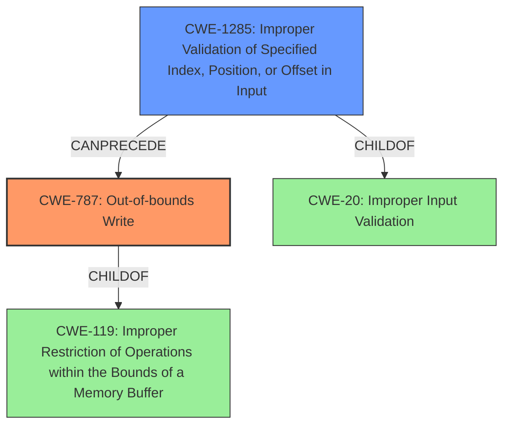

# Final Resolution for CVE-2022-21784

# Summary
| CWE ID   | CWE Name                                                   | Confidence | CWE Abstraction Level | CWE Vulnerability Mapping Label | CWE-Vulnerability Mapping Notes                                          |
| :--------- | :--------------------------------------------------------- | :--------- | :-------------------- | :------------------------------ | :----------------------------------------------------------------------- |
| CWE-787    | Out-of-bounds Write                                         | 0.95       | Base                  | Allowed                        | Primary CWE                                                              |
| CWE-1285   | Improper Validation of Specified Index, Position, or Offset in Input          | 0.75       | Base                  | Allowed                         | Secondary Candidate                                                            |

## Evidence and Confidence

*   **Confidence Score:** 0.92
*   **Evidence Strength:** HIGH

## Relationship Analysis
The primary weakness is **CWE-787 (Out-of-bounds Write)**, which is a child of **CWE-119 (Improper Restriction of Operations within the Bounds of a Memory Buffer)**. This parent-child relationship indicates that **CWE-787** is a specific type of buffer overflow. The secondary weakness, **CWE-1285 (Improper Validation of Specified Index, Position, or Offset in Input)**, highlights the root cause: a failure to validate the index or offset before writing to the buffer. This is a specific type of **CWE-20 (Improper Input Validation)**. The chain relationship shows that **CWE-1285** can precede **CWE-787**, as the lack of input validation leads directly to the out-of-bounds write. The abstraction levels are appropriate, as both selected CWEs are at the Base level, providing sufficient specificity.

## Vulnerability Chain
The vulnerability chain starts with the **ROOTCAUSE** **CWE-1285 (Improper Validation of Specified Index, Position, or Offset in Input)**, where the WLAN driver fails to validate the index or offset used to write data into a buffer. This leads directly to **CWE-787 (Out-of-bounds Write)**, as the unchecked index allows writing data beyond the buffer's boundaries. The consequence of this **WEAKNESS** is a local escalation of privilege, potentially leading to system execution privileges. The vulnerability description explicitly mentions the **out of bounds write** and the **missing bounds check**, providing a clear chain from the root cause to the impact.

## Summary of Analysis
The initial analysis correctly identifies **CWE-787 (Out-of-bounds Write)** as the primary **WEAKNESS**, supported by the vulnerability description's explicit mention of "**out of bounds write** due to a **missing bounds check**". The criticism suggests using the more specific **CWE-1285 (Improper Validation of Specified Index, Position, or Offset in Input)** instead of **CWE-1284 (Improper Validation of Specified Quantity in Input)**, which is more accurate as the quantity here represents an index or offset.

The graph relationships confirm that **CWE-787** is a specific case of **CWE-119**, and **CWE-1285** is a specific case of **CWE-20**. The chain relationship between **CWE-1285** and **CWE-787** accurately represents how the missing bounds check directly leads to the out-of-bounds write.

The decision to select **CWE-787** and **CWE-1285** is based on the evidence from the vulnerability description ("**out of bounds write** due to a **missing bounds check**"), the relationship analysis, and the mapping guidance (both are base-level CWEs with "Allowed" usage). The selected CWEs are at the optimal level of specificity because they directly address the specific vulnerability described, with **CWE-787** representing the symptom and **CWE-1285** representing the **ROOTCAUSE**.