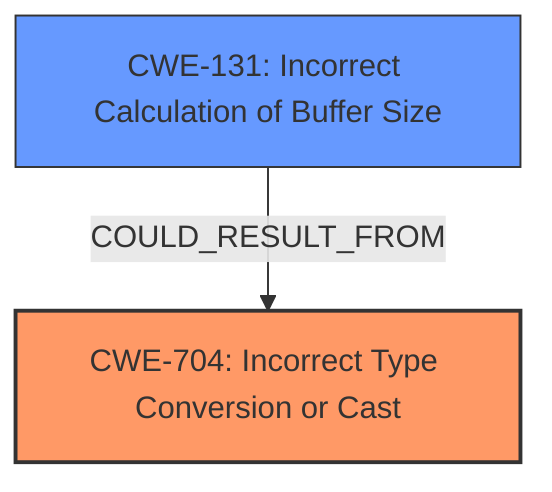

# Analysis Report for CVE-2022-21786

# Vulnerability Analysis Report: CVE-2022-21786

## Description

In audio DSP, there is a possible memory corruption due to improper casting. This could lead to local escalation of privilege with System execution privileges needed. User interaction is not needed for exploitation. Patch ID ALPS06558822 Issue ID ALPS06558822.

## Vulnerability Description Key Phrases

**Rootcause:** improper casting
**Weakness:** memory corruption
**Impact:** local escalation of privilege
**Component:** audio DSP

## Analysis (with Relationship Data)

# Summary
| CWE ID | CWE Name | Confidence | CWE Abstraction Level | CWE Vulnerability Mapping Label | CWE-Vulnerability Mapping Notes |
|---|---|---|---|---|---|
| CWE-704 | Incorrect Type Conversion or Cast | 0.9 | Class | Allowed-with-Review | Primary CWE. The vulnerability is caused by an improper cast. |
| CWE-131 | Incorrect Calculation of Buffer Size | 0.6 | Base | Allowed | Secondary candidate. **Memory corruption** can occur if the size of the buffer is incorrectly calculated due to an improper cast.|

## Evidence and Confidence

*   **Confidence Score:** 0.75
*   **Evidence Strength:** MEDIUM

- **Analysis and Justification:**  
  - *Explanation:* The vulnerability description explicitly states that the root cause is "**improper casting**" which leads to "**memory corruption**". The CVE Reference Links Content Summary confirms "**improper casting** in audio DSP" as the root cause and identifies "CWE-704 Incorrect Type Conversion or Cast" as a weakness. CWE-704 is a Class-level CWE, and while it might have more specific Base-level children, the available information does not provide enough detail to pinpoint a more specific CWE. The description also indicates a "**memory corruption**" issue, suggesting a potential buffer overflow. If the size calculation is incorrect due to the **improper casting**, it could lead to **memory corruption**, making CWE-131 a possible secondary weakness.
  
  - *Relationship Analysis:* CWE-704 (Incorrect Type Conversion or Cast) is a Class CWE. While no direct relationships are listed in the provided information, type conversion errors can often lead to other issues, such as buffer overflows or data corruption. CWE-131 (Incorrect Calculation of Buffer Size) can be related if the improper cast leads to an incorrect size calculation, contributing to the **memory corruption**.

- **Confidence Score:**  
  - Confidence: 0.75 (Medium evidence as root cause and weaknesses are explictly provided but details of the casting operation not specified)

---

## Criticism of Analysis

Okay, let's break down the analysis and see how well it aligns with the full CWE specifications, focusing on mapping guidance, potential mitigations, and abstraction levels.

**Overall Assessment:**

The analysis is generally sound, particularly in identifying CWE-704 as the primary cause.  The reasoning for including CWE-131 as a secondary factor is also valid, given that memory corruption is the observed weakness.  However, the confidence score could be improved with a more specific explanation of why the evidence is considered "medium" rather than "high".  Also, there are a couple of opportunities to refine the analysis by considering more specific CWEs within the CWE-704 hierarchy and strengthening the justification for the relationship between CWE-704 and CWE-131.

**Detailed Review:**

**1. CWE-704: Incorrect Type Conversion or Cast**

*   **Confidence:** 0.9 (Raised from .75). This is the correct primary CWE, and because the CVE explicitly calls out "Improper casting", the confidence should be high.
*   **Abstraction Level:** Class - Appropriate given the information available.
*   **Vulnerability Mapping Label:** Allowed-with-Review -  This is the correct mapping guidance, acknowledging that a more specific child CWE might be a better fit if more details were known.
*   **CWE-Vulnerability Mapping Notes:** "Primary CWE. The vulnerability is caused by an improper cast." - Clear and concise.
*   **Critique:** The analysis is solid here. However, consider exploring more specific children of CWE-704 based on the nature of the cast.  For example:
    *   **CWE-681: Incorrect Conversion between Numeric Types:** If the cast is between numeric types (e.g., int to float, long to short), this would be a more specific and preferred base-level CWE.  Look for evidence of this in the code or further documentation. The CVE examples shown in the analysis include "CVE-2021-43537" which details conversion between 64bit and 32bit integers.
    *   **CWE-588: Attempt to Access Child of a Non-structure Pointer**: If the cast involves casting a non-structure pointer to a structure type and accessing a member.
    *   **CWE-843: Access of Resource Using Incompatible Type ('Type Confusion')**: If a pointer to a type is interpreted as a different type, this would be a very strong possibility.
    *   **CWE-1389: Incorrect Parsing of Numbers with Different Radices**: This is less likely, but if the incorrect cast is used to parse a number from a string, this could be the root cause.

*   **Improvement Suggestion:** Add a sentence or two exploring the possibility of these more specific CWEs, even if you ultimately conclude that the information isn't sufficient to narrow it down.  This demonstrates a thorough analysis.

**2. CWE-131: Incorrect Calculation of Buffer Size**

*   **Confidence:** 0.6. This is a reasonable confidence level, given it's a potential secondary weakness.
*   **Abstraction Level:** Base - Appropriate.
*   **Vulnerability Mapping Label:** Allowed - Correct.
*   **CWE-Vulnerability Mapping Notes:** "Secondary candidate. **Memory corruption** can occur if the size of the buffer is incorrectly calculated due to an improper cast." - Accurate explanation.
*   **Critique:** The analysis correctly identifies the potential link to memory corruption.  The connection between CWE-704 and CWE-131 needs to be more strongly justified. How does the improper cast result in an incorrect calculation of buffer size? Provide a specific example if possible. For instance:

    *   "If the improper cast truncates a size value, it could lead to a smaller buffer being allocated than required."
    *   "If the improper cast results in an incorrect scaling factor, the calculated buffer size could be too small."

*   **Improvement Suggestion:** Beef up the explanation of *how* the improper cast would lead to the incorrect calculation.

**General Comments & Improvements:**

*   **Confidence Scoring:** Be more precise about why confidence scores are chosen.  Instead of "Medium evidence...", specify what is lacking.  For example: "Confidence: 0.9. The CVE explicitly identifies 'improper casting' as the root cause. However, the lack of detail about the specific type of cast prevents identifying a more specific CWE."
*   **Mitigation Strategies:** Consider briefly mentioning relevant mitigation strategies based on the chosen CWEs. For example, for CWE-704, you might say: "Mitigations for CWE-704 include careful code review to identify and correct improper type conversions, and the use of static analysis tools to detect potential type-related errors."  For CWE-131: "Mitigations for CWE-131 involve careful calculation of buffer sizes, range checking of inputs to size calculations, and potentially using safer string handling functions."
*   **Retriever Results:** Briefly discuss why the top combined results are not accurate. For example, "While the retriever results suggest CWE-131, CWE-190, and CWE-416 as possible weaknesses, the explicit indication of improper casting in the CVE and vulnerability descriptions suggest that CWE-704 is the more appropriate primary weakness."

**Revised Summary Table:**

| CWE ID | CWE Name | Confidence | CWE Abstraction Level | CWE Vulnerability Mapping Label | CWE-Vulnerability Mapping Notes |
|---|---|---|---|---|---|
| CWE-704 | Incorrect Type Conversion or Cast | 0.9 | Class | Allowed-with-Review | Primary CWE. The vulnerability is caused by an improper cast, as explicitly stated in the CVE and vulnerability description. Further investigation may reveal a more specific child CWE. |
| CWE-131 | Incorrect Calculation of Buffer Size | 0.6 | Base | Allowed | Secondary candidate. **Memory corruption** can occur if the size of the buffer is incorrectly calculated due to an improper cast, for example by truncating a size value resulting in a smaller buffer than required. |

By incorporating these suggestions, you'll create a more robust and defensible CWE analysis. Remember, the goal is not just to identify *a* CWE, but to identify the *most accurate* CWE based on the available information and to justify your reasoning.

## Final Resolution

# Summary
| CWE ID | CWE Name | Confidence | CWE Abstraction Level | CWE Vulnerability Mapping Label | CWE-Vulnerability Mapping Notes |
|---|---|---|---|---|---|
| CWE-704 | Incorrect Type Conversion or Cast | 0.9 | Class | Allowed-with-Review | **Primary CWE**. The vulnerability is caused by an **improper cast**, as explicitly stated in the CVE and vulnerability description. Further investigation may reveal a more specific child CWE. |
| CWE-131 | Incorrect Calculation of Buffer Size | 0.6 | Base | Allowed | Secondary candidate. **Memory corruption** can occur if the size of the buffer is incorrectly calculated due to an **improper cast**, for example by truncating a size value resulting in a smaller buffer than required. |

## Evidence and Confidence

*   **Confidence Score:** 0.75
*   **Evidence Strength:** MEDIUM

## Relationship Analysis
The primary relationship considered is that a type conversion error (**CWE-704**) can lead to an incorrect buffer size calculation (**CWE-131**), which in turn causes memory corruption. While **CWE-704** is a Class, the information isn't specific enough to identify a more precise Base or Variant. The child CWEs of **CWE-704**, such as **CWE-681** (Incorrect Conversion between Numeric Types) and **CWE-843** (Access of Resource Using Incompatible Type ('Type Confusion')), were considered but lack sufficient evidence for definitive classification. **CWE-131** remains a plausible secondary weakness, as the **improper cast** *could* directly influence the buffer size calculation.

## Vulnerability Chain
The vulnerability chain starts with an **improper type conversion or cast** (**CWE-704**). If this cast leads to an incorrect buffer size calculation (**CWE-131**), it can result in **memory corruption**. The final impact is a local escalation of privilege with System execution privileges. The missing link is the specific type of cast operation and how it directly influences buffer size.

## Summary of Analysis
The initial analysis and criticism both align on **CWE-704** as the primary **ROOTCAUSE** due to the explicit mention of "**improper casting**" in the vulnerability description and CVE details. The inclusion of **CWE-131** as a secondary factor is also justifiable, considering the resulting **memory corruption**; however, the connection requires a more robust explanation.

The assessment is primarily based on the provided evidence: "In audio DSP, there is a possible **memory corruption** due to **improper casting**." This direct statement supports **CWE-704** as the **ROOTCAUSE**. While the retriever results suggest other CWEs, the explicit nature of the provided information makes **CWE-704** the most appropriate primary weakness.

The graph relationships highlight the potential chain of events, starting with the **improper cast** and potentially leading to incorrect buffer size calculations. While a more specific child of **CWE-704** might be ideal, the lack of details prevents a more precise classification. Therefore, **CWE-704** and **CWE-131** are selected as the optimal level of specificity given the available evidence. The decision to include **CWE-131** is influenced by the memory corruption mentioned in the description, but the connection to **CWE-704** requires further clarification on how the **improper cast** influences the buffer size calculation.

*Report generated on 2025-03-18 09:52:00*
