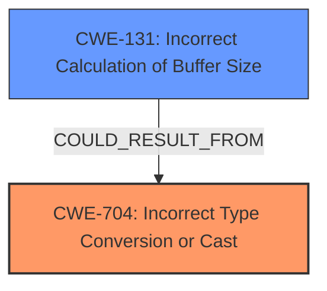

# Final Resolution for CVE-2022-21786

# Summary
| CWE ID | CWE Name | Confidence | CWE Abstraction Level | CWE Vulnerability Mapping Label | CWE-Vulnerability Mapping Notes |
|---|---|---|---|---|---|
| CWE-704 | Incorrect Type Conversion or Cast | 0.9 | Class | Allowed-with-Review | **Primary CWE**. The vulnerability is caused by an **improper cast**, as explicitly stated in the CVE and vulnerability description. Further investigation may reveal a more specific child CWE. |
| CWE-131 | Incorrect Calculation of Buffer Size | 0.6 | Base | Allowed | Secondary candidate. **Memory corruption** can occur if the size of the buffer is incorrectly calculated due to an **improper cast**, for example by truncating a size value resulting in a smaller buffer than required. |

## Evidence and Confidence

*   **Confidence Score:** 0.75
*   **Evidence Strength:** MEDIUM

## Relationship Analysis
The primary relationship considered is that a type conversion error (**CWE-704**) can lead to an incorrect buffer size calculation (**CWE-131**), which in turn causes memory corruption. While **CWE-704** is a Class, the information isn't specific enough to identify a more precise Base or Variant. The child CWEs of **CWE-704**, such as **CWE-681** (Incorrect Conversion between Numeric Types) and **CWE-843** (Access of Resource Using Incompatible Type ('Type Confusion')), were considered but lack sufficient evidence for definitive classification. **CWE-131** remains a plausible secondary weakness, as the **improper cast** *could* directly influence the buffer size calculation.

## Vulnerability Chain
The vulnerability chain starts with an **improper type conversion or cast** (**CWE-704**). If this cast leads to an incorrect buffer size calculation (**CWE-131**), it can result in **memory corruption**. The final impact is a local escalation of privilege with System execution privileges. The missing link is the specific type of cast operation and how it directly influences buffer size.

## Summary of Analysis
The initial analysis and criticism both align on **CWE-704** as the primary **ROOTCAUSE** due to the explicit mention of "**improper casting**" in the vulnerability description and CVE details. The inclusion of **CWE-131** as a secondary factor is also justifiable, considering the resulting **memory corruption**; however, the connection requires a more robust explanation.

The assessment is primarily based on the provided evidence: "In audio DSP, there is a possible **memory corruption** due to **improper casting**." This direct statement supports **CWE-704** as the **ROOTCAUSE**. While the retriever results suggest other CWEs, the explicit nature of the provided information makes **CWE-704** the most appropriate primary weakness.

The graph relationships highlight the potential chain of events, starting with the **improper cast** and potentially leading to incorrect buffer size calculations. While a more specific child of **CWE-704** might be ideal, the lack of details prevents a more precise classification. Therefore, **CWE-704** and **CWE-131** are selected as the optimal level of specificity given the available evidence. The decision to include **CWE-131** is influenced by the memory corruption mentioned in the description, but the connection to **CWE-704** requires further clarification on how the **improper cast** influences the buffer size calculation.