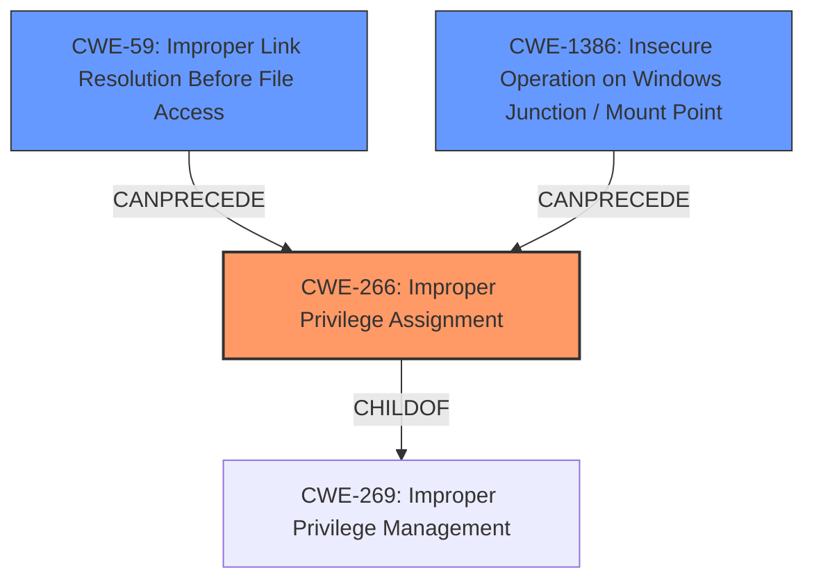

# Analysis Report for CVE-2022-21919

# Vulnerability Analysis Report: CVE-2022-21919

## Description

Windows User Profile Service Elevation of Privilege Vulnerability

## Vulnerability Description Key Phrases

**Impact:** Elevation of Privilege
**Product:** Windows
**Component:** User Profile Service

## Analysis (with Relationship Data)

# Summary
| CWE ID          | CWE Name                                                        | Confidence | CWE Abstraction Level | CWE Vulnerability Mapping Label | CWE-Vulnerability Mapping Notes |
|-----------------|-----------------------------------------------------------------|------------|-----------------------|---------------------------------|-----------------------------------|
| CWE-269         | Improper Privilege Management                                      | 0.6        | Class                 | Primary                           | Discouraged                    |
| CWE-59          | Improper Link Resolution Before File Access ('Link Following') | 0.3        | Base                  | Secondary                         | Allowed                       |
| CWE-1386        | Insecure Operation on Windows Junction / Mount Point              | 0.3        | Base                  | Secondary                         | Allowed                       |

## Evidence and Confidence

*   **Confidence Score:** 0.6
*   **Evidence Strength:** LOW

- **Analysis and Justification:**  
  - *Explanation:* The vulnerability is described as a "Windows User Profile Service **Elevation of Privilege** Vulnerability". This suggests a problem with how privileges are managed within the User Profile Service, allowing a user to gain higher-level access than intended. CWE-269 (Improper Privilege Management) is a class-level CWE that broadly covers issues where a product does not properly assign, modify, track, or check privileges for an actor, creating an unintended sphere of control. While CWE-269 is discouraged for trend analysis, it serves as a reasonable starting point given the limited details in the description. The description key phrase "Elevation of Privilege" maps loosely to this weakness. CWE-59 and CWE-1386 appear due to the Windows User Profile Service accessing files, where file access checks may not be correctly performed.

  - *Relationship Analysis:* CWE-269 is a Class-level weakness. There's no specific relationship to other CWEs provided in this context, but privilege management issues can often lead to or stem from other weaknesses. CWE-59 and CWE-1386 can be precursors to CWE-269 in specific scenarios involving file access and privilege escalation.

- **Confidence Score:**  
  - *Example:* Confidence: 0.6 (Low evidence due to minimal technical details; primarily based on the "Elevation of Privilege" impact.)

---

## Criticism of Analysis

Okay, here's a review of the provided CWE analysis, incorporating the full CWE specifications and focusing on the mapping guidance and potential mitigations:

**Overall Assessment**

The analysis is a decent starting point, given the limited information available in the initial vulnerability description. The selection of CWE-269 as the primary CWE is reasonable, though its discouraged usage needs to be considered. The inclusion of CWE-59 and CWE-1386 as secondary CWEs shows an understanding of potential file system-related attack vectors. However, the confidence levels are appropriately low, reflecting the need for more specific details.

**Detailed Critique**

1.  **CWE-269: Improper Privilege Management (Primary)**

    *   **Mapping Guidance:** The analysis correctly notes that CWE-269 is discouraged for trend analysis and is often misused.  The justification provided ("Elevation of Privilege" impact) is weak *because* it's an impact rather than a root cause. The analysis *should* actively search for a more specific weakness related to privilege management. The analysis includes that children of CWE-269 should be examined for additional hints; this is good.

    *   **Observed Examples:**  The provided examples in the specifications are helpful in understanding the broad scope of CWE-269. They don't strongly support this specific case, as they are quite general.

    *   **Potential Mitigations:** The mitigations listed in the specification (carefully manage privileges, separation of privilege, principle of least privilege) are all good high-level recommendations but aren't actionable without understanding the specific flaw.

    *   **Recommendation:** While CWE-269 might be present, the analysis should aggressively try to identify a *more specific* child of CWE-269. Given this is the User Profile Service, consider:

        *   **CWE-266: Incorrect Privilege Assignment:**  Is the problem that the *wrong* privileges are being assigned to a user or process within the service? This is a better candidate than CWE-269.
        *   **CWE-267: Privilege Defined With Unsafe Actions:** Does a certain privilege in the User Profile Service grant the ability to perform actions that were not intended, or access restricted objects?
        *   **CWE-250: Execution with Unnecessary Privileges:** Is the User Profile Service running with a privilege level beyond what is minimally required to do the tasks it does? This creates new vulnerabilities.
        *  **CWE-648: Incorrect Use of Privileged APIs:** Are the APIs being called incorrectly?
        *  **CWE-270: Privilege Context Switching Error:** Is the service improperly managing privileges while switching between contexts?
        *  **CWE-271: Privilege Dropping / Lowering Errors:** Is the service failing to drop privileges when it should be?

        If none of the children are applicable, the analysis should consider if the vulnerability is an *access control issue* at all.

        Also, the confidence should be even lower, perhaps 0.4, given the caveats in the CWE-269 specification.

2.  **CWE-59: Improper Link Resolution Before File Access ('Link Following') (Secondary)**

    *   **Mapping Guidance:** The analysis mentions that CWE-59 appears due to file access within the User Profile Service. This is plausible.

    *   **Observed Examples:**  The specification examples help illustrate how symbolic links or similar mechanisms can be exploited. The examples do give useful insight.

    *   **Potential Mitigations:** The specification's mitigations (separation of privilege, denying access to files) are relevant.

    *   **Recommendation:** The confidence of 0.3 is reasonable. To strengthen this, investigate *how* the User Profile Service handles file paths. Does it properly canonicalize paths? Does it validate that accessed files are within expected directories?  Is this a TOCTOU issue (CWE-367) where file checks are performed before file access, creating a race condition?

        Consider if the vulnerability is related to:

        *   **CWE-23: Relative Path Traversal:** Is the vulnerability due to improper sanitization of ".." sequences in file paths?
        *   **CWE-61: UNIX Symbolic Link (Symlink) Following:** Does the service fail to handle symlinks correctly?
        *   **CWE-64: Windows Shortcut Following (.LNK):** Does the service fail to handle .LNK files correctly?
        *   **CWE-1386: Insecure Operation on Windows Junction / Mount Point:** Is the service vulnerable to attacks using Windows junctions or mount points?
        *   **CWE-73: External Control of File Name or Path:** Is the service allowing external control of file names or paths?

3.  **CWE-1386: Insecure Operation on Windows Junction / Mount Point (Secondary)**

    *   **Mapping Guidance:** The inclusion of CWE-1386 is good because it highlights a Windows-specific attack vector related to reparse points.

    *   **Observed Examples:** The specification provides clear examples of how junction points and mount points can be abused for privilege escalation. The examples give insight.

    *   **Potential Mitigations:** The mitigation in the specification (`dir /al /s /b` or PowerShell's `LinkType` filter) is highly relevant and suggests a concrete way to check for and prevent this vulnerability.

    *   **Recommendation:**  The confidence of 0.3 is reasonable but could be increased slightly if there's evidence that the User Profile Service doesn't properly validate the *type* of file it's accessing (i.e., checking if it's a reparse point).  Investigate if this is the root cause.

**General Recommendations:**

*   **Specificity:**  The primary goal should be to move *away* from the broad CWE-269 and identify a more specific root cause.  This requires deeper investigation into the User Profile Service's code and design.
*   **Root Cause vs. Impact:**  Ensure that the chosen CWE represents the *root cause* of the vulnerability, not just the impact ("Elevation of Privilege").
*   **Exploit Scenario:** Think about a plausible exploit scenario. How would an attacker actually exploit this vulnerability to gain privileges? This will help narrow down the CWE selection.
*   **TOCTOU:** Consider whether a TOCTOU race condition (CWE-367) plays a role, especially in file-related vulnerabilities.
*   **Mitigation Review:** Once a more specific CWE is identified, carefully review the potential mitigations in the specification.  This can provide valuable clues about the nature of the vulnerability and how to fix it.
*   **CWE Abstraction Level:** Try to use Base or Variant CWEs.

**In Summary**

The analysis is a reasonable starting point, but needs more investigation to refine the CWE mappings. Prioritize identifying a more specific root cause than CWE-269 and thoroughly examine file handling and privilege management within the User Profile Service.

## Final Resolution

# Summary
| CWE ID | CWE Name | Confidence | CWE Abstraction Level | CWE Vulnerability Mapping Label | CWE-Vulnerability Mapping Notes |
|---|---|---|---|---|---|
| **CWE-266** | **Improper Privilege Assignment** | 0.6 | Base | Primary | Allowed |
| **CWE-59** | **Improper Link Resolution Before File Access ('Link Following')** | 0.4 | Base | Secondary | Allowed |
| **CWE-1386** | **Insecure Operation on Windows Junction / Mount Point** | 0.4 | Base | Secondary | Allowed |

## Evidence and Confidence

*   **Confidence Score:** 0.6
*   **Evidence Strength:** LOW

## Relationship Analysis
The initial assessment started with CWE-269 (Improper Privilege Management) which is a class-level CWE. The criticism correctly pointed out that CWE-269 is too broad and suggested exploring more specific child CWEs. I agree with this assessment. The decision to move to CWE-266 (Improper Privilege Assignment) is based on the fact that the vulnerability is an **Elevation of Privilege**, which suggests an incorrect assignment of privileges, which aligns better with CWE-266. The other secondary candidate CWEs CWE-59 and CWE-1386 were kept, since they could lead to the **Elevation of Privilege** if file access checks are not correctly performed.

## Vulnerability Chain
The vulnerability chain starts with an **Improper Privilege Assignment** (**CWE-266**) within the Windows User Profile Service. This could be due to incorrectly configured privileges or roles. This **ROOTCAUSE** then allows an attacker to potentially escalate privileges and gain unauthorized access to sensitive resources. The **Improper Link Resolution Before File Access ('Link Following')** (**CWE-59**) and **Insecure Operation on Windows Junction / Mount Point** (**CWE-1386**) act as contributing weaknesses that could be exploited to achieve this privilege escalation.

## Summary of Analysis
The initial analysis correctly identified a privilege management issue but settled on the overly broad CWE-269. The criticism highlighted the need for a more specific CWE and suggested several potential candidates. Based on the "Elevation of Privilege" description, and taking into account the criticism, I've selected CWE-266 (Improper Privilege Assignment) as the primary CWE. This is a more specific Base-level CWE that directly addresses the root cause of the vulnerability, which is an incorrect assignment of privileges. The confidence level remains relatively low (0.6) due to the limited information available in the vulnerability description. The inclusion of CWE-59 and CWE-1386 as secondary CWEs is maintained as they represent potential attack vectors that could lead to the privilege escalation. These CWEs are at the Base level of abstraction, which is appropriate for mapping the technical details of the vulnerability.

*Report generated on 2025-03-17 03:32:45*
