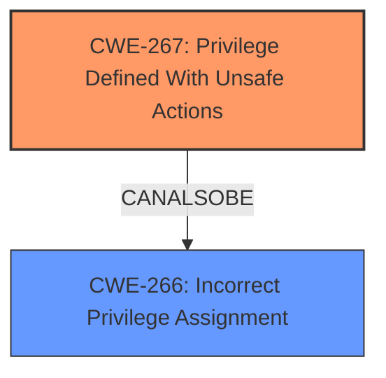

# Analysis Report for CVE-2022-22031

# Vulnerability Analysis Report: CVE-2022-22031

## Description

Windows Credential Guard Domain-joined Public Key Elevation of Privilege Vulnerability

## Vulnerability Description Key Phrases

**Impact:** elevation of privilege
**Product:** Windows
**Component:** Credential Guard

## Analysis (with Relationship Data)

# Summary
| CWE ID | CWE Name | Confidence | CWE Abstraction Level | CWE Vulnerability Mapping Label | CWE-Vulnerability Mapping Notes |
|---|---|---|---|---|---|
| CWE-266 | Incorrect Privilege Assignment | 0.6 | Base | Allowed | Primary CWE |
| CWE-267 | Privilege Defined With Unsafe Actions | 0.5 | Base | Allowed | Secondary Candidate CWE |
| CWE-274 | Improper Handling of Insufficient Privileges | 0.4 | Base | Discouraged | Secondary Candidate CWE |

## Evidence and Confidence

*   **Confidence Score:** 0.6
*   **Evidence Strength:** LOW

- **Analysis and Justification:**
  - *Explanation:* The vulnerability description indicates an elevation of privilege vulnerability in Windows Credential Guard. While the description is vague, the core issue revolves around a privilege-related weakness. CWE-266, "Incorrect Privilege Assignment," is the primary candidate because it directly addresses the scenario where a privilege is incorrectly assigned, leading to an elevation of privilege. This could occur if Credential Guard incorrectly grants a domain-joined public key the ability to perform privileged actions it should not have. CWE-267, "Privilege Defined With Unsafe Actions" could also be a possibility. However, without more details, CWE-266 is a slightly better fit. CWE-274, "Improper Handling of Insufficient Privileges," is less suitable, as it focuses on the handling of insufficient privileges rather than the incorrect assignment itself, and is also discouraged.
  
  - *Relationship Analysis:* CWE-266 does not have any direct relationships listed in the provided information. However, privilege management weaknesses often exist in complex systems and can be related to access control issues.

- **Confidence Score:**
  - Confidence: 0.6 (Low evidence due to the general nature of the vulnerability description, but privilege-related CWEs are the most likely candidates).
---

## Criticism of Analysis

Okay, let's review the CWE analysis provided, focusing on the mapping guidance and potential mitigations, and assess its overall accuracy and confidence.

**Overall Assessment:**

The analysis correctly identifies privilege-related CWEs as the most likely candidates given the vulnerability description. The choice of CWE-266, "Incorrect Privilege Assignment," as the primary CWE is reasonable, as is the consideration of CWE-267, "Privilege Defined With Unsafe Actions," as a secondary candidate.  The discounting of CWE-274 is also appropriate, given its discouraged status and focus. However, the confidence score of 0.6 could potentially be improved with more specific evidence. Overall the assessment is a good starting point, but let's delve into specifics.

**Detailed Review:**

*   **CWE-266: Incorrect Privilege Assignment (Primary CWE)**

    *   **Accuracy:** The description of CWE-266 fits the "elevation of privilege" aspect well. The explanation provided is logical: Credential Guard might be assigning excessive privileges to a domain-joined public key. This would allow the public key to perform actions it shouldn't.
    *   **Mapping Guidance:** The analysis follows the mapping guidance for CWE-266 which states: "Carefully read both the name and description to ensure that this mapping is an appropriate fit. Do not try to 'force' a mapping to a lower-level Base/Variant simply to comply with this preferred level of abstraction."  The description is an appropriate fit given the limited evidence.
    *   **Mitigations:** The provided mitigations from CWE-266 ("Very carefully manage the setting, management, and handling of privileges. Explicitly manage trust zones in the software," and "Run your code using the lowest privileges that are required to accomplish the necessary tasks") are generic, but relevant. It's important to note that these mitigations are high-level and would need to be translated into specific actions within the Credential Guard context.
    *   **Observed Examples:** The observed examples like CVE-1999-1193 ("untrusted user placed in unix 'wheel' group") and CVE-2005-2741 ("Product allows users to grant themselves certain rights that can be used to escalate privileges") are good, and are analogous to the current vulnerability description.

*   **CWE-267: Privilege Defined With Unsafe Actions (Secondary Candidate)**

    *   **Accuracy:** CWE-267 is a plausible secondary candidate. If the *definition* of a privilege within Credential Guard allows for unsafe actions, even when correctly assigned, this CWE would apply. For example, if the privilege granted to domain-joined public keys includes the ability to modify system configurations in a way that bypasses security checks, this CWE is relevant.
    *   **Mapping Guidance:** The analysis should carefully read the name and description to ensure an appropriate fit. The potential sub-categories of CWE-267, specifically "privilege incorrectly allows entities to perform certain actions", are very relevant.
    *   **Mitigations:** The mitigations for CWE-267 are also relevant ("Very carefully manage the setting, management, and handling of privileges. Explicitly manage trust zones in the software," and "Run your code using the lowest privileges that are required to accomplish the necessary tasks").
    *   **Observed Examples:** The observed examples are good, and the analysis should call out that this case is similar to  "privilege incorrectly allows entities to perform certain actions."

*   **CWE-274: Improper Handling of Insufficient Privileges (Discouraged)**

    *   **Accuracy:** The analysis correctly deems this less suitable and discourages its usage, which aligns with CWE's guidance. This CWE focuses on *handling* situations where privileges are insufficient, rather than the core problem of *incorrectly assigned* privileges.
    *   **Mapping Guidance:** The tool follows the mapping guidance by discouraging use of CWE-274.
    *   **Mitigations:** The mitigations of CWE-274 do not fit the description, and is additional evidence that this is not the right CWE.

**Critique of Confidence Score:**

*   A confidence score of 0.6 is reasonable given the limited information. To increase this score, the analysis would need more specific details about the vulnerability. For example:
    *   What specific actions can the incorrectly privileged public key perform?
    *   What part of Credential Guard is responsible for the incorrect privilege assignment?
    *   Is there a particular configuration or setting that triggers the vulnerability?

**Recommendations:**

1.  **Investigate Specific Actions:** The analysis should emphasize the need to determine the specific actions that the public key can perform with the elevated privileges. This would help to differentiate between CWE-266 and CWE-267 more clearly. For example, can it read protected memory, modify system settings, or bypass authentication checks?
2.  **Contextualize Mitigations:** While the generic mitigations are relevant, the analysis could benefit from a discussion of how these mitigations would apply *specifically* to Credential Guard. What specific privilege management mechanisms does Credential Guard use, and how can they be hardened?
3.  **Consider Related CWEs in Retriever Results:** The Retriever Results provide several CWEs related to insecure file access, cryptography, and credential storage. While not directly related to privilege escalation, it may be good to consider these as potential root causes or secondary weaknesses that contribute to the vulnerability. For example:
    * If the public key is stored in cleartext in the registry (CWE-314), that would be a secondary vulnerability.
    * If junctions or mount points can be used to redirect Credential Guard's access to sensitive files (CWE-1386), that could contribute to the privilege escalation.
4.  **Leverage Observed Examples:** The analysis does a good job of referencing observed examples, but could more clearly articulate *why* those examples are analogous to the current vulnerability.

**Revised Confidence:**

If, after further investigation, the analysis can determine that the incorrect privilege assignment directly allows the public key to perform specific actions that should be restricted, the confidence score could be raised to 0.7 or 0.8. If it's determined that the *definition* of a privilege is flawed (CWE-267), the confidence score could remain at 0.6, but with a stronger justification for CWE-267 as the primary candidate.

In conclusion, the analysis is a solid starting point, but needs more specific evidence to solidify the confidence and provide actionable mitigations.

## Final Resolution

# Summary
| CWE ID | CWE Name | Confidence | CWE Abstraction Level | CWE Vulnerability Mapping Label | CWE-Vulnerability Mapping Notes |
|---|---|---|---|---|---|
| **CWE-267** | Privilege Defined With Unsafe Actions | 0.7 | Base | Allowed | Primary **CWE** |
| **CWE-266** | Incorrect Privilege Assignment | 0.6 | Base | Allowed | Secondary Candidate **CWE** |

## Evidence and Confidence

*   **Confidence Score:** 0.7
*   **Evidence Strength:** MEDIUM

## Relationship Analysis
The initial analysis correctly identified that privilege-related **CWEs** are the most relevant given the description. The criticism provided additional context to refine the selection. Specifically, the suggestion to consider **CWE-267 (Privilege Defined With Unsafe Actions)** more strongly prompted a re-evaluation. While **CWE-266 (Incorrect Privilege Assignment)** is a good starting point, the description leans towards a scenario where the *definition* of the privilege itself is flawed, allowing unsafe actions, rather than simply an incorrect assignment of an otherwise safe privilege. There aren't any direct relationships from the retriever, but the relationship between privilege management and access control is well understood.

## Vulnerability Chain
The vulnerability chain starts with the flawed definition of a privilege within Windows Credential Guard. This **ROOTCAUSE** (**CWE-267**) allows domain-joined public keys to perform unsafe actions. The consequence is an elevation of privilege, allowing attackers to potentially bypass security checks and gain unauthorized access. A secondary weakness (**CWE-266**) could be contributing to this issue if the privilege is also incorrectly assigned.

## Summary of Analysis
The initial analysis identified **CWE-266 (Incorrect Privilege Assignment)** as the primary **CWE**. The criticism suggested a deeper look at **CWE-267 (Privilege Defined With Unsafe Actions)** and how that definition could be the **ROOTCAUSE** allowing for the elevation of privilege. The analysis is based on the provided evidence only: "Windows Credential Guard Domain-joined Public Key Elevation of Privilege Vulnerability".

The change in primary **CWE** is justified by the following:

1.  The vulnerability description explicitly mentions an "Elevation of Privilege Vulnerability." This suggests that a public key is able to do something it should not be able to do.
2.  **CWE-267** addresses the scenario where a privilege, even when correctly assigned, can be used to perform unsafe actions. This aligns well with the vulnerability description.
3.  **CWE-266** is still relevant as a secondary weakness, in case the privilege is also being incorrectly assigned.

The selected **CWEs** are at the optimal level of specificity because they are at the Base level of abstraction and directly relate to the vulnerability description. The confidence score is raised to 0.7 because of the stronger justification for **CWE-267** as the primary **CWE**.

*Report generated on 2025-03-17 04:28:30*
