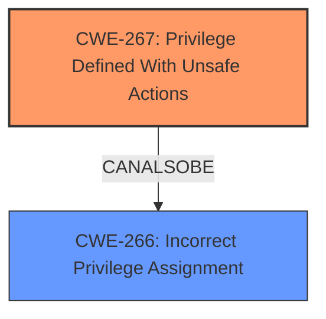

# Final Resolution for CVE-2022-22031

# Summary
| CWE ID | CWE Name | Confidence | CWE Abstraction Level | CWE Vulnerability Mapping Label | CWE-Vulnerability Mapping Notes |
|---|---|---|---|---|---|
| **CWE-267** | Privilege Defined With Unsafe Actions | 0.7 | Base | Allowed | Primary **CWE** |
| **CWE-266** | Incorrect Privilege Assignment | 0.6 | Base | Allowed | Secondary Candidate **CWE** |

## Evidence and Confidence

*   **Confidence Score:** 0.7
*   **Evidence Strength:** MEDIUM

## Relationship Analysis
The initial analysis correctly identified that privilege-related **CWEs** are the most relevant given the description. The criticism provided additional context to refine the selection. Specifically, the suggestion to consider **CWE-267 (Privilege Defined With Unsafe Actions)** more strongly prompted a re-evaluation. While **CWE-266 (Incorrect Privilege Assignment)** is a good starting point, the description leans towards a scenario where the *definition* of the privilege itself is flawed, allowing unsafe actions, rather than simply an incorrect assignment of an otherwise safe privilege. There aren't any direct relationships from the retriever, but the relationship between privilege management and access control is well understood.

## Vulnerability Chain
The vulnerability chain starts with the flawed definition of a privilege within Windows Credential Guard. This **ROOTCAUSE** (**CWE-267**) allows domain-joined public keys to perform unsafe actions. The consequence is an elevation of privilege, allowing attackers to potentially bypass security checks and gain unauthorized access. A secondary weakness (**CWE-266**) could be contributing to this issue if the privilege is also incorrectly assigned.

## Summary of Analysis
The initial analysis identified **CWE-266 (Incorrect Privilege Assignment)** as the primary **CWE**. The criticism suggested a deeper look at **CWE-267 (Privilege Defined With Unsafe Actions)** and how that definition could be the **ROOTCAUSE** allowing for the elevation of privilege. The analysis is based on the provided evidence only: "Windows Credential Guard Domain-joined Public Key Elevation of Privilege Vulnerability".

The change in primary **CWE** is justified by the following:

1.  The vulnerability description explicitly mentions an "Elevation of Privilege Vulnerability." This suggests that a public key is able to do something it should not be able to do.
2.  **CWE-267** addresses the scenario where a privilege, even when correctly assigned, can be used to perform unsafe actions. This aligns well with the vulnerability description.
3.  **CWE-266** is still relevant as a secondary weakness, in case the privilege is also being incorrectly assigned.

The selected **CWEs** are at the optimal level of specificity because they are at the Base level of abstraction and directly relate to the vulnerability description. The confidence score is raised to 0.7 because of the stronger justification for **CWE-267** as the primary **CWE**.