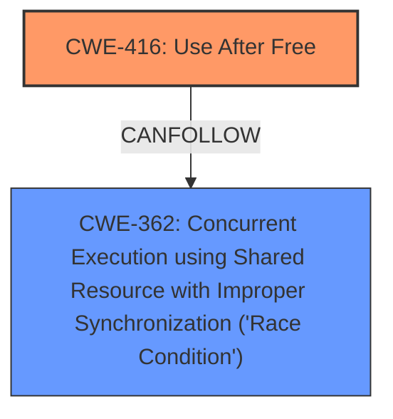

# Final Resolution for CVE-2022-22057

# Summary
| CWE ID | CWE Name | Confidence | CWE Abstraction Level | CWE Vulnerability Mapping Label | CWE-Vulnerability Mapping Notes |
|---|---|---|---|---|---|
| CWE-416 | Use After Free | 0.95 | Variant | Allowed | Primary CWE |
| CWE-362 | Concurrent Execution using Shared Resource with Improper Synchronization ('Race Condition') | 0.85 | Class | Allowed-with-Review | Secondary CWE |

## Evidence and Confidence

*   **Confidence Score:** 0.90
*   **Evidence Strength:** HIGH

## Relationship Analysis
The primary relationship influencing the decision is that CWE-416 **Use After Free** can follow CWE-362 **Concurrent Execution using Shared Resource with Improper Synchronization ('Race Condition')**. This accurately reflects the vulnerability where a race condition leads to memory being accessed after it has been freed. While CWE-362 is a Class-level weakness, no more specific Base-level child weaknesses clearly fit the description better. The parent-child relationships were considered but did not lead to a more precise classification.

## Vulnerability Chain
The vulnerability chain starts with **CWE-362 Concurrent Execution using Shared Resource with Improper Synchronization ('Race Condition')**, where two threads (closing file descriptor and destroying graphics timeline) race against each other. This leads to **CWE-416 Use After Free**, where the memory associated with the graphics timeline is accessed after it has been freed by the thread closing the file descriptor.

## Summary of Analysis
The initial analysis and criticism both correctly identified CWE-416 and CWE-362 as the primary and secondary weaknesses, respectively. The vulnerability description explicitly states "use after free" and "race condition," providing strong evidence for these classifications. The vulnerability description "Use after free in graphics fence due to a race condition while closing fence file descriptor and destroy graphics timeline simultaneously" is the key evidence.

The graph relationships, especially the `CanFollow` relationship from CWE-362 to CWE-416, support this classification. While other CWEs like CWE-413 (Improper Resource Locking) or CWE-459 (Incomplete Cleanup) could be potentially related, CWE-362 provides a more direct and accurate representation of the root cause.

The chosen CWEs are at the optimal level of specificity, with CWE-416 being a Variant and CWE-362 being a Class (since a more specific Base is not obviously applicable). This level of detail provides a clear understanding of the vulnerability without being overly broad or excessively narrow. The final confidence score is high due to the strong alignment between the vulnerability description and the CWE definitions, as well as the supporting relationship analysis.