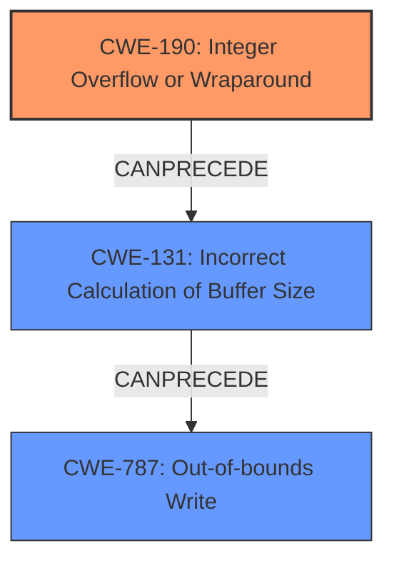

# Analysis Report for CVE-2022-22074

# Vulnerability Analysis Report: CVE-2022-22074

## Description

Memory Corruption during wma file playback due to integer overflow in Snapdragon Auto, Snapdragon Compute, Snapdragon Connectivity, Snapdragon Consumer IOT, Snapdragon Industrial IOT, Snapdragon Mobile, Snapdragon Voice & Music, Snapdragon Wearables

## Vulnerability Description Key Phrases

**Rootcause:** integer overflow
**Weakness:** Memory Corruption
**Product:** Snapdragon Auto, Snapdragon Compute, Snapdragon Connectivity, Snapdragon Consumer IOT, Snapdragon Industrial IOT, Snapdragon Mobile, Snapdragon Voice & Music, Snapdragon Wearables
**Component:** wma file playback

## Analysis (with Relationship Data)

# Summary
| CWE ID | CWE Name | Confidence | CWE Abstraction Level | CWE Vulnerability Mapping Label | CWE-Vulnerability Mapping Notes |
|---|---|---|---|---|---|
| CWE-190 | Integer Overflow or Wraparound | 0.9 | Base | Allowed | Primary CWE |
| CWE-787 | Out-of-bounds Write | 0.6 | Base | Allowed | Secondary Candidate |
| CWE-131 | Incorrect Calculation of Buffer Size | 0.6 | Base | Allowed | Secondary Candidate |

## Evidence and Confidence

*   **Confidence Score:** 0.75
*   **Evidence Strength:** MEDIUM

- **Analysis and Justification:**  
  - *Explanation:* The vulnerability description explicitly states that it is due to an **integer overflow** during wma file playback. This aligns directly with CWE-190 (Integer Overflow or Wraparound). The **integer overflow** leads to **memory corruption**, implying that the overflowed value is then used in a way that causes memory to be accessed incorrectly.
  - *Relationship Analysis:* CWE-190 is a base level CWE. It can precede CWE-119 (Improper Restriction of Operations within the Bounds of a Memory Buffer), which is a parent of CWE-787 (Out-of-bounds Write). While CWE-787 is a potential consequence of the **integer overflow**, the provided information does not explicitly state an out-of-bounds write, so it will be listed as a secondary candidate. CWE-131 (Incorrect Calculation of Buffer Size) is also a potential consequence and thus a secondary candidate.

- **Confidence Score:**
  - Confidence: 0.9 (High evidence for CWE-190 due to direct mention of **integer overflow** in the vulnerability description, and medium confidence for CWE-787 and CWE-131 as potential consequences)

## Criticism of Analysis

Okay, let's review the provided CWE analysis with the full CWE specifications in mind.

**Overall Assessment:**

The analysis correctly identifies CWE-190 (Integer Overflow or Wraparound) as the primary cause based on the vulnerability description. The identification of CWE-787 (Out-of-bounds Write) and CWE-131 (Incorrect Calculation of Buffer Size) as secondary candidates is also reasonable, as they are potential consequences of CWE-190. However, I will offer some suggestions for improvements and a more nuanced understanding of the relationships.

**Detailed Critique:**

1.  **CWE-190: Integer Overflow or Wraparound:**
    *   **Justification:** The analysis is strong here. The vulnerability description explicitly mentions "integer overflow," making CWE-190 a clear and direct match. The confidence level of 0.9 is appropriate.
    *   **Mapping Guidance Consideration:** The analysis acknowledges the terminology issues related to "overflow" and "wraparound" as mentioned in the CWE specification. It also correctly notes that CWE-190 is a base-level CWE, which is preferred.
    *   **Mitigation Analysis:** The identified mitigations are accurate (Language Selection, using safe integer libraries).  The mitigation related to requiring strict protocol definitions is less directly relevant but still a reasonable general security practice.
    *   **Observed Examples:** The examples given are relevant to the general concept of integer overflows leading to other issues.
    *   **Potential Improvement:**  The analysis could benefit from exploring *how* the integer overflow leads to memory corruption. Is it directly used as an offset? Is it used to calculate a buffer size? Knowing this would strengthen the connection. Consider CWE-680: Integer Overflow to Buffer Overflow, even though it is discouraged. If the overflow directly leads to a calculation that causes less memory to be allocated than expected and then a buffer overflow occurs, this would be a more specific composite.

2.  **CWE-787: Out-of-bounds Write:**
    *   **Justification:** This is a reasonable secondary candidate because memory corruption often manifests as an out-of-bounds write. However, it's important to recognize that memory corruption can also involve out-of-bounds reads, use-after-free, and other memory safety violations.
    *   **Mapping Guidance Consideration:** The analysis correctly recognizes that CWE-787 is a potential *consequence* of CWE-190, but not necessarily the direct cause as the overflowed value could be used in other ways to cause "Memory Corruption".
    *   **Mitigation Analysis:** The listed mitigations for CWE-787 (Language selection, Safe libraries, compiler protections) are all relevant and standard practices for preventing buffer overflows.
    *   **Observed Examples:** The examples provided are good demonstrations of generic out-of-bounds writes.
    *   **Potential Improvement:** Confidence could be increased if the root cause analysis shows evidence of how the integer overflow leads to an out-of-bounds write rather than another type of memory corruption. If it's a buffer overflow, is it on the stack or heap? Could be more specific.

3.  **CWE-131: Incorrect Calculation of Buffer Size:**
    *   **Justification:** This is another plausible secondary candidate. If the integer overflow is used in a buffer size calculation, it could lead to allocating an insufficiently sized buffer.
    *   **Mapping Guidance Consideration:** The analysis acknowledges that the overflow can be primary to resource consumption issues (CWE-400), which is valid.
    *   **Mitigation Analysis:** Mitigations like allocating for the largest possible encoding and understanding numeric representations are crucial for preventing this. Input validation is also a valid consideration.
    *   **Observed Examples:** The provided CVEs are good examples of how incorrect buffer size calculations can lead to exploitable vulnerabilities.
    *   **Potential Improvement:** The connection to CWE-190 could be made more explicit. For example, "the integer overflow occurs during the calculation of the buffer size, resulting in a smaller-than-expected buffer."

**Additional Considerations and Suggestions:**

*   **CWE-119: Improper Restriction of Operations within the Bounds of a Memory Buffer:** It's good that the analysis doesn't directly use CWE-119, as the mapping guidance discourages its use. The analysis correctly identifies CWE-190, CWE-787, and CWE-131, which are more specific and appropriate.
*   **CWE-125 (Out-of-bounds Read):** While the analysis focuses on out-of-bounds writes, it is also possible that the integer overflow could be used to calculate an offset for a read operation, leading to information disclosure. While less likely, consider mentioning this possibility.
*   **CWE-20 (Improper Input Validation):** CWE-20 is a parent of CWE-190. Although this is related, I think it is not as important as the others and CWE-190 is a direct match, so it is OK not including it.
*   **CWE-1284 (Improper Validation of Specified Quantity in Input):** Consider this if the size/length/quantity used in the overflow is directly derived from user controlled input.
*   **Data Flow Analysis:** If more information were available, try to trace the flow of data:
    1.  Where does the integer come from? (user input, file, network, etc.)
    2.  How is it used in the calculation?
    3.  How does the result of the calculation impact memory allocation or buffer access?
*   **Consider the Target Platform/Architecture:** The impact of an integer overflow can vary depending on the platform and compiler. Does the compiler provide any built-in protection? Does the language have safe integer handling capabilities?

**Revised Confidence Scores (Optional):**

*   **CWE-190:** 0.95 (very high, given the direct mention in the description)
*   **CWE-787:** 0.7 (moderate, as it's a plausible consequence, but the specific mechanism isn't confirmed)
*   **CWE-131:** 0.7 (moderate, as it's a plausible consequence related to buffer size calculation, but requires more context)

**Summary of Changes:**

*   Strengthen the justification for CWE-787 and CWE-131 by explaining *how* the integer overflow leads to these consequences.
*   Consider the data flow to better understand the root cause and potential impact.
*   Acknowledge the less likely possibility of CWE-125 (Out-of-bounds Read).
*   Maintain focus on the more specific CWEs and avoid resorting to overly broad classifications like CWE-119.

By addressing these points, the analysis can become more comprehensive and accurate in its CWE mapping. Remember that the goal is to identify the most precise and relevant CWEs that explain the vulnerability and guide effective mitigation strategies.

## Final Resolution

# Summary
| CWE ID | CWE Name | Confidence | CWE Abstraction Level | CWE Vulnerability Mapping Label | CWE-Vulnerability Mapping Notes |
|---|---|---|---|---|---|
| CWE-190 | Integer Overflow or Wraparound | 0.95 | Base | Allowed | Primary CWE |
| CWE-131 | Incorrect Calculation of Buffer Size | 0.7 | Base | Allowed | Secondary Candidate |
| CWE-787 | Out-of-bounds Write | 0.7 | Base | Allowed | Secondary Candidate |

## Evidence and Confidence

*   **Confidence Score:** 0.8
*   **Evidence Strength:** MEDIUM

## Relationship Analysis
The primary weakness is identified as **CWE-190 (Integer Overflow or Wraparound)**. The analysis correctly points out the potential consequences, which are **CWE-787 (Out-of-bounds Write)** and **CWE-131 (Incorrect Calculation of Buffer Size)**. These relationships form a chain where an integer overflow leads to an incorrect buffer size calculation, which can then lead to an out-of-bounds write. The abstraction levels are appropriate, as all CWEs selected are at the Base level, providing the necessary specificity.

## Vulnerability Chain
The vulnerability chain starts with the **CWE-190 (Integer Overflow or Wraparound)**, which occurs during wma file playback. This overflow leads to **CWE-131 (Incorrect Calculation of Buffer Size)** because the overflowed value is used to calculate the buffer size. Finally, the incorrectly calculated buffer size results in **CWE-787 (Out-of-bounds Write)**, leading to memory corruption.

## Summary of Analysis
The initial analysis was accurate in identifying **CWE-190 (Integer Overflow or Wraparound)** as the primary cause, given the vulnerability description mentioning "integer overflow." The criticism suggested exploring how the integer overflow leads to memory corruption. It suggested considering CWE-680, but this is discouraged. Instead, it is more precise to say that **CWE-190 (Integer Overflow or Wraparound)** leads to **CWE-131 (Incorrect Calculation of Buffer Size)**, which then leads to **CWE-787 (Out-of-bounds Write)**.

The graph relationships influenced the final selection by showing the chain of events, starting from the **integer overflow**, leading to an incorrect buffer size, and finally resulting in an out-of-bounds write. This chain helped in understanding the sequence of weaknesses and selecting the most appropriate CWEs.

The selected CWEs are at the optimal level of specificity because they accurately represent the root cause (**CWE-190**) and the potential consequences (**CWE-131** and **CWE-787**).

*Report generated on 2025-03-18 09:57:32*
