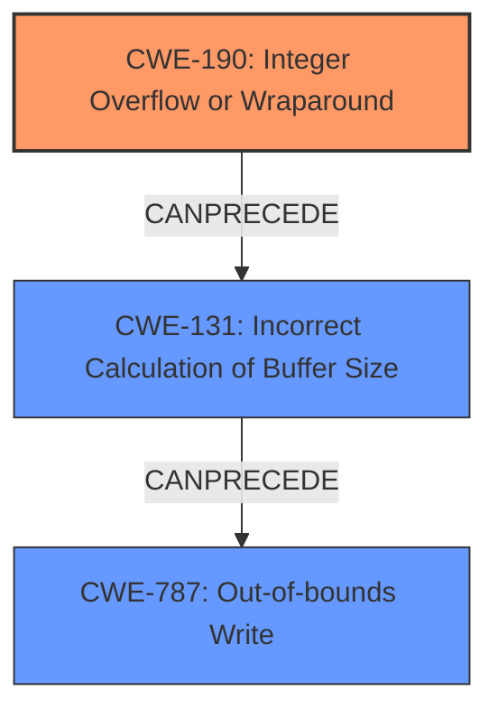

# Final Resolution for CVE-2022-22074

# Summary
| CWE ID | CWE Name | Confidence | CWE Abstraction Level | CWE Vulnerability Mapping Label | CWE-Vulnerability Mapping Notes |
|---|---|---|---|---|---|
| CWE-190 | Integer Overflow or Wraparound | 0.95 | Base | Allowed | Primary CWE |
| CWE-131 | Incorrect Calculation of Buffer Size | 0.7 | Base | Allowed | Secondary Candidate |
| CWE-787 | Out-of-bounds Write | 0.7 | Base | Allowed | Secondary Candidate |

## Evidence and Confidence

*   **Confidence Score:** 0.8
*   **Evidence Strength:** MEDIUM

## Relationship Analysis
The primary weakness is identified as **CWE-190 (Integer Overflow or Wraparound)**. The analysis correctly points out the potential consequences, which are **CWE-787 (Out-of-bounds Write)** and **CWE-131 (Incorrect Calculation of Buffer Size)**. These relationships form a chain where an integer overflow leads to an incorrect buffer size calculation, which can then lead to an out-of-bounds write. The abstraction levels are appropriate, as all CWEs selected are at the Base level, providing the necessary specificity.

## Vulnerability Chain
The vulnerability chain starts with the **CWE-190 (Integer Overflow or Wraparound)**, which occurs during wma file playback. This overflow leads to **CWE-131 (Incorrect Calculation of Buffer Size)** because the overflowed value is used to calculate the buffer size. Finally, the incorrectly calculated buffer size results in **CWE-787 (Out-of-bounds Write)**, leading to memory corruption.

## Summary of Analysis
The initial analysis was accurate in identifying **CWE-190 (Integer Overflow or Wraparound)** as the primary cause, given the vulnerability description mentioning "integer overflow." The criticism suggested exploring how the integer overflow leads to memory corruption. It suggested considering CWE-680, but this is discouraged. Instead, it is more precise to say that **CWE-190 (Integer Overflow or Wraparound)** leads to **CWE-131 (Incorrect Calculation of Buffer Size)**, which then leads to **CWE-787 (Out-of-bounds Write)**.

The graph relationships influenced the final selection by showing the chain of events, starting from the **integer overflow**, leading to an incorrect buffer size, and finally resulting in an out-of-bounds write. This chain helped in understanding the sequence of weaknesses and selecting the most appropriate CWEs.

The selected CWEs are at the optimal level of specificity because they accurately represent the root cause (**CWE-190**) and the potential consequences (**CWE-131** and **CWE-787**).