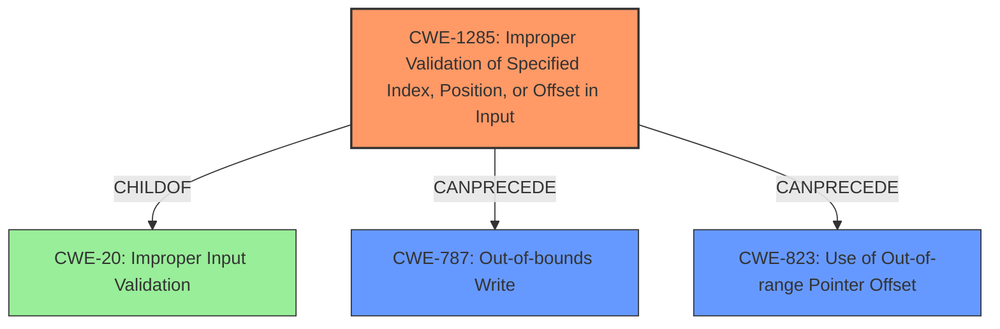

# Final Resolution for CVE-2022-22080

# Summary
| CWE ID | CWE Name | Confidence | CWE Abstraction Level | CWE Vulnerability Mapping Label | CWE-Vulnerability Mapping Notes |
|---|---|---|---|---|---|
| CWE-1285 | Improper Validation of Specified Index, Position, or Offset in Input | 0.80 | Base | Allowed | Primary CWE: The product receives input that is expected to specify an index, position, or offset into an indexable resource such as a buffer or file, but it does not validate or incorrectly validates that the specified index/position/offset has the required properties. |
| CWE-787 | **Out-of-bounds Write** | 0.70 | Base | Allowed | Secondary CWE: The improper validation leads to writing data past the end, or before the beginning, of the intended buffer. |
| CWE-823 | Use of **Out-of-range Pointer Offset** | 0.60 | Base | Allowed | Contributing CWE: The `backend id` is used as an offset to calculate the memory location to read/write which leads to memory corruption. |

## Evidence and Confidence

*   **Confidence Score:** 0.75
*   **Evidence Strength:** MEDIUM

## Relationship Analysis
The decision was influenced by several CWE relationships.
  - Parent-child: CWE-1285 is a child of CWE-20 (Improper Input Validation), but CWE-1285 is more specific and appropriate.
  - Chain: The vulnerability can be viewed as a chain: Improper validation of the backend ID (CWE-1285) leading to an **out-of-bounds write** (CWE-787), where the backend ID is used as a pointer offset (**CWE-823**).
  - Peer: CWE-129 (Improper Validation of Array Index) was considered as a more specific variant of CWE-1285, but the description does not explicitly state that the backend ID is used as an array index.
  - Abstraction Levels: All selected CWEs are at the Base level, which is preferred for root cause analysis.

## Vulnerability Chain
The vulnerability chain starts with the **improper validation** of the `backend id` (CWE-1285). This leads to a scenario where an invalid `backend id` is used as an offset to access memory (**CWE-823**), resulting in an **out-of-bounds write** (**CWE-787**) and subsequent memory corruption.

Missing links: The description lacks specific details on how the `backend id` is used as an offset, however, this relationship is implied from the vulnerability description.

## Summary of Analysis
The analysis builds upon the initial assessment and the criticism. The primary **WEAKNESS** is the **improper validation** of the `backend id`, which directly aligns with CWE-1285. The resulting memory corruption is best described as an **out-of-bounds write** (CWE-787). Including CWE-823 provides additional context, as it highlights how the `backend id` *could* be used as an offset that points outside of the intended boundaries, leading to memory corruption.

The final decision is based on the provided evidence, relationship analysis, and mapping guidance. The key evidence from the vulnerability description is "**Improper validation of backend id in PCM routing process can lead to memory corruption**".

The graph relationships influenced the selection by highlighting the chain of events and the potential contributing factors. CWE-1285 is chosen as the primary **ROOTCAUSE** because it directly addresses the **improper validation** aspect. CWE-787 is a secondary CWE due to the memory corruption. CWE-823 contributes to the vulnerability by highlighting the usage of the `backend id` as an offset.

The selected CWEs are at the optimal level of specificity, as they provide a comprehensive description of the vulnerability without being overly abstract or granular. The decision to include CWE-787 enhances the clarity of the impact (memory corruption), while CWE-823 better defines the cause.