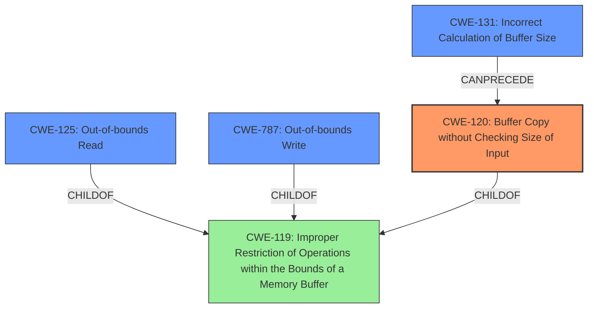

# Final Resolution for CVE-2022-22088

# Summary
| CWE ID | CWE Name | Confidence | CWE Abstraction Level | CWE Vulnerability Mapping Label | CWE-Vulnerability Mapping Notes |
|---|---|---|---|---|---|
| CWE-120 | Buffer Copy without Checking Size of Input ('Classic Buffer Overflow') | 0.85 | Base | Primary | Allowed-with-Review |
| CWE-787 | Out-of-bounds Write | 0.6 | Base | Secondary | Allowed |
| CWE-125 | Out-of-bounds Read | 0.5 | Base | Secondary | Allowed |
| CWE-131 | Incorrect Calculation of Buffer Size | 0.4 | Base | Secondary | Allowed |

## Evidence and Confidence

*   **Confidence Score:** 0.8
*   **Evidence Strength:** MEDIUM

## Relationship Analysis
The primary CWE, CWE-120 (Buffer Copy without Checking Size of Input), is a base-level CWE. CWE-125 (Out-of-bounds Read) and CWE-787 (Out-of-bounds Write) are both children of CWE-119 (Improper Restriction of Operations within the Bounds of a Memory Buffer). Although CWE-119 is a parent, it's not chosen as primary due to its discouraged usage when more specific CWEs are available. CWE-131 (Incorrect Calculation of Buffer Size) can precede CWE-120 if a flawed size calculation leads to uncontrolled data copying. The relationships reinforce the selection of CWE-120 as the most direct cause, with the others contributing to the overall impact.

## Vulnerability Chain
The vulnerability chain starts with parsing a command response from a remote Bluetooth host. The core **WEAKNESS** is CWE-120 (Buffer Copy without Checking Size of Input), where data is copied without proper size validation. This can be caused by an earlier **ROOTCAUSE** of CWE-131 (Incorrect Calculation of Buffer Size) or a failure to sanitize the size parameter in the command response (CWE-20). This leads to CWE-787 (Out-of-bounds Write), overwriting memory, and potentially CWE-125 (Out-of-bounds Read) if the parsing logic attempts to access data beyond the intended boundary. The ultimate impact is memory corruption, which can lead to unpredictable behavior or a crash.

## Summary of Analysis
The initial analysis correctly identified CWE-120 as the primary **WEAKNESS** based on the "**buffer overflow**" in the vulnerability description. The criticism provided valuable suggestions for strengthening the justification, explicitly addressing the "Usage: Discouraged" guidance for CWE-119, and considering other potentially relevant CWEs like CWE-1284.

Based on the vulnerability description, "**Memory corruption in Bluetooth HOST due to buffer overflow while parsing the command response received from remote**", CWE-120 remains the most appropriate primary classification because the core problem is copying the data without checking the input size.

*   **CWE-120:** The "**buffer overflow**" is the key evidence here. The description specifically points to uncontrolled copying as the issue, aligning directly with CWE-120's definition.
*   **CWE-787:** It is included as a secondary CWE because a **buffer overflow** inherently leads to an out-of-bounds write condition.
*   **CWE-125:** It is included as a secondary CWE because the parsing logic may attempt to access data past the end of the buffer due to incorrect size calculation.
*   **CWE-131:** It is included because a faulty calculation of the **buffer** size could lead to an overflow.

The graph relationships influenced the selection by reinforcing the connection between CWE-120 and its related CWEs (CWE-125 and CWE-787 are children of CWE-119, and CWE-120 is also a child of CWE-119). The abstraction levels were considered, ensuring that the selected CWEs are at the base level for optimal specificity.

The selected CWEs are at the optimal level of specificity because they directly address the root cause and contributing factors of the vulnerability based on the available evidence.