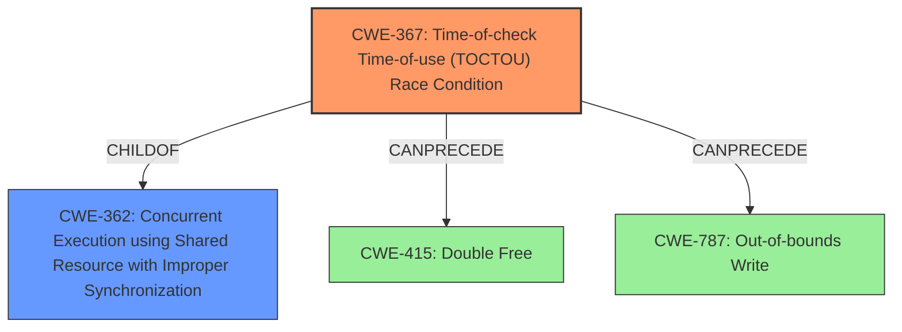

# Analysis Report for CVE-2022-22093

# Vulnerability Analysis Report: CVE-2022-22093

## Description

Memory corruption or temporary denial of service due to improper handling of concurrent hypervisor operations to attach or detach IRQs from virtual interrupt sources in Snapdragon Compute, Snapdragon Connectivity, Snapdragon Industrial IOT, Snapdragon Mobile

## Vulnerability Description Key Phrases

**Rootcause:** improper handling of concurrent hypervisor operations
**Impact:** Memory corruption or temporary denial of service
**Vector:** attach or detach IRQs from virtual interrupt sources
**Product:** ['Snapdragon Compute', 'Snapdragon Connectivity', 'Snapdragon Industrial IOT', 'Snapdragon Mobile']

## Analysis (with Relationship Data)

# Summary
| CWE ID | CWE Name | Confidence | CWE Abstraction Level | CWE Vulnerability Mapping Label | CWE-Vulnerability Mapping Notes |
|---|---|---|---|---|---|
| CWE-367 | Time-of-check Time-of-use (TOCTOU) Race Condition | 0.75 | Base | Allowed | Primary CWE |
| CWE-415 | Double Free | 0.4 | Variant | Allowed | Secondary Candidate |
| CWE-787 | Out-of-bounds Write | 0.4 | Base | Allowed | Secondary Candidate |

## Evidence and Confidence

*   **Confidence Score:** 0.75
*   **Evidence Strength:** MEDIUM

- **Analysis and Justification:**  
  - *Explanation:* "The vulnerability description highlights an **improper handling of concurrent hypervisor operations** related to attaching/detaching IRQs, leading to memory corruption or denial of service. This strongly suggests a race condition, where multiple threads or processes access and manipulate shared resources (in this case, IRQs) concurrently without proper synchronization. CWE-367 (Time-of-check Time-of-use (TOCTOU) Race Condition) directly addresses this scenario, where the state of a resource changes between the time it's checked and the time it's used, leading to unexpected or erroneous behavior. The description clearly states this condition occurs during concurrent hypervisor operations.

  - *Relationship Analysis:* "CWE-367 is a Base level CWE, which is preferred for root cause analysis. While other CWEs like CWE-787 (Out-of-bounds Write) and CWE-415 (Double Free) are related to memory corruption, they are impacts of the race condition rather than the root cause. The concurrent operations on IRQs is the key weakness.
The retriever results indicated CWE-367 is a plausible option."

- **Confidence Score:**  
  - *Example:* Confidence: 0.75 (Moderate evidence from the description matching a classic race condition scenario, but lacks specific details about the code implementation. The graph retriever supported the choice.)

---
- **Analysis and Justification:**  
  - *Explanation:* "Memory corruption is stated as an impact of the vulnerability. A potential impact of the race condition described in the vulnerability description is that the same memory location might be freed twice, due to the unsynchronized access. Therefore, CWE-415 (Double Free) is a possible secondary weakness.

  - *Relationship Analysis:* "CWE-415 is a Variant level CWE, indicating a more specific type of weakness than its potential parents. The retriever results indicated CWE-415 but with a low score and sparse support."

- **Confidence Score:**  
  - *Example:* Confidence: 0.4 (Low confidence due to the lack of direct evidence. This is only a plausible impact of the race condition described.)

---
- **Analysis and Justification:**  
  - *Explanation:* "Memory corruption is stated as an impact of the vulnerability. A potential impact of the race condition described in the vulnerability description is that memory could be written out of bounds. Therefore, CWE-787 (Out-of-bounds Write) is a possible secondary weakness.

  - *Relationship Analysis:* "CWE-787 is a Base level CWE. The retriever results indicated CWE-787 with a moderate score and support."

- **Confidence Score:**  
  - *Example:* Confidence: 0.4 (Low confidence due to the lack of direct evidence. This is only a plausible impact of the race condition described.)

## Criticism of Analysis

Okay, let's review the provided CWE analysis with the full CWE specifications in mind.

**Overall Assessment:**

The analysis is generally sound and well-reasoned, particularly in its primary assignment of CWE-367. The justification is clear and aligns well with the vulnerability description. The consideration of secondary CWEs, while assigned lower confidence, is also logical given the potential impacts described. The use of examples and references to the retriever results strengthens the analysis. However, there are a few areas where the reasoning could be more precise, or alternative CWEs could be considered.

**Detailed Critique:**

**1. CWE-367: Time-of-check Time-of-use (TOCTOU) Race Condition (Confidence: 0.75)**

*   **Strengths:**
    *   The core argument for CWE-367 being the primary weakness is strong.  The "improper handling of concurrent hypervisor operations" directly maps to the description of CWE-367: "The product checks the state of a resource before using that resource, but the resource's state can change between the check and the use."  The attachment/detachment of IRQs from virtual interrupt sources represents a shared resource being accessed concurrently.
    *   The analysis correctly identifies that memory corruption and DoS are potential impacts, not the root cause.
    *   The confidence score of 0.75 is appropriate. The description provides strong evidence, but specific code details are missing.
*   **Areas for Improvement:**
    *   **Specificity:** While CWE-367 is a good fit, consider if a more specific child of CWE-362 (Concurrent Execution using Shared Resource with Improper Synchronization) would be even better. Although CWE-367 is a Base CWE and therefore preferred, CWE-362 is the parent. Are operations performed on an IRQ checked and then used, or is it just a lack of protection around a concurrent operation?
    *   **Mitigation:** Mentioning potential mitigations related to CWE-367 could strengthen the analysis. For example, implementing proper locking mechanisms (mutexes, semaphores) to protect access to the IRQ management structures. From the spec: "In languages that support it, use synchronization primitives. Only wrap these around critical code to minimize the impact on performance."

**2. CWE-415: Double Free (Confidence: 0.4)**

*   **Strengths:**
    *   The analysis correctly identifies double-free as a *potential* consequence of a race condition.
    *   Acknowledging the lack of direct evidence and assigning a low confidence score (0.4) is appropriate.
*   **Areas for Improvement:**
    *   **Justification:** The connection between the race condition and double-free could be made slightly more explicit.  Explain how, under specific race scenarios, a pointer to memory associated with an IRQ might be freed by one thread, and then, due to the race, a second thread might attempt to free the *same* memory.
    *   **Alternative Cause:** Consider if `CWE-459: Incomplete Cleanup` is also a possible cause. Is a path being missed to free the memory, leading to a double free?
    *   **Mitigation:** As the CWE spec mentions: "Ensure that each allocation is freed only once. After freeing a chunk, set the pointer to NULL to ensure the pointer cannot be freed again." This would be an appropriate mitigation to mention.

**3. CWE-787: Out-of-bounds Write (Confidence: 0.4)**

*   **Strengths:**
    *   The analysis correctly identifies out-of-bounds write as a *potential* consequence of the race condition.
    *   Acknowledging the lack of direct evidence and assigning a low confidence score (0.4) is appropriate.
*   **Areas for Improvement:**
    *   **Justification:** Similarly to CWE-415, the link to the race condition should be more explicit. How might the concurrent operations cause a write beyond the bounds of allocated memory?  Perhaps one thread re-sizes an IRQ management data structure while another is in the process of writing data to it, leading to a buffer overflow?
    *   **Alternative CWE:** Consider `CWE-823: Use of Out-of-range Pointer Offset`. If pointer arithmetic is used to access memory related to IRQs and a calculation goes wrong, this could be the root cause.
    *   **Mitigation:** As the specification says, a language with built-in memory protection could help. Additionally, "Use automatic buffer overflow detection mechanisms that are offered by certain compilers or compiler extensions."

**Additional Considerations & Observations:**

*   **Retriever Results:**  While the analysis mentions the retriever results, it could benefit from a more critical assessment of them.  For example, while CWE-822 (Untrusted Pointer Dereference) has a high score, it doesn't seem directly relevant to the vulnerability description. Why did the retriever suggest it? Is there something about the hypervisor environment that might lead to untrusted pointer dereferences? If not, explicitly state why it's not a good fit.
*   **CWE-1285 (Improper Validation of Specified Index, Position, or Offset in Input):** This appeared in the Retriever Results. Could this be the underlying cause? If there is not validation around the index, position, or offset, then the Race Condition could be a symptom, not the root cause.
*   **CWE Selection:** Given the hypervisor context, double-check if any CWEs specific to virtualization or hypervisor vulnerabilities exist (though none immediately come to mind).  This might provide a more precise fit.
*   **Mitigations:** In general, consider including more specific mitigations when discussing each CWE. Draw directly from the "Potential Mitigations" sections within the CWE specifications. This shows a deeper understanding of the weakness and provides practical advice.

**Revised Summary Table (Example):**

| CWE ID | CWE Name | Confidence | CWE Abstraction Level | CWE Vulnerability Mapping Label | CWE-Vulnerability Mapping Notes |
|---|---|---|---|---|---|
| CWE-367 | Time-of-check Time-of-use (TOCTOU) Race Condition | 0.75 | Base | Allowed | Primary CWE. Concurrent access to IRQ management structures without proper synchronization. Potential mitigation: Implement locking mechanisms (mutexes, semaphores) to protect access. |
| CWE-415 | Double Free | 0.4 | Variant | Allowed | Secondary Candidate. Race condition could lead to freeing the same memory twice. Potential mitigation: Set pointers to NULL after freeing memory. |
| CWE-787 | Out-of-bounds Write | 0.4 | Base | Allowed | Secondary Candidate. Race condition could corrupt memory and cause an out-of-bounds write if one thread resizes a data structure while another is writing to it. Potential Mitigations: Memory protection, compiler extensions. |

By incorporating these suggestions, you can further strengthen the analysis and provide a more comprehensive assessment of the vulnerability in relation to the CWE specifications.

## Final Resolution

# Summary
| CWE ID | CWE Name | Confidence | CWE Abstraction Level | CWE Vulnerability Mapping Label | CWE-Vulnerability Mapping Notes |
|---|---|---|---|---|---|
| CWE-367 | Time-of-check Time-of-use (TOCTOU) Race Condition | 0.8 | Base | Allowed | Primary CWE. Concurrent access to IRQ management structures without proper synchronization. Potential mitigation: Implement locking mechanisms (mutexes, semaphores) to protect access. |
| CWE-415 | Double Free | 0.4 | Variant | Allowed | Secondary Candidate. Race condition could lead to freeing the same memory twice. Potential mitigation: Set pointers to NULL after freeing memory. |
| CWE-787 | Out-of-bounds Write | 0.4 | Base | Allowed | Secondary Candidate. Race condition could corrupt memory and cause an out-of-bounds write if one thread resizes a data structure while another is writing to it. Potential Mitigations: Memory protection, compiler extensions. |

## Evidence and Confidence

*   **Confidence Score:** 0.8
*   **Evidence Strength:** MEDIUM

## Relationship Analysis
The primary relationship considered was the parent-child relationship between CWE-362 (Concurrent Execution using Shared Resource with Improper Synchronization) and CWE-367 (**Time-of-check Time-of-use Race Condition**). While CWE-362 is a class, the description aligns with a more specific instance of CWE-367, so CWE-367 was chosen as the primary **WEAKNESS**. The other relationships were based on impacts due to the race condition that may result in memory corruption such as CWE-415 and CWE-787.

## Vulnerability Chain
The chain of weaknesses starts with **improper handling of concurrent hypervisor operations** (CWE-367) which leads to memory corruption (CWE-787) or a double free (CWE-415), resulting in a temporary denial of service. The **ROOT CAUSE** is the race condition (CWE-367), and the other CWEs are potential impacts.

## Summary of Analysis
The initial analysis and criticism were well-reasoned. The vulnerability description states "improper handling of concurrent hypervisor operations to attach or detach IRQs from virtual interrupt sources". This directly supports the selection of CWE-367 (**Time-of-check Time-of-use Race Condition**) because it describes the exact scenario where the resource's state (IRQ attachment) can change between the check and the use due to concurrent operations.

The analysis also considered the relationships between CWEs, specifically the hierarchical relationship between CWE-362 and CWE-367. While CWE-362 is a parent, CWE-367 is at the base level and more precisely describes the **WEAKNESS**, making it a better fit for the primary CWE.

The selection of CWE-367 is at the optimal level of specificity. It is a Base level CWE and directly addresses the race condition described in the vulnerability. Higher-level CWEs would be too general, while lower-level CWEs would require more specific information about the code implementation. The confidence score was increased to 0.8 due to the direct evidence in the vulnerability description.

*Report generated on 2025-03-18 10:11:15*
