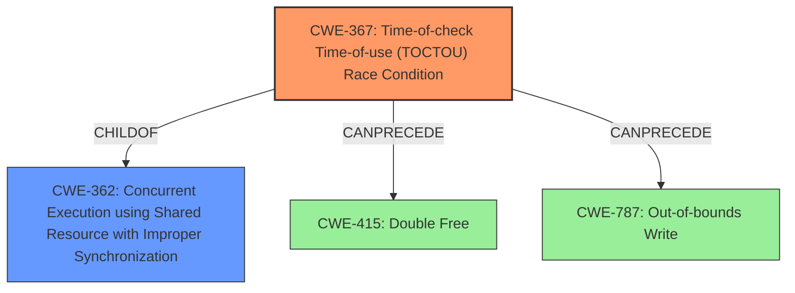

# Final Resolution for CVE-2022-22093

# Summary
| CWE ID | CWE Name | Confidence | CWE Abstraction Level | CWE Vulnerability Mapping Label | CWE-Vulnerability Mapping Notes |
|---|---|---|---|---|---|
| CWE-367 | Time-of-check Time-of-use (TOCTOU) Race Condition | 0.8 | Base | Allowed | Primary CWE. Concurrent access to IRQ management structures without proper synchronization. Potential mitigation: Implement locking mechanisms (mutexes, semaphores) to protect access. |
| CWE-415 | Double Free | 0.4 | Variant | Allowed | Secondary Candidate. Race condition could lead to freeing the same memory twice. Potential mitigation: Set pointers to NULL after freeing memory. |
| CWE-787 | Out-of-bounds Write | 0.4 | Base | Allowed | Secondary Candidate. Race condition could corrupt memory and cause an out-of-bounds write if one thread resizes a data structure while another is writing to it. Potential Mitigations: Memory protection, compiler extensions. |

## Evidence and Confidence

*   **Confidence Score:** 0.8
*   **Evidence Strength:** MEDIUM

## Relationship Analysis
The primary relationship considered was the parent-child relationship between CWE-362 (Concurrent Execution using Shared Resource with Improper Synchronization) and CWE-367 (**Time-of-check Time-of-use Race Condition**). While CWE-362 is a class, the description aligns with a more specific instance of CWE-367, so CWE-367 was chosen as the primary **WEAKNESS**. The other relationships were based on impacts due to the race condition that may result in memory corruption such as CWE-415 and CWE-787.

## Vulnerability Chain
The chain of weaknesses starts with **improper handling of concurrent hypervisor operations** (CWE-367) which leads to memory corruption (CWE-787) or a double free (CWE-415), resulting in a temporary denial of service. The **ROOT CAUSE** is the race condition (CWE-367), and the other CWEs are potential impacts.

## Summary of Analysis
The initial analysis and criticism were well-reasoned. The vulnerability description states "improper handling of concurrent hypervisor operations to attach or detach IRQs from virtual interrupt sources". This directly supports the selection of CWE-367 (**Time-of-check Time-of-use Race Condition**) because it describes the exact scenario where the resource's state (IRQ attachment) can change between the check and the use due to concurrent operations.

The analysis also considered the relationships between CWEs, specifically the hierarchical relationship between CWE-362 and CWE-367. While CWE-362 is a parent, CWE-367 is at the base level and more precisely describes the **WEAKNESS**, making it a better fit for the primary CWE.

The selection of CWE-367 is at the optimal level of specificity. It is a Base level CWE and directly addresses the race condition described in the vulnerability. Higher-level CWEs would be too general, while lower-level CWEs would require more specific information about the code implementation. The confidence score was increased to 0.8 due to the direct evidence in the vulnerability description.