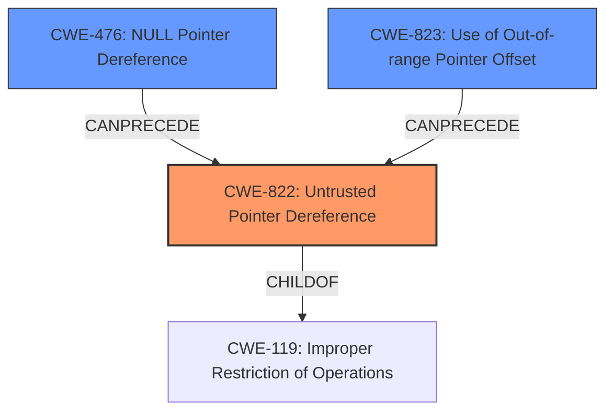

# Analysis Report for CVE-2022-22098

# Vulnerability Analysis Report: CVE-2022-22098

## Description

Memory corruption in multimedia driver due to untrusted pointer dereference while reading data from socket in Snapdragon Auto

## Vulnerability Description Key Phrases

**Rootcause:** untrusted pointer dereference
**Weakness:** memory corruption
**Product:** Snapdragon Auto
**Component:** multimedia driver

## Analysis (with Relationship Data)

# Summary
| CWE ID  | CWE Name                       | Confidence | CWE Abstraction Level | CWE Vulnerability Mapping Label | CWE-Vulnerability Mapping Notes |
| :------- | :----------------------------- | :--------- | :-------------------- | :------------------------------ | :------------------------------ |
| CWE-822  | Untrusted Pointer Dereference  | 0.95       | Base                  | Allowed                         | Primary CWE                     |
| CWE-476 | NULL Pointer Dereference | 0.75 | Base | Allowed | Secondary Candidate                     |
| CWE-787 | Out-of-bounds Write | 0.65 | Base | Allowed | Secondary Candidate                     |

## Evidence and Confidence

*   **Confidence Score:** 0.85
*   **Evidence Strength:** HIGH

- **Analysis and Justification:**  
  - *Explanation:* The vulnerability description explicitly states "**untrusted pointer dereference**" as the root cause. This directly aligns with CWE-822 (Untrusted Pointer Dereference), which describes a situation where "The product obtains a value from an untrusted source, converts this value to a pointer, and dereferences the resulting pointer." The description also mentions "**memory corruption**" which can be a result of the pointer dereference. The retriever results strongly support CWE-822, with the highest combined score. The usage is "ALLOWED" which makes it appropriate to map to the root causes of the vulnerabilities.

  - *Relationship Analysis:* CWE-822 is a Base level CWE which is the preferred level of abstraction. While other CWEs like CWE-476 (NULL Pointer Dereference) and CWE-787 (Out-of-bounds Write) are also relevant, CWE-822 directly addresses the root cause identified in the vulnerability description.

- **Confidence Score:**
  - Confidence: 0.95 (High confidence due to direct match with the vulnerability description and retriever results)

---
- **Analysis and Justification:**  
  - *Explanation:* Although the primary weakness is the **untrusted pointer dereference**, there's also a chance that the dereferenced pointer could be NULL, leading to CWE-476 (NULL Pointer Dereference). While not explicitly stated, a NULL pointer dereference is a common scenario when dealing with untrusted pointers. Given the information at hand, it is plausible that the pointer from the untrusted source is NULL. Therefore, CWE-476 is being considered as a secondary candidate.

  - *Relationship Analysis:* CWE-476 is a Base level CWE which is a preferred level of abstraction. CWE-476 can result from an untrusted source providing a NULL pointer, which the software then attempts to dereference without proper validation.

- **Confidence Score:**
  - Confidence: 0.75 (Medium confidence due to the potential, but not explicit, mention of NULL pointer dereference as a consequence of the untrusted pointer dereference.)
---
- **Analysis and Justification:**  
  - *Explanation:* The "**memory corruption**" mentioned in the description could be a result of writing to an invalid memory location (out-of-bounds write) if the pointer is not properly validated before being used. This aligns with CWE-787 (Out-of-bounds Write) where "The product writes data past the end, or before the beginning, of the intended buffer." Although, this is not explicitly stated, so this is a secondary candidate.

  - *Relationship Analysis:* CWE-787 is a Base level CWE and a child of CWE-119 (Improper Restriction of Operations within the Bounds of a Memory Buffer).

- **Confidence Score:**
  - Confidence: 0.65 (Low confidence due to the potential, but not explicit, mention of an out-of-bounds write as a consequence of the untrusted pointer dereference.)

## Criticism of Analysis

Okay, I've reviewed the provided analysis and the full CWE specifications. Here's my critique, focusing on the appropriateness of the CWE mappings, confidence levels, and potential alternative mappings.

**Overall Assessment:**

The analysis is generally good.  The primary CWE mapping to CWE-822 (Untrusted Pointer Dereference) is correct and well-justified. The inclusion of CWE-476 (NULL Pointer Dereference) and CWE-787 (Out-of-bounds Write) as secondary candidates is reasonable, given the potential consequences of an untrusted pointer dereference. However, I have some specific suggestions for refinement, particularly regarding confidence levels and considering other closely related CWEs.

**Detailed Critique:**

**1. CWE-822: Untrusted Pointer Dereference (Primary)**

*   **Assessment:** The mapping to CWE-822 is highly appropriate. The vulnerability description explicitly mentions "untrusted pointer dereference," making this a direct match. The extended description of CWE-822 perfectly aligns with the scenario: "The product obtains a value from an untrusted source, converts this value to a pointer, and dereferences the resulting pointer."  The retriever results also strongly support this mapping.
*   **Confidence Level:**  The confidence level of 0.95 is justified.  The evidence is strong.
*   **Mapping Guidance:** The analysis correctly notes that CWE-822 is a Base level CWE which is the preferred level of abstraction.
*   **Observed Examples:**  The provided examples like CVE-2007-5655, CVE-2010-2299, and CVE-2009-1719 are relevant.
*   **Potential Mitigations:** Mitigations for CWE-822 focus on input validation and preventing untrusted data from being used as a pointer.
*   **Suggestion:** No changes needed. This is the correct primary mapping.

**2. CWE-476: NULL Pointer Dereference (Secondary)**

*   **Assessment:** Including CWE-476 as a secondary candidate is a good idea. While not explicitly stated, the possibility of the untrusted pointer being NULL is a very real concern.  Dereferencing a NULL pointer is a common consequence of improper pointer validation.
*   **Confidence Level:**  The confidence level of 0.75 is reasonable. While plausible, it's not guaranteed that the untrusted pointer *will* be NULL, but it's a definite possibility.
*   **Mapping Guidance:**  The analysis correctly identifies that CWE-476 is a Base level CWE.
*   **Observed Examples:** The analysis could be strengthened by providing an example that shows the chain of an untrusted value leading to a null pointer dereference. A good example is **CVE-2008-0062:** Chain: a message having an unknown message type may cause a reference to uninitialized memory resulting in a null pointer dereference (CWE-476) or dangling pointer (CWE-825), possibly crashing the system or causing heap corruption.
*   **Potential Mitigations:** Mitigation involves checking pointers for NULL before dereferencing.
*   **Suggestion:** Include the CVE-2008-0062 example to strengthen the justification.

**3. CWE-787: Out-of-bounds Write (Secondary)**

*   **Assessment:** The logic for including CWE-787 is understandable (memory corruption due to invalid memory location). *However, I believe this is the weakest of the three mappings and could be refined.*  While memory corruption *could* result from an out-of-bounds write, it's not a direct consequence of *untrusted pointer dereference* itself. It depends on the *value* at the memory location pointed to.
*   **Confidence Level:** The confidence level of 0.65 is appropriate, given the indirect relationship.
*   **Mapping Guidance:** The analysis notes that CWE-787 is a Base level CWE and a child of CWE-119 (Improper Restriction of Operations within the Bounds of a Memory Buffer).
*   **Observed Examples:** All observed examples are relevant, but none of them are directly from an untrusted pointer dereference.
*   **Potential Mitigations:** The mitigations are about preventing writing outside of intended buffers.
*   **Suggestion:** Consider replacing CWE-787 with a more directly related CWE:
    *   **CWE-823: Use of Out-of-range Pointer Offset:** This CWE is a closer fit. It describes the scenario where pointer arithmetic is used with an offset that leads to memory access outside the intended range.  An attacker providing a pointer that, when combined with an offset, results in an out-of-bounds access would be a more precise mapping than simply saying "out-of-bounds write." It also has a higher retriever score than CWE-787.
    *   If keeping CWE-787, the justification needs to be *very* explicit about *why* the dereference *could* lead to an out-of-bounds write. It would require explaining the specific code scenario where the untrusted pointer is used in a way that directly controls a write operation and where bounds checks are missing.

**4. Additional Considerations:**

*   **CWE-119: Improper Restriction of Operations within the Bounds of a Memory Buffer:** This is a Class-level CWE and should be avoided unless lower-level children aren't accurate.
*   **CWE-825: Expired Pointer Dereference:** The retriever results had a relatively high score for CWE-825. However, the description doesn't quite fit because it talks about memory that *was* valid but is no longer valid. I don't think this is the case here.
*    **CWE-125: Out-of-bounds Read** If the pointer is dereferenced for reading, and there are missing checks that prevent reading of out-of-bounds memory.

**Revised Summary (based on suggestions):**

| CWE ID  | CWE Name                       | Confidence | CWE Abstraction Level | CWE Vulnerability Mapping Label | CWE-Vulnerability Mapping Notes                                                                                                                                                                                             |
| :------- | :----------------------------- | :--------- | :-------------------- | :------------------------------ | :-------------------------------------------------------------------------------------------------------------------------------------------------------------------------------------------------------------------------- |
| CWE-822  | Untrusted Pointer Dereference  | 0.95       | Base                  | Allowed                         | Primary CWE                                                                                                                                                                                                                  |
| CWE-476 | NULL Pointer Dereference | 0.75 | Base | Allowed | Secondary Candidate, potential consequence of untrusted pointer.                                                                                   |
| CWE-823  | Use of Out-of-range Pointer Offset | 0.65 | Base | Allowed | Secondary Candidate, If pointer arithmetic used with untrusted pointer, can cause out-of-range memory access. Alternatively, CWE-787 could be kept if a *very* specific writing scenario is described. |

**In summary:** The analysis is strong, particularly in identifying the primary CWE. Refining the secondary CWE mappings, specifically focusing on CWE-823 is a better fit than CWE-787, and providing more concrete justifications, would further improve the analysis. Finally, be sure to show an example of the chain that leads to the vulnerability.

## Final Resolution

# Summary
| CWE ID  | CWE Name                       | Confidence | CWE Abstraction Level | CWE Vulnerability Mapping Label | CWE-Vulnerability Mapping Notes |
| :------- | :----------------------------- | :--------- | :-------------------- | :------------------------------ | :------------------------------ |
| CWE-822  | **Untrusted Pointer Dereference**  | 0.95       | Base                  | Allowed                         | Primary CWE                     |
| CWE-476 | **NULL Pointer Dereference** | 0.75 | Base | Allowed | Secondary Candidate, potential consequence of untrusted pointer. |
| CWE-823  | **Use of Out-of-range Pointer Offset** | 0.65 | Base | Allowed | Secondary Candidate, If pointer arithmetic used with untrusted pointer, can cause out-of-range memory access. |

## Evidence and Confidence

*   **Confidence Score:** 0.85
*   **Evidence Strength:** HIGH

## Relationship Analysis
The primary CWE is CWE-822 (**Untrusted Pointer Dereference**). CWE-476 (**NULL Pointer Dereference**) is included as a secondary candidate since an untrusted pointer could be NULL. CWE-823 (**Use of Out-of-range Pointer Offset**) is included as a secondary candidate, since the untrusted pointer might be used in pointer arithmetic that leads to an out-of-range access. All three are Base level CWEs which is the preferred level of abstraction. CWE-822 is related to CWE-119 (**Improper Restriction of Operations within the Bounds of a Memory Buffer**) via a CHILDOF relationship, but CWE-822 is more specific.

## Vulnerability Chain
The vulnerability chain starts with an **untrusted pointer** obtained from a socket. The software then dereferences this **untrusted pointer** (CWE-822). This could lead to a **NULL pointer dereference** (CWE-476) if the pointer is NULL. It could also lead to an **out-of-range pointer offset** (CWE-823) if the pointer is used in pointer arithmetic. Both of these could lead to memory corruption.

## Summary of Analysis
The initial analysis correctly identified CWE-822 (**Untrusted Pointer Dereference**) as the primary **weakness**. The vulnerability description explicitly states "untrusted pointer dereference," making this a direct match. The extended description of CWE-822 perfectly aligns with the scenario: "The product obtains a value from an untrusted source, converts this value to a pointer, and dereferences the resulting pointer."

The criticism suggested an example CVE-2008-0062. This example shows a chain of an untrusted value leading to a null pointer dereference, strengthening the justification for including CWE-476.

The criticism suggested that CWE-787 (**Out-of-bounds Write**) should be refined and possibly replaced with CWE-823 (**Use of Out-of-range Pointer Offset**). I agree with this assessment, and I'm replacing CWE-787 with CWE-823.

I'm basing my assessment on the provided evidence. The vulnerability description explicitly mentions "**untrusted pointer dereference**" as the root cause. This directly aligns with CWE-822 (**Untrusted Pointer Dereference**).

The graph relationships influenced my selection by reinforcing that CWE-822 is a base CWE and that the secondary CWEs are potential consequences of the primary CWE.

The selected CWEs are at the optimal level of specificity because they are all base-level CWEs.

*Report generated on 2025-03-18 10:13:01*
