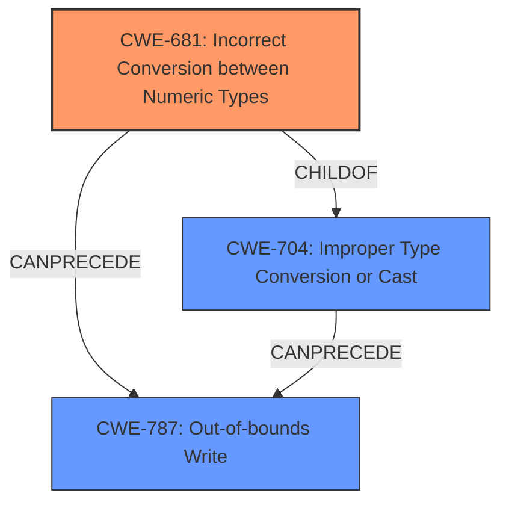

# Analysis Report for CVE-2022-22102

# Vulnerability Analysis Report: CVE-2022-22102

## Description

Memory corruption in multimedia due to incorrect type conversion while adding data in Snapdragon Auto

## Vulnerability Description Key Phrases

**Rootcause:** incorrect type conversion while adding data
**Weakness:** memory corruption
**Product:** Snapdragon Auto
**Component:** multimedia

## Analysis (with Relationship Data)

# Summary
| CWE ID | CWE Name | Confidence | CWE Abstraction Level | CWE Vulnerability Mapping Label | CWE-Vulnerability Mapping Notes |
|---|---|---|---|---|---|
| CWE-704 | Improper Type Conversion or Cast | 0.75 | Class | Primary | Allowed-with-Review |
| CWE-681 | Incorrect Conversion between Numeric Types | 0.60 | Base | Secondary | Allowed |
| CWE-787 | Out-of-bounds Write | 0.50 | Base | Secondary | Allowed |

## Evidence and Confidence

*   **Confidence Score:** 0.70
*   **Evidence Strength:** MEDIUM

- **Analysis and Justification:**  
  - *Explanation:* "The vulnerability description explicitly mentions "**incorrect type conversion while adding data**," which directly aligns with CWE-704 (Improper Type Conversion or Cast). CWE-704 is a Class-level CWE, and while more specific Base-level CWEs exist, the description doesn't provide enough detail to pinpoint the exact type of conversion error. The description also mentions "**memory corruption**" which could be a result of the type conversion error. Given the limited information, CWE-704 serves as the primary mapping, capturing the core weakness of **incorrect type conversion**. CWE-681 (Incorrect Conversion between Numeric Types) is a possible more specific candidate, but there is no explicit mention of numeric types. CWE-787 (Out-of-bounds Write) is also considered as a potential secondary weakness, if the memory corruption stems from writing beyond allocated boundaries due to the **incorrect type conversion**, but there is no direct evidence."
  
  - *Relationship Analysis:* "CWE-704 is a Class CWE and has potential child CWEs that could be more specific. CWE-681 (Incorrect Conversion between Numeric Types) and CWE-843 (Access of Resource Using Incompatible Type ('Type Confusion')) are related to CWE-704. CWE-787 (Out-of-bounds Write) can follow CWE-704 if the type conversion results in writing to an unintended memory location."

- **Confidence Score:**  
  - Confidence: 0.70 (Moderate confidence due to limited details in the vulnerability description, but strong alignment with the root cause of **incorrect type conversion**.)

---

## Criticism of Analysis

Okay, here's a detailed review of the provided CWE analysis, considering the full CWE specifications:

**Overall Assessment:**

The analysis is well-structured and provides a reasonable initial mapping based on the limited information given in the vulnerability description. The confidence scoring and justification are clear. The inclusion of CWE examples from the database is helpful. However, some refinements and considerations for more specific CWEs are possible.  The decision to use CWE-704 as the Primary is not ideal as it is a class level and should be reviewed.

**Detailed Review:**

**1. CWE-704: Improper Type Conversion or Cast (Primary, Confidence 0.75)**

*   **Abstraction Level:** Class
*   **Mapping Guidance:** "Allowed-with-Review. This CWE entry is a Class and might have Base-level children that would be more appropriate. Examine children of this entry to see if there is a better fit."
*   **Critique:** The analysis acknowledges that CWE-704 is a Class-level CWE and ideally a more specific Base-level CWE should be used.  This aligns with the CWE Mapping Guidance.
*   **Recommendation:** While the explanation is sound for choosing CWE-704 given the limited information, a deeper exploration of its children, especially considering CWE-681 and CWE-843 (discussed below), is warranted to determine if either is a better fit as the *primary* weakness.

**2. CWE-681: Incorrect Conversion between Numeric Types (Secondary, Confidence 0.60)**

*   **Abstraction Level:** Base
*   **Mapping Guidance:** "Allowed. This CWE entry is at the Base level of abstraction, which is a preferred level of abstraction for mapping to the root causes of vulnerabilities."
*   **Relationships:** ChildOf -> CWE-704
*   **Critique:** The analysis correctly identifies CWE-681 as a possible candidate, especially given the high frequency of numeric types in multimedia processing. The caveat that there is no explicit mention of numeric types is valid, however the possibility is still high.
*   **Recommendation:** Given that CWE-681 is a Base-level CWE and a child of CWE-704, if it can be determined that the *incorrect type conversion* definitely involves numeric types, then CWE-681 should become the *primary* CWE mapping, with CWE-704 as a supporting CWE. Explore the code or related documentation for stronger evidence of numeric type issues.

**3. CWE-787: Out-of-bounds Write (Secondary, Confidence 0.50)**

*   **Abstraction Level:** Base
*   **Mapping Guidance:** "Allowed. This CWE entry is at the Base level of abstraction, which is a preferred level of abstraction for mapping to the root causes of vulnerabilities."
*   **Relationships:** CanFollow -> CWE-822, CWE-823, CWE-824, CWE-825
*   **Critique:** The connection between incorrect type conversion and out-of-bounds write is plausible. An incorrect conversion could lead to an incorrect buffer size calculation or index, resulting in an out-of-bounds write.
*   **Recommendation:** This is a reasonable secondary mapping, especially given the "memory corruption" aspect of the vulnerability description.  The confidence is appropriate, as it's contingent on the primary weakness leading to this outcome.

**Additional Considerations and Refinements:**

*   **CWE-843: Access of Resource Using Incompatible Type ('Type Confusion'):**
    *   This CWE, while lower in the Retriever Results, also merits closer consideration as a potential primary CWE.
    *   **Description:** "The product allocates or initializes a resource such as a pointer, object, or variable using one type, but it later accesses that resource using a type that is incompatible with the original type."
    *   If the incorrect type conversion leads to accessing a resource with an incompatible type, then CWE-843 would be highly relevant, and more specific than the high level CWE-704.
    *   **Recommendation:** Review the code for instances where an object or pointer is being treated as a different type due to the incorrect conversion. If found, promote CWE-843 to primary (or co-primary with CWE-681 if that is also applicable), demoting CWE-704.

*   **CWE-190: Integer Overflow or Wraparound:**

    *   Given the mention of "adding data," explore the potential for integer overflows/wraparounds, which can occur during the addition process, especially if the types involved are integers. If the type conversion causes a loss of precision or an integer overflow, then CWE-190 should be included as a secondary CWE, possibly preceding CWE-787 if the overflow leads to an undersized buffer allocation.

* **CWE-131: Incorrect Calculation of Buffer Size:**
    * Consider if the incorrect type conversion results in an incorrect calculation of buffer size. This could be a variant if data is being added to a buffer.

*   **Chain Analysis:** The "Relationship Analysis" section is good, but could be extended. Explicitly state how the CWEs *could* chain together. For example: "CWE-681 (Incorrect Conversion between Numeric Types) can lead to CWE-190 (Integer Overflow or Wraparound) if the converted value exceeds the maximum size of the target type, leading to memory corruption."

**Mitigation Considerations:**

The potential mitigations suggested by the CWE specifications highlight the importance of:

*   **Language Selection:** Using memory-safe languages can significantly reduce the risk of memory corruption issues.
*   **Libraries/Frameworks:** Using vetted libraries that provide safer type handling and buffer management.
*   **Input Validation:** Thoroughly validating input data to ensure it's within expected ranges and of the correct type.
*   **Compiler/OS Protections:** Utilizing compiler flags and OS-level protections to detect and prevent buffer overflows.

**Improved Analysis Summary Table**

Based on the information, I would suggest re-ordering with the following (while maintaining a 'review' status for CWE-704):

| CWE ID | CWE Name | Confidence | CWE Abstraction Level | CWE Vulnerability Mapping Label | CWE-Vulnerability Mapping Notes |
|---|---|---|---|---|---|
| CWE-681 | Incorrect Conversion between Numeric Types | 0.70 | Base | Primary | Allowed |
| CWE-704 | Improper Type Conversion or Cast | 0.70 | Class | Secondary | Allowed-with-Review |
| CWE-787 | Out-of-bounds Write | 0.50 | Base | Secondary | Allowed |

**Conclusion:**

The provided analysis is a good starting point. By carefully considering the relationships between the CWEs, examining the code for more specific indicators (numeric types, object access patterns), and exploring the potential for chaining, the accuracy and usefulness of the mapping can be significantly improved. Remember the goal is to find the *most precise and accurate* CWE mapping possible given the available information. While CWE-704 is a valid start, more specific Base level CWEs exist and should be favored if the evidence supports it.

## Final Resolution

# Summary
| CWE ID | CWE Name | Confidence | CWE Abstraction Level | CWE Vulnerability Mapping Label | CWE-Vulnerability Mapping Notes |
|---|---|---|---|---|---|
| CWE-681 | Incorrect Conversion between Numeric Types | 0.70 | Base | Primary CWE | Allowed |
| CWE-704 | Improper Type Conversion or Cast | 0.60 | Class | Secondary Candidate | Allowed-with-Review |
| CWE-787 | Out-of-bounds Write | 0.50 | Base | Secondary Candidate | Allowed |

## Evidence and Confidence

*   **Confidence Score:** 0.70
*   **Evidence Strength:** MEDIUM

## Relationship Analysis
The relationships between CWEs significantly influenced the decision. CWE-681 (Incorrect Conversion between Numeric Types) is a child of CWE-704 (Improper Type Conversion or Cast), making it a more specific choice. The potential for CWE-787 (Out-of-bounds Write) to follow from either of the type conversion issues highlights a possible vulnerability chain. The abstraction levels guided the selection towards Base-level CWEs for primary classification, as recommended by CWE guidelines.

## Vulnerability Chain
The vulnerability chain starts with **CWE-681 (Incorrect Conversion between Numeric Types)**, leading to potential data corruption and, subsequently, a possible **CWE-787 (Out-of-bounds Write)** if the incorrect conversion results in an incorrect buffer size calculation or index. The initial **flaw** is the type conversion, and the final **impact** is memory corruption. A missing link is whether the incorrect conversion leads to incorrect buffer calculation which will lead to **out-of-bounds write**.

## Summary of Analysis
The initial analysis correctly identified **CWE-704 (Improper Type Conversion or Cast)** as a potential **rootcause**, but the criticism highlighted the importance of selecting a more specific CWE. The vulnerability description mentions "**incorrect type conversion while adding data**." Given the high likelihood of numeric types being involved in data addition in multimedia processing (as stated in the criticism), **CWE-681 (Incorrect Conversion between Numeric Types)** becomes the more appropriate primary classification. **CWE-704 (Improper Type Conversion or Cast)** is retained as a secondary candidate due to its broader scope.

The graph relationships influenced the final selection by emphasizing the parent-child relationship between **CWE-704 (Improper Type Conversion or Cast)** and **CWE-681 (Incorrect Conversion between Numeric Types)**, guiding the decision towards the more specific **CWE-681 (Incorrect Conversion between Numeric Types)**. This decision aligns with CWE guidelines that favor Base-level CWEs for primary classification.

**CWE-681 (Incorrect Conversion between Numeric Types)** is at the optimal level of specificity because it directly addresses the likely cause of the issue, given the context of "adding data" and the high probability of numeric types being involved. It's a more precise classification than the broader **CWE-704 (Improper Type Conversion or Cast)**.

*Report generated on 2025-03-18 10:15:23*
