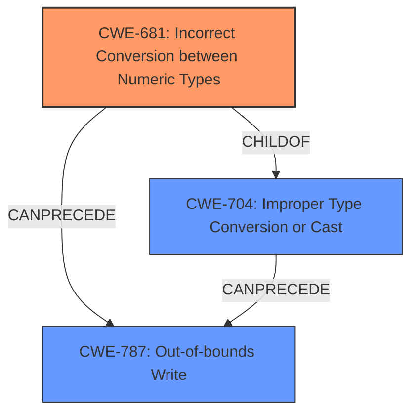

# Final Resolution for CVE-2022-22102

# Summary
| CWE ID | CWE Name | Confidence | CWE Abstraction Level | CWE Vulnerability Mapping Label | CWE-Vulnerability Mapping Notes |
|---|---|---|---|---|---|
| CWE-681 | Incorrect Conversion between Numeric Types | 0.70 | Base | Primary CWE | Allowed |
| CWE-704 | Improper Type Conversion or Cast | 0.60 | Class | Secondary Candidate | Allowed-with-Review |
| CWE-787 | Out-of-bounds Write | 0.50 | Base | Secondary Candidate | Allowed |

## Evidence and Confidence

*   **Confidence Score:** 0.70
*   **Evidence Strength:** MEDIUM

## Relationship Analysis
The relationships between CWEs significantly influenced the decision. CWE-681 (Incorrect Conversion between Numeric Types) is a child of CWE-704 (Improper Type Conversion or Cast), making it a more specific choice. The potential for CWE-787 (Out-of-bounds Write) to follow from either of the type conversion issues highlights a possible vulnerability chain. The abstraction levels guided the selection towards Base-level CWEs for primary classification, as recommended by CWE guidelines.

## Vulnerability Chain
The vulnerability chain starts with **CWE-681 (Incorrect Conversion between Numeric Types)**, leading to potential data corruption and, subsequently, a possible **CWE-787 (Out-of-bounds Write)** if the incorrect conversion results in an incorrect buffer size calculation or index. The initial **flaw** is the type conversion, and the final **impact** is memory corruption. A missing link is whether the incorrect conversion leads to incorrect buffer calculation which will lead to **out-of-bounds write**.

## Summary of Analysis
The initial analysis correctly identified **CWE-704 (Improper Type Conversion or Cast)** as a potential **rootcause**, but the criticism highlighted the importance of selecting a more specific CWE. The vulnerability description mentions "**incorrect type conversion while adding data**." Given the high likelihood of numeric types being involved in data addition in multimedia processing (as stated in the criticism), **CWE-681 (Incorrect Conversion between Numeric Types)** becomes the more appropriate primary classification. **CWE-704 (Improper Type Conversion or Cast)** is retained as a secondary candidate due to its broader scope.

The graph relationships influenced the final selection by emphasizing the parent-child relationship between **CWE-704 (Improper Type Conversion or Cast)** and **CWE-681 (Incorrect Conversion between Numeric Types)**, guiding the decision towards the more specific **CWE-681 (Incorrect Conversion between Numeric Types)**. This decision aligns with CWE guidelines that favor Base-level CWEs for primary classification.

**CWE-681 (Incorrect Conversion between Numeric Types)** is at the optimal level of specificity because it directly addresses the likely cause of the issue, given the context of "adding data" and the high probability of numeric types being involved. It's a more precise classification than the broader **CWE-704 (Improper Type Conversion or Cast)**.