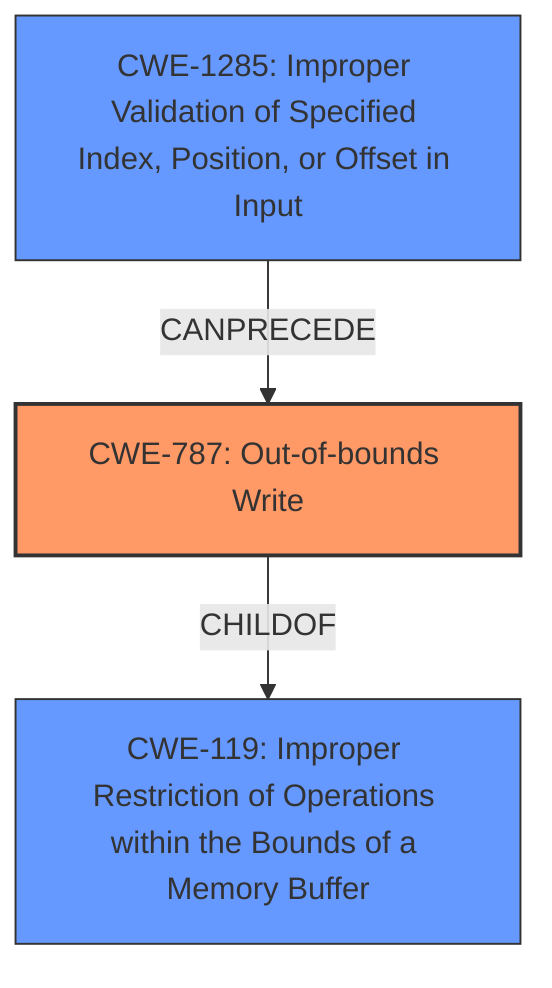

# Final Resolution for CVE-2022-22104

# Summary
| CWE ID | CWE Name | Confidence | CWE Abstraction Level | CWE Vulnerability Mapping Label | CWE-Vulnerability Mapping Notes |
|---|---|---|---|---|---|
| CWE-787 | Out-of-bounds Write | 0.75 | Base | Allowed | Primary CWE: The vulnerability results in memory corruption due to writing data past the end of the intended buffer. |
| CWE-1285 | Improper Validation of Specified Index, Position, or Offset in Input | 0.75 | Base | Allowed | Secondary Candidate: The vulnerability stems from an **improper check on the messages received**, which can lead to an out-of-bounds write. Implementing an **accept known good** input validation strategy can mitigate the vulnerability. |

## Evidence and Confidence

*   **Confidence Score:** 0.75
*   **Evidence Strength:** MEDIUM

## Relationship Analysis
The primary relationship impacting the decision is the CANPRECEDE relationship where CWE-1285 (Improper Validation of Specified Index, Position, or Offset in Input) can precede CWE-787 (Out-of-bounds Write). CWE-787 also has a CHILDOF relationship with CWE-119 (Improper Restriction of Operations within the Bounds of a Memory Buffer). The selection of CWE-787 and CWE-1285 is at the Base abstraction level, providing sufficient specificity.

## Vulnerability Chain
The vulnerability chain begins with CWE-1285 (Improper Validation of Specified Index, Position, or Offset in Input) where the **improper check on the messages received** leads to an unvalidated index or offset. This lack of validation then results in CWE-787 (Out-of-bounds Write), as the program writes data outside the intended buffer, causing **memory corruption**.

## Summary of Analysis
The initial analysis and the criticism both agree on the relevance of CWE-787 and CWE-1285. The vulnerability description states "Memory corruption in multimedia due to **improper check on the messages received**." This provides direct evidence for both **memory corruption** (CWE-787) and **improper checks** which lead to validation issues on the messages (CWE-1285).

The graph relationships influenced the final selection by confirming that CWE-1285 can logically precede CWE-787. The abstraction levels are optimal, as both CWEs are at the Base level, providing specific details about the vulnerability. The increased confidence in CWE-1285 is justified by its role as the root cause of the out-of-bounds write. I did not select any of the others because they were not clearly supported by the evidence.

The final decision is based on the provided evidence and the graph relationships, ensuring that the selected CWEs accurately represent the vulnerability.