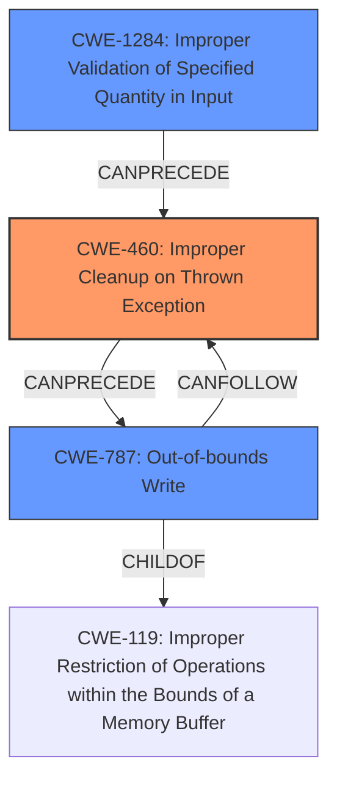

# Final Resolution for CVE-2022-22150

# Summary
| CWE ID | CWE Name | Confidence | CWE Abstraction Level | CWE Vulnerability Mapping Label | CWE-Vulnerability Mapping Notes |
|---|---|---|---|---|---|
| CWE-460 | Improper Cleanup on Thrown Exception | 0.9 | Base | Primary | Allowed |
| CWE-787 | Out-of-bounds Write | 0.7 | Base | Secondary Candidate | Allowed |
| CWE-1284 | Improper Validation of Specified Quantity in Input | 0.5 | Base | Secondary Candidate | Allowed |

## Evidence and Confidence

*   **Confidence Score:** 0.8
*   **Evidence Strength:** MEDIUM

## Relationship Analysis
The primary relationship impacting the decision is the causal one, where **CWE-460** (Improper Cleanup on Thrown Exception) leads to **CWE-787** (Out-of-bounds Write). **CWE-787** is a child of **CWE-119** (Improper Restriction of Operations within the Bounds of a Memory Buffer), indicating that it's a specific type of buffer-related error. Also, `getPageNthWordQuads` is called with an invalid parameter, making **CWE-1284** (Improper Validation of Specified Quantity in Input) a strong secondary candidate, because the exception is being thrown due to the invalid input parameter.

## Vulnerability Chain
The vulnerability chain starts with calling the `getPageNthWordQuads` method with an invalid parameter. This leads to **CWE-1284**, because the input is not properly validated. Then a C++ exception is thrown, but it is not properly handled, leading to **CWE-460** (**rootcause**). This results in an inconsistent engine state and finally leads to **CWE-787** (**memory corruption**).

## Summary of Analysis
The initial analysis and criticism are well-reasoned and accurate. The primary **WEAKNESS** is indeed the **improper exception handling (CWE-460)**, as the vulnerability description explicitly mentions this. The secondary candidate, **CWE-787**, is the consequence of this **rootcause**, representing the **memory corruption**. The suggestion to clarify the relationship between the **CWEs** as a causal one is valid and makes the analysis clearer. However, the analysis did not consider that the exception is thrown due to invalid input. Therefore, I am adding **CWE-1284** to the secondary candidates.

The graph relationships confirm this, with **CWE-460** potentially leading to **CWE-787**. The abstraction levels are also appropriate, as both **CWE-460** and **CWE-787** are at the Base level.

The final decision is to keep **CWE-460** as the primary **WEAKNESS**, as it's the **rootcause** of the vulnerability. **CWE-787** remains as a secondary candidate because it's the consequence of the improper exception handling. Also, **CWE-1284** is being added as a secondary candidate because the invalid input leads to the exception. This classification provides the optimal level of specificity, reflecting both the **rootcause** and the resulting impact. The confidence score remains at 0.8, as it is still highly likely that this is related to the exception handling, but there is sufficient evidence to show that invalid input also plays a role.

The evidence supporting this decision is from the vulnerability description: "A specially-crafted PDF document can trigger an exception which is improperly handled, leaving the engine in an invalid state, which can lead to memory corruption and arbitrary code execution... calling the `getPageNthWordQuads` method with an invalid parameter."