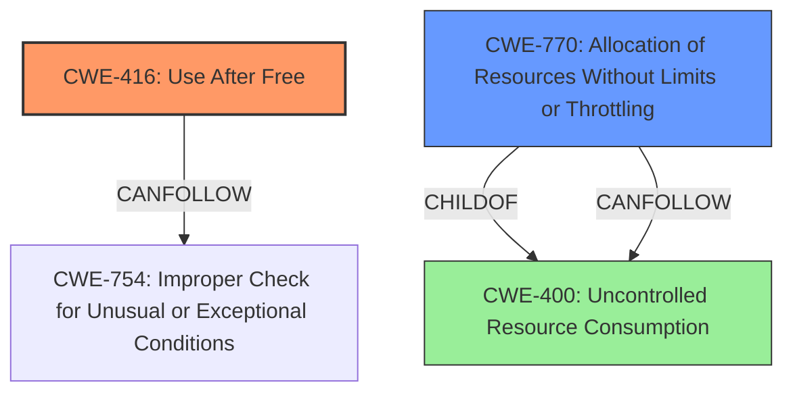

# Final Resolution for CVE-2022-22208

# Summary
| CWE ID | CWE Name | Confidence | CWE Abstraction Level | CWE Vulnerability Mapping Label | CWE-Vulnerability Mapping Notes |
|---|---|---|---|---|---|
| CWE-416 | Use After Free | 0.9 | Variant | Primary | Allowed |
| CWE-770 | Allocation of Resources Without Limits or Throttling | 0.6 | Base | Secondary | Allowed |

## Evidence and Confidence

*   **Confidence Score:** 0.8
*   **Evidence Strength:** MEDIUM

## Relationship Analysis
The primary weakness is **CWE-416 (Use After Free)**, a variant of a memory management issue. The secondary weakness identified is **CWE-770 (Allocation of Resources Without Limits or Throttling)**. The BGP session flapping may trigger both the **CWE-416** condition and contribute to excessive resource allocation. **CWE-400 (Uncontrolled Resource Consumption)** was considered, but its higher abstraction level makes it less suitable than **CWE-770**.

## Vulnerability Chain
The vulnerability chain starts with BGP session flapping. This leads to **CWE-416 (Use After Free)**, where memory is accessed after being freed, resulting in a crash. Simultaneously, the BGP session flapping can contribute to excessive resource allocation without proper limits (**CWE-770**), potentially exacerbating the denial-of-service condition. The **Use After Free** can also cause a crash/restart loop which further consumes resources.

## Summary of Analysis
The initial analysis correctly identified **CWE-416 (Use After Free)** as the primary **WEAKNESS**. The vulnerability description explicitly states: "When a BGP session flap happens, a **Use After Free** of a memory location that was assigned to another object can occur, which will lead to an rpd crash."

The criticism suggested strengthening the justification for **CWE-410** or replacing it with **CWE-770**. After reviewing the vulnerability description and considering the relationship between BGP session flapping and resource consumption, **CWE-770 (Allocation of Resources Without Limits or Throttling)** is a more appropriate secondary CWE than **CWE-410 (Insufficient Resource Pool)**. The continuous flapping leads to the allocation of resources without proper throttling, contributing to the denial-of-service condition.

The decision to use **CWE-770** is based on the understanding that the continuous BGP session flaps cause the system to allocate more resources, and the lack of limits on these allocations contributes to the DoS. This is more directly related to the vulnerability description than an insufficient resource pool, which might be a consequence but not a direct cause.

**CWE-400 (Uncontrolled Resource Consumption)** is too high-level and doesn't accurately capture the specific **ROOTCAUSE**. **CWE-770** is a more specific Base-level CWE that aligns with the vulnerability.