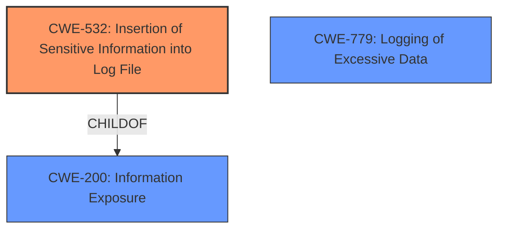

# Analysis Report for CVE-2022-22291

# Vulnerability Analysis Report: CVE-2022-22291

## Description

Logging of excessive data vulnerability in telephony prior to SMR Feb-2022 Release 1 allows privileged attackers to get Cell Location Information through log of user device.

## Vulnerability Description Key Phrases

**Rootcause:** Logging of excessive data
**Impact:** get Cell Location Information
**Attacker:** privileged attackers
**Product:** telephony
**Version:** prior to SMR Feb-2022 Release 1

## Analysis (with Relationship Data)

# Summary
| CWE ID  | CWE Name                               | Confidence | CWE Abstraction Level | CWE Vulnerability Mapping Label | CWE-Vulnerability Mapping Notes |
| ------- | -------------------------------------- | ---------- | --------------------- | ------------------------------- | ----------------------------- |
| CWE-532 | Insertion of Sensitive Information into Log File | 0.85       | Base                  | Allowed                         |                               |

## Evidence and Confidence

*   **Confidence Score:** 0.85
*   **Evidence Strength:** HIGH

- **Analysis and Justification:**
  - *Explanation:* The vulnerability description explicitly states "**Logging of excessive data**" leading to a privileged attacker being able to get "Cell Location Information". This directly aligns with CWE-532 "Insertion of Sensitive Information into Log File", which is a Base level CWE and therefore preferred. The "CVE Reference Links Content Summary" section also confirms the **rootcause** as "Logging of excessive data vulnerability in telephony" and the **weakness** as "Logging of excessive data." The impact is that "Privileged attackers can get Cell Location Information through log of user device."
  - *Relationship Analysis:* CWE-532 is related to information exposure, which is a child of CWE-200, but this vulnerability is not just information exposure, but specifically logging of sensitive information.

- **Confidence Score:**
  - Confidence: 0.85 (High confidence due to explicit mention of logging sensitive information in the vulnerability description and confirmation in CVE reference links)

## Criticism of Analysis

Okay, let's review the provided analysis in light of the full CWE specifications.

**Overall Assessment:**

The analysis correctly identifies `CWE-532: Insertion of Sensitive Information into Log File` as the primary weakness. The rationale is strong and well-supported by the vulnerability description and CVE summaries. The confidence score of 0.85 is justified.

**Detailed Critique:**

*   **CWE-532 Justification:** The analysis does a good job of explaining why CWE-532 is the most appropriate choice. It directly addresses the core issue: sensitive data (Cell Location Information) is being written to a log file, making it accessible to privileged attackers. This aligns perfectly with the CWE-532 description.

*   **Addressing Alternative CWEs and the Reasoning:**
    *   **CWE-200:** The analysis correctly notes that CWE-532 is a child of CWE-200 but is more specific and therefore preferred. It acknowledges that while the *impact* is information exposure, the *root cause* is the logging of that sensitive information. This demonstrates an understanding of the CWE guidelines regarding the misuse of CWE-200 and selecting more granular CWEs when available.
    *   **CWE-779:** The analysis doesn't specifically address CWE-779 (Logging of Excessive Data), which is also flagged by the retriever results. While the vulnerability description *implies* excessive data, the core problem isn't necessarily the *volume* of the data but the *sensitivity* of what's being logged.  It's plausible the logging might be minimal but still create a vulnerability due to the sensitive information. If the analysis had evidence that the *volume* of logging was a contributing factor, mentioning and dismissing CWE-779 would strengthen the argument.
    *   **CWE-213:** The analysis does not specifically address CWE-213 (Exposure of Sensitive Information Due to Incompatible Policies). Although cell location information is considered as sensitive information according to user policies, it is exposed due to logging. Therefore, it is less related to the root cause in the provided input.

*   **Evidence Strength:** The evidence strength is "HIGH" and this is accurate. The explicit mentions of "Logging of excessive data" and "Cell Location Information" in the vulnerability description and CVE summaries make the connection very clear.

*   **CWE Examples:** The analysis includes examples of CWE-200. These examples are helpful in understanding the broader context of information exposure, but it would have been more impactful to include examples specific to `CWE-532`. However, the examples can also be used in explaining why CWE-200 is not appropriate.

*   **Mitigation Considerations:** The analysis doesn't explicitly discuss mitigations from the CWE-532 specification, but this is not necessarily required.  Acknowledging some of these mitigations would improve the analysis:
    *   **Architecture and Design, Implementation:** "Consider seriously the sensitivity of the information written into log files. Do not write secrets into the log files."  This is a direct mitigation for this vulnerability.
    *   **Distribution:** "Remove debug log files before deploying the application into production." While not the primary mitigation, it highlights the importance of disabling or securing logging in production environments.
    *   **Operation:** "Protect log files against unauthorized read/write."  This is important, as even with reduced logging, securing the logs is crucial.

**Recommendations for Improvement:**

1.  **Explicitly Address CWE-779:**  Briefly discuss why CWE-779 is not the primary weakness, focusing on the fact that the *sensitivity* of the data is the main issue, not necessarily the *volume* of logging.
2.  **Include CWE-532 Examples:** Providing a few relevant examples of CWE-532 from the CWE database would strengthen the analysis.
3.  **Discuss Mitigations:** Briefly mention one or two key mitigations from the CWE-532 specification to demonstrate a comprehensive understanding of the weakness.
4. **Consider additional context:** The analysis should consider the logging level and the logging framework being used.

**Revised Summary Table (Incorporating Recommendations):**

| CWE ID  | CWE Name                               | Confidence | CWE Abstraction Level | CWE Vulnerability Mapping Label | CWE-Vulnerability Mapping Notes                                                                                                                                                                                                                                                                                                                                                                           |
| ------- | -------------------------------------- | ---------- | --------------------- | ------------------------------- | ------------------------------------------------------------------------------------------------------------------------------------------------------------------------------------------------------------------------------------------------------------------------------------------------------------------------------------------------------------------------------------------------------------- |
| CWE-532 | Insertion of Sensitive Information into Log File | 0.85       | Base                  | Allowed                         | The vulnerability description explicitly states "**Logging of excessive data**" leading to a privileged attacker being able to get "Cell Location Information". This directly aligns with CWE-532. While CWE-779 (Logging of Excessive Data) is related, the core issue is the *sensitivity* of the logged data, not necessarily the volume. Key mitigations include avoiding logging sensitive information and securing log files. |

**Conclusion:**

The analysis is strong and arrives at the correct CWE mapping. By addressing the recommendations, the analysis would become even more robust and demonstrate a more complete understanding of the relevant CWE specifications.

## Final Resolution

# Summary
| CWE ID  | CWE Name                               | Confidence | CWE Abstraction Level | CWE Vulnerability Mapping Label | CWE-Vulnerability Mapping Notes |
| ------- | -------------------------------------- | ---------- | --------------------- | ------------------------------- | ----------------------------- |
| CWE-532 | Insertion of Sensitive Information into Log File | 0.95       | Base                  | Allowed                         | Primary CWE. The vulnerability description explicitly states "**Logging of excessive data**" leading to a privileged attacker being able to get "Cell Location Information". This directly aligns with CWE-532. The core issue is the *sensitivity* of the logged data. |
| CWE-779 | Logging of Excessive Data | 0.4       | Base                  | Allowed                         | Secondary Candidate. The vulnerability description mentions "**Logging of excessive data**" which could point to CWE-779. However, the primary concern is the sensitivity of the data rather than the volume of logs. |

## Evidence and Confidence

*   **Confidence Score:** 0.95
*   **Evidence Strength:** HIGH

## Relationship Analysis
The primary relationship influencing the decision is the parent-child relationship between CWE-532 and CWE-200 (Information Exposure). While the impact results in information exposure, the **rootcause** is specifically the logging of sensitive data, making CWE-532 the more appropriate and specific choice.

Although the description mentions "**Logging of excessive data**" which is related to CWE-779 (Logging of Excessive Data), the sensitivity of data being logged is the bigger concern, so CWE-532 is selected over CWE-779.

## Vulnerability Chain
The vulnerability chain starts with the **rootcause**:

1.  **CWE-532: Insertion of Sensitive Information into Log File**: The system logs sensitive cell location information.

This leads to the **impact**:

2.  Privileged attackers can access the log file and obtain the sensitive cell location information, violating user privacy.

## Summary of Analysis
The initial analysis correctly identified CWE-532 as the primary **weakness**. The vulnerability description explicitly states "**Logging of excessive data**" which directly leads to the exposure of "Cell Location Information." The evidence strength is high due to the explicit mention of logging sensitive information.

The criticism suggested addressing CWE-779 (Logging of Excessive Data). While the vulnerability description mentions "**Logging of excessive data**," the core issue is the *sensitivity* of the data being logged, not necessarily the volume. If the volume of logging were the main issue, CWE-779 would be more appropriate. Since the primary concern is the logging of cell location data, CWE-532 is the more accurate classification.

The selection of CWE-532 is at the optimal level of specificity because it directly addresses the **rootcause** of the vulnerability, which is the insertion of sensitive information into log files.

*Report generated on 2025-03-17 04:20:49*
