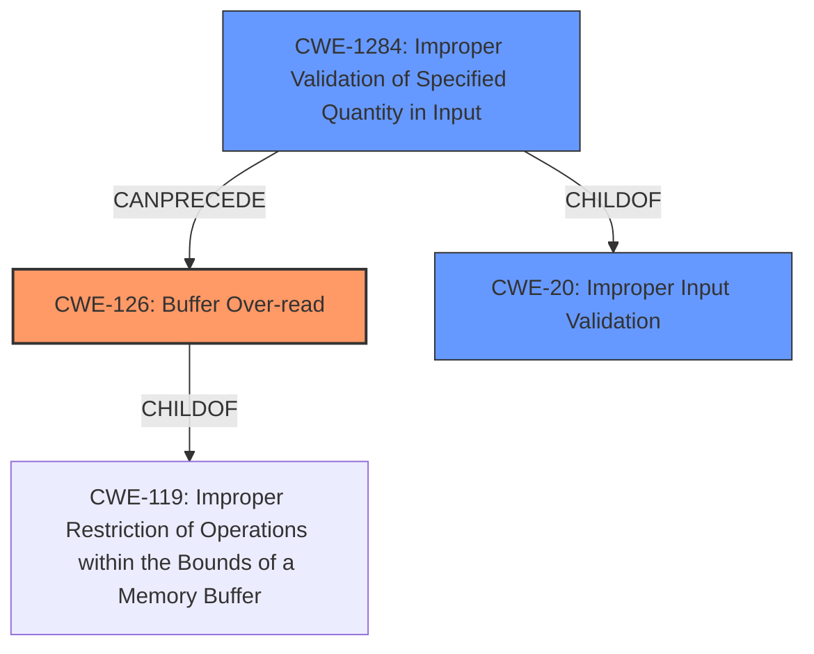

# Analysis Report for CVE-2022-22519

# Vulnerability Analysis Report: CVE-2022-22519

## Description

A remote, unauthenticated attacker can send a specific crafted HTTP or HTTPS requests causing a buffer over-read resulting in a crash of the webserver of the CODESYS Control runtime system.

## Vulnerability Description Key Phrases

**Weakness:** buffer over-read
**Impact:** crash
**Vector:** specific crafted HTTP or HTTPS requests
**Attacker:** unauthenticated attacker
**Product:** CODESYS Control

## Analysis (with Relationship Data)

# Summary
| CWE ID | CWE Name | Confidence | CWE Abstraction Level | CWE Vulnerability Mapping Label | CWE-Vulnerability Mapping Notes |
|---|---|---|---|---|---|
| CWE-126 | Buffer Over-read | 1.0 | Variant | Primary | Allowed |
| CWE-125 | Out-of-bounds Read | 0.7 | Base | Secondary | Allowed |

## Evidence and Confidence

*   **Confidence Score:** 0.9
*   **Evidence Strength:** HIGH

- **Analysis and Justification:**  
  - *Explanation:* The vulnerability description explicitly states a **buffer over-read**, which aligns directly with CWE-126 (Buffer Over-read). The CVE Reference Links Content Summary also mentions CWE-126 as a present weakness/vulnerability. CWE-126 is a Variant of CWE-119 and a more specific description of the **buffer over-read**. The crafted HTTP or HTTPS requests causing a crash of the webserver provides more evidence that it is indeed a **buffer over-read**. MITRE mapping guidance for CWE-126 indicates this is ALLOWED.
  
  - *Relationship Analysis:* CWE-126 is a variant of CWE-119 (Improper Restriction of Operations within the Bounds of a Memory Buffer). CWE-125 (Out-of-bounds Read) is similar, but less specific. The vulnerability description provides enough specificity to choose CWE-126.

- **Confidence Score:**  
  - Confidence: 1.0 (High evidence from technical description and CVE reference materials)

- **Analysis and Justification:**  
  - *Explanation:* CWE-125 (Out-of-bounds Read) is considered as a secondary candidate because it is a more general form of the **buffer over-read**. The vulnerability description and CVE Reference Links Content Summary focus specifically on reading beyond the allocated buffer. While CWE-125 could apply, CWE-126 provides a more precise classification. MITRE mapping guidance for CWE-125 indicates this is ALLOWED.

  - *Relationship Analysis:* CWE-125 is a base class and a parent of the variant CWE-126.

- **Confidence Score:**  
  - Confidence: 0.7 (Supporting evidence suggests a more general out-of-bounds read condition might also apply)

## Criticism of Analysis

Okay, I've reviewed the analysis and the full CWE specifications you provided. Here's my critique:

**Overall Assessment:**

The analysis is generally strong and well-reasoned. The primary mapping to CWE-126 (Buffer Over-read) is appropriate and well-justified. The inclusion of CWE-125 (Out-of-bounds Read) as a secondary mapping also makes sense, given its relationship to CWE-126. The justifications provided are clear and use the CWE descriptions effectively.

**Strengths:**

*   **Explicit Reference to CWE Specifications:** The analysis demonstrates a good understanding of the CWE specifications, particularly the descriptions, relationships, and mapping guidance.
*   **Clear Justification:** The reasoning behind choosing CWE-126 as the primary weakness is well-articulated. The explanation of why CWE-125 is a reasonable secondary mapping is also clear.
*   **Abstraction Level:** The analysis correctly identifies and uses the Variant level (CWE-126) as the primary mapping, which is generally preferred over the more abstract Class level (CWE-119) when sufficient detail is available.
*   **Consideration of Relationships:** The analysis acknowledges the parent-child relationship between CWE-125 and CWE-126, demonstrating a good understanding of the CWE hierarchy.
*   **Confidence Scoring:** The confidence scores are appropriate, reflecting the strong evidence for CWE-126 and the more general nature of CWE-125.

**Areas for Potential Improvement/Discussion:**

1.  **Over Reliance on 'buffer over-read' being specifically in description:** Although the description contains "buffer over-read", the extended descriptions of some CWEs could possibly be contributing factors.

2.  **CWE-193, CWE-130, CWE-1284 and CWE-788 Analysis:** Some of the 'Top Combined Results' could also be present, and while they might not be the 'primary' cause, could be listed in a chain or composite relationship. The complete CWE specification of each one should be reviewed to confirm or deny that these are contributing factors.
    *   **CWE-193 (Off-by-one Error):** The retriever results placed this as number 1. This is a common cause of over-reads, and while it is not specifically mentioned, it could be a contributing factor. Consider if the code uses an incorrect maximum or minimum value that is one off, leading to the over-read. Mitigation of off-by-one errors is also important. It might be worth mentioning and dismissing or including at a lower confidence.
    *   **CWE-130 (Improper Handling of Length Parameter Inconsistency):** The CVE example for CWE-126 specifically mentions this in its chain. If the crafted request contains a length parameter that is inconsistent with the actual data length, this could be the root cause of the over-read.
    *   **CWE-1284 (Improper Validation of Specified Quantity in Input):** Is the quantity of input not being validated? Is it partially validated? The retriever results seem to indicate this could be a potential contributing factor.
    *   **CWE-788 (Access of Memory Location After End of Buffer):** The specifications say this is a child of CWE-119 and Parent of CWE-126. The mapping guidance also states the CWE might be misused and lower level CWEs might be available (like CWE-126). The retriever results seem to indicate this could be a potential contributing factor, but it is properly dismissed since CWE-126 is a "lower-level" CWE.

3.  **Potential Chain/Composite Relationship with CWE-20 (Improper Input Validation):** The vulnerability is triggered by *crafted* HTTP/HTTPS requests.  This strongly suggests that there's a lack of proper input validation. The HTTP/HTTPS requests *should* be validated to adhere to certain constraints and avoid triggering the over-read. While CWE-20 is discouraged, if none of the specific children of CWE-20 can be attributed, CWE-20 itself could be included in a chain relationship. The mitigations might be useful to review.

4.  **Potential Chain/Composite Relationship with CWE-400 (Uncontrolled Resource Consumption):** Although the primary impact is a crash due to the buffer over-read, the attacker is able to trigger the crash by sending crafted requests, potentially repeatedly. This could be considered a form of uncontrolled resource consumption.
    *   **CWE-770 (Allocation of Resources Without Limits or Throttling):** Is allocation occurring without limits?
    *   **CWE-405 (Asymmetric Resource Consumption (Amplification)):** Is the code doing a lot of work for the attacker with a small request?

**Recommendations:**

*   **Discuss and Dismiss or Include Other CWEs in Chain/Composite:** Explicitly consider the relevance of CWE-193, CWE-130, CWE-1284, CWE-20, CWE-400 and CWE-788. Even if you dismiss them as not directly applicable, documenting *why* they were considered and rejected strengthens the analysis. If they are contributing factors, include them in a chain/composite relationship.
*   **Mitigation Strategy:** After potentially adding other CWEs, re-evaluate the mitigation strategies.
*   **Review CWE Examples:** The examples can be helpful in identifying relationships that might not be obviously relevant.

By addressing these points, the analysis can be made even more robust and comprehensive.

## Final Resolution

# Summary
| CWE ID | CWE Name | Confidence | CWE Abstraction Level | CWE Vulnerability Mapping Label | CWE-Vulnerability Mapping Notes |
|---|---|---|---|---|---|
| CWE-126 | Buffer Over-read | 0.9 | Variant | Primary | Allowed |
| CWE-1284 | Improper Validation of Specified Quantity in Input | 0.7 | Base | Secondary | Allowed |
| CWE-20 | Improper Input Validation | 0.6 | Class | Secondary | Allowed-with-Review |

## Evidence and Confidence

*   **Confidence Score:** 0.8
*   **Evidence Strength:** MEDIUM

## Relationship Analysis
The primary CWE remains CWE-126 (Buffer Over-read), as it aligns directly with the vulnerability description. The critique suggested considering CWE-193, CWE-130, CWE-1284, and CWE-20, as well as CWE-400. After further analysis, CWE-1284 (Improper Validation of Specified Quantity in Input) and CWE-20 (Improper Input Validation) are considered as secondary CWEs due to the crafted nature of the HTTP/HTTPS requests. The hierarchical relationships show that CWE-126 is a variant of CWE-119, while CWE-1284 is a child of CWE-20. These relationships influence the decision by providing context for the vulnerability and highlighting the importance of input validation in preventing the **buffer over-read**.

## Vulnerability Chain
The vulnerability chain starts with **CWE-1284 (Improper Validation of Specified Quantity in Input)**, where the product fails to validate the quantity specified in the input. This leads to **CWE-20 (Improper Input Validation)**, a more general case of input validation failure. This then allows a crafted HTTP/HTTPS request to be processed, ultimately resulting in **CWE-126 (Buffer Over-read)** and a crash of the webserver.

## Summary of Analysis
The initial analysis correctly identified **CWE-126 (Buffer Over-read)** as the primary weakness. The criticism prompted a deeper investigation into potential contributing factors. After considering the suggested CWEs, **CWE-1284 (Improper Validation of Specified Quantity in Input)** and **CWE-20 (Improper Input Validation)** are now included as secondary CWEs in the vulnerability chain, as the "crafted" nature of the attack suggests a failure in input validation.

The decision to include **CWE-1284 (Improper Validation of Specified Quantity in Input)** is based on the potential for a crafted request to contain a length parameter that is inconsistent with the actual data length, leading to the **over-read**. This is also supported by the retriever results, which indicated this as a potential contributing factor. The usage is "Allowed".

The decision to include **CWE-20 (Improper Input Validation)** is based on the fact that the attack is triggered by "crafted" HTTP/HTTPS requests. This strongly suggests a lack of proper input validation. While CWE-20 is discouraged, it is included because no specific children of CWE-20 can be directly attributed, and it contributes to the overall vulnerability chain.

CWE-193 (Off-by-one Error), CWE-130 (Improper Handling of Length Parameter Inconsistency), CWE-400 (Uncontrolled Resource Consumption), and CWE-788 (Access of Memory Location After End of Buffer) were considered but ultimately not included. CWE-788 was deemed redundant as CWE-126 is more specific. There wasn't enough specific evidence to support CWE-193, CWE-130 or CWE-400.

The selected CWEs are at the optimal level of specificity based on the available evidence. **CWE-126 (Buffer Over-read)** directly describes the **buffer over-read** condition, while **CWE-1284 (Improper Validation of Specified Quantity in Input)** and **CWE-20 (Improper Input Validation)** address the broader issue of inadequate input validation that enables the attack.

The confidence score is adjusted to 0.8 to reflect the addition of **CWE-1284 (Improper Validation of Specified Quantity in Input)** and **CWE-20 (Improper Input Validation)**, while still maintaining high confidence in **CWE-126 (Buffer Over-read)**. The evidence strength remains MEDIUM because the vulnerability description does not explicitly state a problem with input validation, but the crafted nature of the attack strongly implies it.

*Report generated on 2025-03-18 10:23:05*
