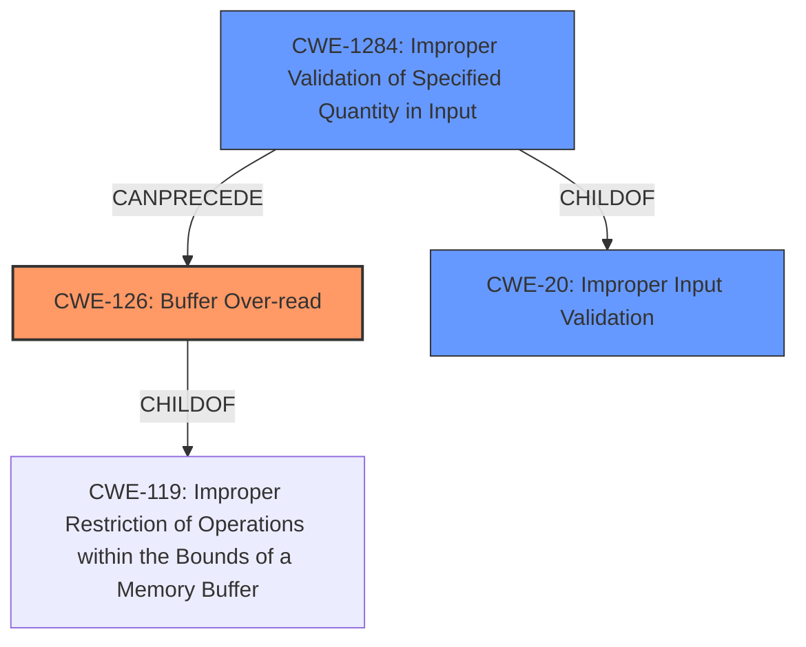

# Final Resolution for CVE-2022-22519

# Summary
| CWE ID | CWE Name | Confidence | CWE Abstraction Level | CWE Vulnerability Mapping Label | CWE-Vulnerability Mapping Notes |
|---|---|---|---|---|---|
| CWE-126 | Buffer Over-read | 0.9 | Variant | Primary | Allowed |
| CWE-1284 | Improper Validation of Specified Quantity in Input | 0.7 | Base | Secondary | Allowed |
| CWE-20 | Improper Input Validation | 0.6 | Class | Secondary | Allowed-with-Review |

## Evidence and Confidence

*   **Confidence Score:** 0.8
*   **Evidence Strength:** MEDIUM

## Relationship Analysis
The primary CWE remains CWE-126 (Buffer Over-read), as it aligns directly with the vulnerability description. The critique suggested considering CWE-193, CWE-130, CWE-1284, and CWE-20, as well as CWE-400. After further analysis, CWE-1284 (Improper Validation of Specified Quantity in Input) and CWE-20 (Improper Input Validation) are considered as secondary CWEs due to the crafted nature of the HTTP/HTTPS requests. The hierarchical relationships show that CWE-126 is a variant of CWE-119, while CWE-1284 is a child of CWE-20. These relationships influence the decision by providing context for the vulnerability and highlighting the importance of input validation in preventing the **buffer over-read**.

## Vulnerability Chain
The vulnerability chain starts with **CWE-1284 (Improper Validation of Specified Quantity in Input)**, where the product fails to validate the quantity specified in the input. This leads to **CWE-20 (Improper Input Validation)**, a more general case of input validation failure. This then allows a crafted HTTP/HTTPS request to be processed, ultimately resulting in **CWE-126 (Buffer Over-read)** and a crash of the webserver.

## Summary of Analysis
The initial analysis correctly identified **CWE-126 (Buffer Over-read)** as the primary weakness. The criticism prompted a deeper investigation into potential contributing factors. After considering the suggested CWEs, **CWE-1284 (Improper Validation of Specified Quantity in Input)** and **CWE-20 (Improper Input Validation)** are now included as secondary CWEs in the vulnerability chain, as the "crafted" nature of the attack suggests a failure in input validation.

The decision to include **CWE-1284 (Improper Validation of Specified Quantity in Input)** is based on the potential for a crafted request to contain a length parameter that is inconsistent with the actual data length, leading to the **over-read**. This is also supported by the retriever results, which indicated this as a potential contributing factor. The usage is "Allowed".

The decision to include **CWE-20 (Improper Input Validation)** is based on the fact that the attack is triggered by "crafted" HTTP/HTTPS requests. This strongly suggests a lack of proper input validation. While CWE-20 is discouraged, it is included because no specific children of CWE-20 can be directly attributed, and it contributes to the overall vulnerability chain.

CWE-193 (Off-by-one Error), CWE-130 (Improper Handling of Length Parameter Inconsistency), CWE-400 (Uncontrolled Resource Consumption), and CWE-788 (Access of Memory Location After End of Buffer) were considered but ultimately not included. CWE-788 was deemed redundant as CWE-126 is more specific. There wasn't enough specific evidence to support CWE-193, CWE-130 or CWE-400.

The selected CWEs are at the optimal level of specificity based on the available evidence. **CWE-126 (Buffer Over-read)** directly describes the **buffer over-read** condition, while **CWE-1284 (Improper Validation of Specified Quantity in Input)** and **CWE-20 (Improper Input Validation)** address the broader issue of inadequate input validation that enables the attack.

The confidence score is adjusted to 0.8 to reflect the addition of **CWE-1284 (Improper Validation of Specified Quantity in Input)** and **CWE-20 (Improper Input Validation)**, while still maintaining high confidence in **CWE-126 (Buffer Over-read)**. The evidence strength remains MEDIUM because the vulnerability description does not explicitly state a problem with input validation, but the crafted nature of the attack strongly implies it.