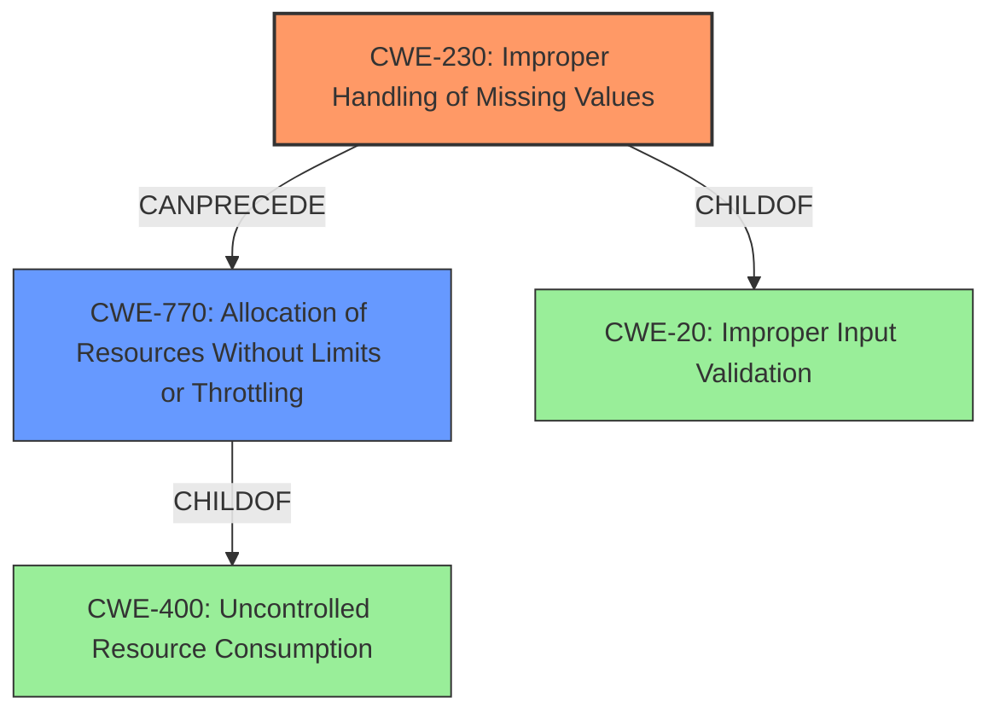

# Final Resolution for CVE-2022-22562

# Summary

| CWE ID  | CWE Name                                                     | Confidence | CWE Abstraction Level | CWE Vulnerability Mapping Label | CWE-Vulnerability Mapping Notes |
| :-------- | :----------------------------------------------------------- | :--------- | :-------------------- | :------------------------------ | :------------------------------ |
| CWE-230 | Improper Handling of Missing Values                           | 0.85       | Variant               | Primary                         | Allowed                         |
| CWE-770 | Allocation of Resources Without Limits or Throttling | 0.75      | Base                  | Secondary                       | Allowed             |

## Evidence and Confidence

*   **Confidence Score:** 0.80
*   **Evidence Strength:** HIGH

## Relationship Analysis
The primary weakness is **CWE-230 (Improper Handling of Missing Values)**, which is a variant of **CWE-20 (Improper Input Validation)**. **CWE-230** can lead to **CWE-770 (Allocation of Resources Without Limits or Throttling)**, resulting in a denial-of-service. The relationship analysis supports the choice of **CWE-770** as a more specific alternative to **CWE-400**, which is too broad.

## Vulnerability Chain
The vulnerability chain starts with the **root cause**: **CWE-230 (Improper Handling of Missing Values)**. This leads to **CWE-770 (Allocation of Resources Without Limits or Throttling)**, which ultimately results in a denial-of-service. The missing link is the exact mechanism by which **CWE-230** causes uncontrolled resource allocation, but the vulnerability description strongly implies that the missing values are not properly handled, leading to excessive resource usage.

## Summary of Analysis
The initial analysis correctly identified **CWE-230 (Improper Handling of Missing Values)** as the primary weakness. The criticism highlighted that **CWE-400 (Uncontrolled Resource Consumption)** is too broad and suggested **CWE-770 (Allocation of Resources Without Limits or Throttling)** as a more specific alternative. The vulnerability description states that the **improper handling of missing values** leads to a denial-of-service, which supports the selection of **CWE-230**.

The choice of **CWE-770** is based on the understanding that the **improper handling of missing values** likely causes the system to allocate resources without proper limits or throttling, eventually leading to resource exhaustion and a denial-of-service. This is a more specific explanation than simply stating that resource consumption is uncontrolled.

The retriever results included other CWEs such as **CWE-410 (Insufficient Resource Pool)**, **CWE-280 (Improper Handling of Insufficient Privileges)**, and **CWE-274 (Improper Handling of Insufficient Privileges)**. These were rejected because they do not directly address the **root cause** of the vulnerability, which is the **improper handling of missing values**. **CWE-410** might be a consequence of **CWE-770**, but it's not the direct cause. **CWE-280** and **CWE-274** are related to privilege issues, which are not mentioned in the vulnerability description.

The selected CWEs are at the optimal level of specificity. **CWE-230** is a Variant-level CWE that directly describes the **root cause**. **CWE-770** is a Base-level CWE that explains the mechanism by which the **improper handling of missing values** leads to a denial-of-service. Using these CWEs provides a more accurate and actionable representation of the vulnerability.