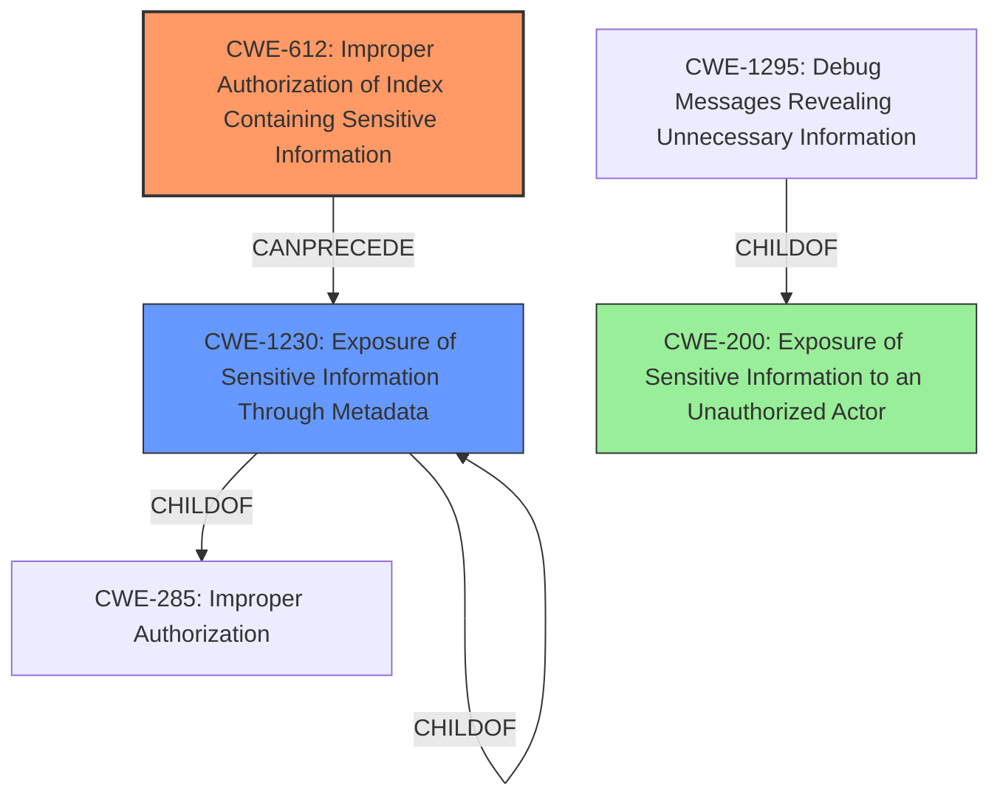

# Analysis Report for CVE-2022-22565

# Vulnerability Analysis Report: CVE-2022-22565

## Description

Dell PowerScale OneFS, versions 9.0.0-9.3.0, contain an improper authorization of index containing sensitive information. An authenticated and privileged user could potentially exploit this vulnerability, leading to disclosure or modification of sensitive data.

## Vulnerability Description Key Phrases

**Rootcause:** improper authorization of index containing sensitive information
**Impact:** disclosure or modification of sensitive data
**Attacker:** authenticated and privileged user
**Product:** Dell PowerScale OneFS
**Version:** 9.0.0-9.3.0

## Analysis (with Relationship Data)

# Summary
| CWE ID | CWE Name | Confidence | CWE Abstraction Level | CWE Vulnerability Mapping Label | CWE-Vulnerability Mapping Notes |
|---|---|---|---|---|---|
| CWE-612 | Improper Authorization of Index Containing Sensitive Information | 0.9 | Base | Primary | Allowed |
| CWE-497 | Exposure of Sensitive System Information to an Unauthorized Control Sphere | 0.6 | Base | Secondary | Allowed |
| CWE-200 | Exposure of Sensitive Information to an Unauthorized Actor | 0.3 | Class | Secondary | Discouraged |

## Evidence and Confidence

*   **Confidence Score:** 0.9
*   **Evidence Strength:** HIGH

- **Analysis and Justification:**
  - *Explanation:* The vulnerability description states "**improper authorization of index containing sensitive information**". The CVE Reference Links Content Summary confirms this as the root cause and mentions "Insufficient access control on an index that stores sensitive data". CWE-612, "Improper Authorization of Index Containing Sensitive Information", directly matches this description. The Retriever Results also rank CWE-612 as the top match with a score of 0.6694. The MITRE mapping guidance for CWE-612 indicates that it is ALLOWED at the Base level of abstraction. While other CWEs like CWE-497 (Exposure of Sensitive System Information to an Unauthorized Control Sphere) are related, CWE-612 is more specific to the **index** aspect of the vulnerability.
  CWE-200 (Exposure of Sensitive Information to an Unauthorized Actor) is more general and discouraged to use according to MITRE.

  - *Relationship Analysis:* CWE-612 does not have direct relationships to other CWEs in the provided data. However, vulnerabilities related to authorization often can lead to privilege escalation or data modification.

- **Confidence Score:**
  - Confidence: 0.9 (High confidence due to the direct match between the vulnerability description and CWE-612 description, as well as the high retriever score and ALLOWED mapping guidance.)

---

## Criticism of Analysis

Okay, here's a detailed review of the provided CWE analysis, incorporating the full CWE specifications.

**Overall Assessment:**

The analysis is generally well-reasoned and arrives at a largely correct primary CWE mapping.  The justification for selecting CWE-612 as the primary weakness is strong, particularly given the explicit mention of "index containing sensitive information" in the vulnerability description. The confidence score of 0.9 is appropriate. The decision to avoid CWE-200 is also sound, recognizing its tendency for misuse. However, the justification for the secondary CWE and its confidence score requires further examination.

**Detailed Breakdown:**

*   **CWE-612: Improper Authorization of Index Containing Sensitive Information (Primary)**

    *   **Confidence:** 0.9
    *   **Assessment:**  Excellent choice. The vulnerability description directly aligns with CWE-612's description: "The product creates a search index of private or sensitive documents, but it does not properly limit index access to actors who are authorized to see the original information." The authenticated, privileged user is able to access sensitive data via the index due to improper authorization controls. The high confidence is justified.
    *   **Mapping Guidance:** The analysis correctly notes that CWE-612 is a Base level CWE and is ALLOWED for mapping.
    *   **Mitigation Considerations:**  The Mitigations for CWE-612 would focus on access controls for the index itself.  This includes ensuring that the access control lists (ACLs) or other authorization mechanisms applied to the indexed data are also consistently and correctly enforced on the index. This might involve designing the index to respect the original data's permissions or implementing a separate authorization layer specifically for index access. The provided information on "authenticated and privileged user" is especially important here, because if the system allowed a privileged user to access indexes they should not have, that would be a violation of the Principle of Least Privilege, which is a key tenet of secure system design.

*   **CWE-497: Exposure of Sensitive System Information to an Unauthorized Control Sphere (Secondary)**

    *   **Confidence:** 0.6
    *   **Assessment:** While CWE-497 is *related*, it's not the most precise secondary mapping. It's a broader category than CWE-612. The core issue here isn't just exposure of system information *in general*, but the exposure of information *through a specific mechanism* (the improperly authorized index).  It's a valid *consequence*, but less directly a *cause*. A confidence score of 0.6 is too high, 0.4 would be more accurate.
    *   **Mapping Guidance:** The analysis correctly notes that CWE-497 is a Base level CWE and is ALLOWED for mapping.
    *   **Mitigation Considerations:**  Mitigations for CWE-497 are more general, like avoiding the generation of internal details in error messages.  While these are good practices, they don't directly address the root cause of the indexed data's exposure. The Observed Examples listed for CWE-497 don't include cases that are directly relevant to the described vulnerability.
    *   **Alternative Secondary CWE:** Consider *CWE-1230: Exposure of Sensitive Information Through Metadata*. Since an index is a form of metadata, this would be a more precise secondary mapping. It specifically addresses the scenario where the original data is protected, but derived metadata exposes sensitive information.

*   **CWE-200: Exposure of Sensitive Information to an Unauthorized Actor**

    *   **Confidence:** 0.3
    *   **Assessment:**  Correctly identified as too general and therefore discouraged.  This is primarily a *result* of the vulnerability, not the core weakness.
    *   **Mapping Guidance:** The analysis appropriately notes that CWE-200 is discouraged.

**Recommendations:**

1.  **Re-evaluate the Secondary CWE:** Seriously consider replacing CWE-497 with *CWE-1230: Exposure of Sensitive Information Through Metadata*. This is a more precise reflection of the vulnerability. Lower the score to 0.4 if you keep CWE-497.
2.  **Strengthen Relationship Analysis:** Provide a deeper explanation of how improper authorization (CWE-612) *directly* leads to the exposure of sensitive information.  Explicitly mention the Principle of Least Privilege and its violation.
3.  **Mitigation Discussion:** Expand the Mitigation Considerations sections, specifically focusing on how the mitigations for each CWE would be applied *in the context of this specific vulnerability*.  For example, for CWE-612, discuss specific index access control mechanisms.

**Revised Summary Table (Example):**

| CWE ID | CWE Name | Confidence | CWE Abstraction Level | CWE Vulnerability Mapping Label | CWE-Vulnerability Mapping Notes |
|---|---|---|---|---|---|
| CWE-612 | Improper Authorization of Index Containing Sensitive Information | 0.9 | Base | Primary | Allowed |
| CWE-1230 | Exposure of Sensitive Information Through Metadata | 0.5 | Base | Secondary | Allowed |
| CWE-200 | Exposure of Sensitive Information to an Unauthorized Actor | 0.3 | Class | Secondary | Discouraged |

By incorporating these suggestions, the analysis will be more accurate, more informative, and more useful for guiding remediation efforts.

## Final Resolution

# Summary
| CWE ID | CWE Name | Confidence | CWE Abstraction Level | CWE Vulnerability Mapping Label | CWE-Vulnerability Mapping Notes |
|---|---|---|---|---|---|
| CWE-612 | Improper Authorization of Index Containing Sensitive Information | 0.9 | Base | Primary | Allowed |
| CWE-1230 | Exposure of Sensitive Information Through Metadata | 0.5 | Base | Secondary | Allowed |
| CWE-200 | Exposure of Sensitive Information to an Unauthorized Actor | 0.3 | Class | Secondary | Discouraged |

## Evidence and Confidence

*   **Confidence Score:** 0.8
*   **Evidence Strength:** HIGH

## Relationship Analysis
The primary CWE is CWE-612, which directly addresses the **improper authorization** of an **index containing sensitive information**. CWE-1230 is a more specific secondary CWE than CWE-497 because it recognizes that an index is a form of metadata, and the vulnerability is related to exposure through that metadata. CWE-200 is a general class of weakness and is discouraged.

## Vulnerability Chain
The vulnerability chain starts with **CWE-612**, the **improper authorization** of the index. This allows an authenticated and privileged user to access sensitive information that should be protected, leading to **CWE-1230**, the **exposure of sensitive information through metadata**. The final impact is **CWE-200**, the general **exposure of sensitive information** to an unauthorized actor, but this is more of a consequence than a root cause.

## Summary of Analysis
Based on the vulnerability description, the initial analysis correctly identified **CWE-612 (Improper Authorization of Index Containing Sensitive Information)** as the primary **ROOTCAUSE**. The description explicitly states "improper authorization of index containing sensitive information," which directly aligns with CWE-612. The criticism suggested replacing CWE-497 with **CWE-1230 (Exposure of Sensitive Information Through Metadata)**, which is a more precise secondary mapping. I agree with this assessment. An index is a form of metadata; therefore, if an index is improperly authorized, it could lead to the exposure of sensitive information through that metadata. The original selection of CWE-497 was too broad and less directly related to the **ROOTCAUSE**. The selection of **CWE-200 (Exposure of Sensitive Information to an Unauthorized Actor)** remains as a tertiary mapping since it is the result of the vulnerability and the root cause. The confidence score is reduced to 0.8 because the relationship between CWE-612 and CWE-1230 is not a direct parent-child relationship. Also, based on the mapping guidance, CWE-200 is discouraged, so it should not be weighted heavily.

*Report generated on 2025-03-17 03:48:30*
