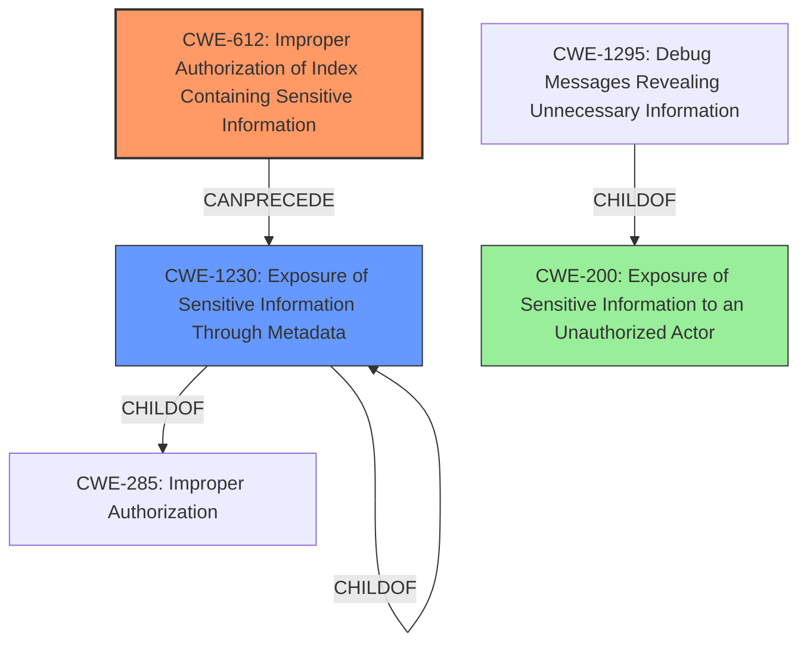

# Final Resolution for CVE-2022-22565

# Summary
| CWE ID | CWE Name | Confidence | CWE Abstraction Level | CWE Vulnerability Mapping Label | CWE-Vulnerability Mapping Notes |
|---|---|---|---|---|---|
| CWE-612 | Improper Authorization of Index Containing Sensitive Information | 0.9 | Base | Primary | Allowed |
| CWE-1230 | Exposure of Sensitive Information Through Metadata | 0.5 | Base | Secondary | Allowed |
| CWE-200 | Exposure of Sensitive Information to an Unauthorized Actor | 0.3 | Class | Secondary | Discouraged |

## Evidence and Confidence

*   **Confidence Score:** 0.8
*   **Evidence Strength:** HIGH

## Relationship Analysis
The primary CWE is CWE-612, which directly addresses the **improper authorization** of an **index containing sensitive information**. CWE-1230 is a more specific secondary CWE than CWE-497 because it recognizes that an index is a form of metadata, and the vulnerability is related to exposure through that metadata. CWE-200 is a general class of weakness and is discouraged.

## Vulnerability Chain
The vulnerability chain starts with **CWE-612**, the **improper authorization** of the index. This allows an authenticated and privileged user to access sensitive information that should be protected, leading to **CWE-1230**, the **exposure of sensitive information through metadata**. The final impact is **CWE-200**, the general **exposure of sensitive information** to an unauthorized actor, but this is more of a consequence than a root cause.

## Summary of Analysis
Based on the vulnerability description, the initial analysis correctly identified **CWE-612 (Improper Authorization of Index Containing Sensitive Information)** as the primary **ROOTCAUSE**. The description explicitly states "improper authorization of index containing sensitive information," which directly aligns with CWE-612. The criticism suggested replacing CWE-497 with **CWE-1230 (Exposure of Sensitive Information Through Metadata)**, which is a more precise secondary mapping. I agree with this assessment. An index is a form of metadata; therefore, if an index is improperly authorized, it could lead to the exposure of sensitive information through that metadata. The original selection of CWE-497 was too broad and less directly related to the **ROOTCAUSE**. The selection of **CWE-200 (Exposure of Sensitive Information to an Unauthorized Actor)** remains as a tertiary mapping since it is the result of the vulnerability and the root cause. The confidence score is reduced to 0.8 because the relationship between CWE-612 and CWE-1230 is not a direct parent-child relationship. Also, based on the mapping guidance, CWE-200 is discouraged, so it should not be weighted heavily.