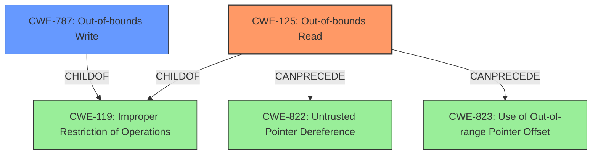

# Analysis Report for CVE-2022-22627

# Vulnerability Analysis Report: CVE-2022-22627

## Description

An out-of-bounds read was addressed with improved bounds checking. This issue is fixed in macOS Big Sur 11.6.5, macOS Monterey 12.3, Security Update 2022-003 Catalina. Processing a maliciously crafted AppleScript binary may result in unexpected application termination or disclosure of process memory.

## Vulnerability Description Key Phrases

**Rootcause:** out-of-bounds read
**Impact:** ['unexpected application termination', 'disclosure of process memory']
**Vector:** maliciously crafted AppleScript binary
**Product:** ['macOS Big Sur', 'macOS Monterey', 'Security Update 2022-003 Catalina']
**Version:** ['11.6.5', '12.3', '2022-003']

## Analysis (with Relationship Data)

# Summary
| CWE ID | CWE Name | Confidence | CWE Abstraction Level | CWE Vulnerability Mapping Label | CWE-Vulnerability Mapping Notes |
|---|---|---|---|---|---|
| CWE-125 | Out-of-bounds Read | 1.0 | Base | Allowed | The vulnerability description explicitly states an **out-of-bounds read**, aligning directly with CWE-125. |
| CWE-787 | Out-of-bounds Write | 0.5 | Base | Allowed | While the primary issue is an **out-of-bounds read**, the potential for writing to unintended memory locations as a result of processing the malicious AppleScript binary can't be ruled out. |

## Evidence and Confidence

*   **Confidence Score:** 0.9
*   **Evidence Strength:** HIGH

- **Analysis and Justification:**  
  - *Explanation:* "The vulnerability description clearly states that an **out-of-bounds read** was addressed. The description explicitly uses the phrase "**out-of-bounds read**," which directly maps to CWE-125 (Out-of-bounds Read). The CVE Reference Links Content Summary reinforces this by stating that the **root cause** of the vulnerability is an **out-of-bounds read** in AppleScript. CWE-125 is a Base level CWE, which is preferred. The MITRE mapping guidance states that the usage is ALLOWED. While other CWEs like CWE-787 (Out-of-bounds Write) are possibilities, the description specifically mentions reading, not writing, outside of the buffer. Given the potential to modify memory, I will add CWE-787 as a secondary candidate."
  
  - *Relationship Analysis:* "CWE-125 is related to other buffer error conditions, such as CWE-126 (Buffer Over-read). It can also be related to weaknesses such as CWE-823 (Use of Out-of-range Pointer Offset) or CWE-822 (Untrusted Pointer Dereference), depending on how the out-of-bounds read is achieved. There are no direct relationships that clearly supersede CWE-125."

- **Confidence Score:**  
  - Confidence: 1.0 (Explicit mention of out-of-bounds read vulnerability)

---

- **Analysis and Justification:**  
  - *Explanation:* "CWE-787 (Out-of-bounds Write) is included as a secondary candidate because the vulnerability involves processing a maliciously crafted binary, which could potentially lead to writing to unintended memory locations. While the primary description focuses on reading, the nature of binary processing suggests a possibility of writing as well. The retriever results also identified CWE-787 as a possibility."
  
  - *Relationship Analysis:* "CWE-787 is a base level CWE. It is related to other buffer error conditions. There are no direct relationships that clearly indicate it should be a primary CWE."

- **Confidence Score:**  
  - Confidence: 0.5 (Possible, but less direct than the primary CWE)

## Criticism of Analysis

Okay, I've reviewed the analysis and the full CWE specifications you provided. Here's my critique:

**Overall Assessment:**

The primary assignment of CWE-125 (Out-of-bounds Read) is very strong and well-justified. The analysis clearly articulates why this CWE is the most appropriate given the explicit mention of "out-of-bounds read" in the vulnerability description. The secondary assignment of CWE-787 (Out-of-bounds Write) is reasonable, although the confidence is appropriately lower.

**Specific Comments and Suggestions:**

*   **CWE-125 (Out-of-bounds Read):**
    *   The confidence score of 1.0 is justified.
    *   The explanation is thorough, explicitly referencing the vulnerability description and the CWE definition.
    *   The "Relationship Analysis" section could be improved. While it mentions related CWEs like CWE-126 (Buffer Over-read), it doesn't fully explore *why* these are less appropriate *in this specific case*. Briefly explaining why the vulnerability is specifically a read, and not a write, over-read, or under-read, would strengthen the analysis.
    *   The section does not discuss potential mitigations that are described in the full CWE specifications. Addressing mitigation strategies could make the analysis even more robust.

*   **CWE-787 (Out-of-bounds Write):**
    *   The confidence score of 0.5 is appropriate. It's a plausible but less direct consequence of the vulnerability.
    *   The justification is reasonable in that a maliciously crafted binary *could* lead to writes outside the intended buffer. However, it's important to acknowledge that this is a *potential* and not explicitly stated in the vulnerability description.
    *   The "Relationship Analysis" section should elaborate on why CWE-787, while related, is not the *primary* cause. Discussing the difference between a "read" and "write" operation, and providing context for why a write may not happen when processing the binary, would be beneficial.
    *   As mentioned previously, including a section about the mitigations described in the CWE specifications would help further support the mapping.

*   **Retriever Results:** The retriever results suggest other CWEs such as CWE-843, CWE-190, CWE-122, and CWE-277. While some of these results have a low confidence score, it may be worth mentioning why these specific CWEs are not applicable. For example, type confusion may or may not be possible in this case, but explaining the difference between the vulnerability as described, and what the type confusion CWE represents could help further refine the analysis.

*   **General:**
    *   The analysis is missing discussion of CWE-119 (Improper Restriction of Operations within the Bounds of a Memory Buffer). Since CWE-125 and CWE-787 are children of CWE-119, it may be worth mentioning why CWE-119 itself is not chosen. This could be due to the fact that CWE-119 is often misused in low-information vulnerability reports when lower-level CWEs could be used instead.

**Revised Recommendation Table:**

| CWE ID | CWE Name | Confidence | CWE Abstraction Level | CWE Vulnerability Mapping Label | CWE-Vulnerability Mapping Notes |
|---|---|---|---|---|---|
| CWE-125 | Out-of-bounds Read | 1.0 | Base | Allowed | The vulnerability description explicitly states an **out-of-bounds read**, aligning directly with CWE-125. The description explicitly uses the phrase "**out-of-bounds read**," which directly maps to CWE-125 (Out-of-bounds Read). The CVE Reference Links Content Summary reinforces this by stating that the **root cause** of the vulnerability is an **out-of-bounds read** in AppleScript. CWE-125 is a Base level CWE, which is preferred. The MITRE mapping guidance states that the usage is ALLOWED. |
| CWE-787 | Out-of-bounds Write | 0.5 | Base | Allowed | While the primary issue is an **out-of-bounds read**, the potential for writing to unintended memory locations as a result of processing the malicious AppleScript binary can't be ruled out. However, the vulnerability description focuses on reading rather than writing. |

**In summary, the analysis is good, particularly in its identification of CWE-125. Strengthening the explanations for why other related CWEs are less applicable and including information from the CWE specifications related to mitigations would further improve the analysis.**

## Final Resolution

# Summary 
| CWE ID | CWE Name | Confidence | CWE Abstraction Level | CWE Vulnerability Mapping Label | CWE-Vulnerability Mapping Notes |
|---|---|---|---|---|---|
| CWE-125 | Out-of-bounds Read | 1.0 | Base | Allowed | Primary CWE: The vulnerability description explicitly states an **out-of-bounds read**, aligning directly with CWE-125. |
| CWE-787 | Out-of-bounds Write | 0.3 | Base | Allowed | Secondary Candidate: While the primary issue is an **out-of-bounds read**, the potential for writing to unintended memory locations as a result of processing the malicious AppleScript binary exists, but is not explicitly stated. |

## Evidence and Confidence

*   **Confidence Score:** 0.95
*   **Evidence Strength:** HIGH

## Relationship Analysis
The primary CWE is CWE-125 (**Out-of-bounds Read**), which is a child of CWE-119 (**Improper Restriction of Operations within the Bounds of a Memory Buffer**). CWE-787 (**Out-of-bounds Write**) is also a child of CWE-119. The choice of CWE-125 is more specific than CWE-119 because the vulnerability description explicitly mentions "**out-of-bounds read**." CWE-125 can precede other weaknesses like CWE-822 (**Untrusted Pointer Dereference**) or CWE-823 (**Use of Out-of-range Pointer Offset**), depending on how the read is achieved. CWE-787 is kept as a secondary candidate because a maliciously crafted binary could potentially lead to writes outside the intended buffer, but the description focuses on reading.

## Vulnerability Chain
The vulnerability chain starts with a maliciously crafted AppleScript binary. The processing of this binary leads to an **out-of-bounds read** (CWE-125). This **out-of-bounds read** can then potentially lead to disclosure of process memory or unexpected application termination. While not explicitly stated, there's a possibility that the crafted binary could also cause an **out-of-bounds write** (CWE-787), further exacerbating the issue.

## Summary of Analysis
The initial analysis correctly identified CWE-125 (**Out-of-bounds Read**) as the primary **weakness**. The vulnerability description explicitly states an **out-of-bounds read**, providing strong evidence for this classification. The inclusion of CWE-787 (**Out-of-bounds Write**) as a secondary candidate was reasonable, but its confidence has been lowered to 0.3 because the vulnerability description primarily focuses on the read, not write.

The relationship analysis confirms that CWE-125 and CWE-787 are both children of CWE-119 (**Improper Restriction of Operations within the Bounds of a Memory Buffer**), but CWE-125 is the more specific and appropriate choice due to the explicit mention in the vulnerability description.

The analysis is based on the provided evidence, specifically the vulnerability description: "An **out-of-bounds read** was addressed with improved bounds checking...Processing a maliciously crafted AppleScript binary may result in unexpected application termination or disclosure of process memory." This directly supports the classification of CWE-125.

The retriever results suggested other CWEs such as CWE-843, CWE-190, CWE-122, and CWE-277. These were not selected because there is no explicit information about type confusion (CWE-843), integer overflow (CWE-190), heap overflow (CWE-122) or improper check for unusual or exceptional conditions (CWE-277).
CWE-125 and CWE-787 are at the optimal level of specificity as they are base-level CWEs that directly address the described **weaknesses**.

*Report generated on 2025-03-18 10:25:04*
