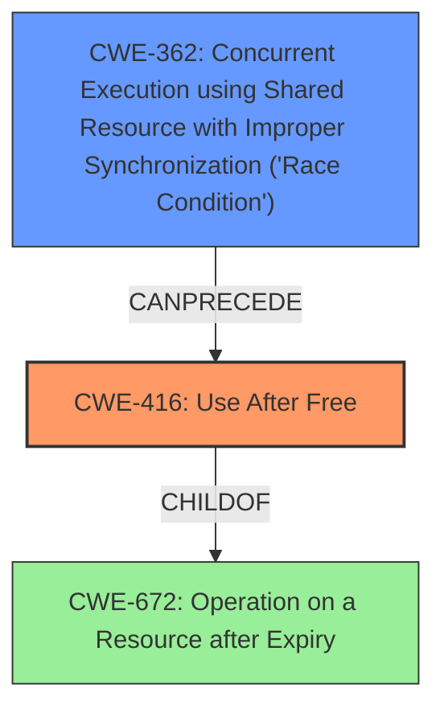

# Analysis Report for CVE-2022-2296

# Vulnerability Analysis Report: CVE-2022-2296

## Description

Use after free in Chrome OS Shell in Google Chrome on Chrome OS prior to 103.0.5060.114 allowed a remote attacker who convinced a user to engage in specific user interactions to potentially exploit heap corruption via direct UI interactions.

## Vulnerability Description Key Phrases

**Rootcause:** use after free
**Impact:** heap corruption
**Vector:** direct UI interactions
**Attacker:** remote attacker
**Product:** Google Chrome on Chrome OS
**Version:** prior to 103.0.5060.114
**Component:** Chrome OS Shell

## Analysis (with Relationship Data)

# Summary
| CWE ID | CWE Name | Confidence | CWE Abstraction Level | CWE Vulnerability Mapping Label | CWE-Vulnerability Mapping Notes |
|---|---|---|---|---|---|
| CWE-416 | Use After Free | 1.0 | Variant | Allowed | The product reuses or references memory after it has been freed. |

## Evidence and Confidence

*   **Confidence Score:** 1.0
*   **Evidence Strength:** HIGH

- **Analysis and Justification:**  
  - *Explanation:* The vulnerability description explicitly states "**use after free**" as the **rootcause** of the vulnerability. The CVE Reference Links Content Summary also confirms "**use after free**" as the root cause and a weakness. The vulnerability occurs in Chrome OS Shell in Google Chrome on Chrome OS, and a remote attacker can potentially exploit heap corruption through direct UI interactions. CWE-416 (Use After Free) is a Variant level CWE that accurately describes this vulnerability: "The product reuses or references memory after it has been freed." The retriever results also ranked CWE-416 as the top candidate with the highest score. The MITRE mapping guidance states that CWE-416 is ALLOWED for mapping.
  
  - *Relationship Analysis:* There are no direct relationships impacting the mapping decision. CWE-416 is a child of CWE-672 (Operation on a Resource after Expiry).

- **Confidence Score:**  
  - Confidence: 1.0 (High evidence from vulnerability description and CVE reference materials)

## Criticism of Analysis

Okay, here's a detailed review of the provided analysis, incorporating the full CWE specifications.

**Overall Assessment:**

The analysis correctly identifies CWE-416 (Use After Free) as the primary weakness. The justification is sound, based on the vulnerability description and CVE details. The confidence level of 1.0 is appropriate given the explicit mention of "use after free."  The evidence strength is rightly marked as HIGH.

**Detailed Breakdown:**

*   **Summary Table:** The table accurately summarizes the analysis.

*   **Evidence and Confidence:**

    *   The explanation is clear and concise, referencing the key phrases from the original input and the CVE details.
    *   The relationship analysis to CWE-672 is also relevant as it's a parent, helps provide context.
    *   The confidence score of 1.0 is justified based on the strength of the evidence.

*   **CWE Examples from Database:** The inclusion of known examples is excellent. It helps to illustrate the variety of scenarios where CWE-416 can manifest.

*   **Relevant CWE Specifications:** The inclusion of the full specifications for all CWEs mentioned is extremely helpful for a comprehensive review.

**Specific CWE Considerations and Potential Alternatives/Nuances:**

While CWE-416 is the most accurate mapping, let's consider the other CWEs that appeared in the retriever results to see if there are any secondary weaknesses to consider or potential chaining issues.

1.  **CWE-416 (Use After Free):**
    *   **Correctness:** The chosen CWE is correct.
    *   **Abstraction Level:** Variant, which is preferred.
    *   **Mapping Guidance:** "Allowed" - Perfect.
    *   **Mitigations:** The provided mitigations (language selection, setting pointers to NULL after free) are standard and relevant.

2.  **CWE-366 (Race Condition within a Thread):**
    *   **Relevance:** Race conditions can *lead to* use-after-free vulnerabilities.  It's possible there's a race condition that allows memory to be freed while another thread is still using it.
    *   **Abstraction Level:** Base, acceptable
    *   **Mapping Guidance:** "Allowed"
    *   **Mitigations:** Locking mechanisms and resource-locking validation checks are the standard mitigations for race conditions.
    *   **Recommendation:** While not the primary weakness, consider if concurrency is involved. If the UAF occurs because of a race, include CWE-366 as a secondary weakness in a chain. For instance, `CWE-366 -> CWE-416`.

3.  **CWE-415 (Double Free):**
    *   **Relevance:** Double free is a separate error where the same memory is freed twice.  Without additional information, it is very unlikely the root cause.
    *   **Abstraction Level:** Variant
    *   **Mapping Guidance:** "Allowed"
    *   **Mitigations:** The provided mitigations are standard.
    *   **Recommendation:** Do not include unless there's evidence of a double free.

4.  **CWE-356 (Product UI does not Warn User of Unsafe Actions):**
     * **Relevance**: This is probably a red herring from the "UI interactions" part of the original description. The root cause is memory management, not UI design.
     * **Recommendation**: Disregard as a potential CWE.

5.  **CWE-843 (Access of Resource Using Incompatible Type ('Type Confusion')):**
    *   **Relevance:**  This is unlikely unless type confusion leads to accessing freed memory. Without more details, it's unlikely.
    *    **Recommendation**: Disregard as a potential CWE.

6.  **CWE-1021 (Improper Restriction of Rendered UI Layers or Frames):**
    *   **Relevance:**  This is probably a red herring from the "UI interactions" part of the original description.
    *   **Recommendation**: Disregard as a potential CWE.

7.  **CWE-122 (Heap-based Buffer Overflow):**
    *   **Relevance:** It's possible that *after* the memory is freed, a buffer overflow overwrites the metadata of the heap which can result in a crash.
    *   **Recommendation**: If it can be determined that the use-after-free is in combination with a heap overflow, it may be worth adding as a chain.

8.  **CWE-362 (Concurrent Execution using Shared Resource with Improper Synchronization ('Race Condition')):**
    * **Relevance:** This is a parent of CWE-366.  If CWE-366 is relevant, then CWE-362 is also relevant.  Consider it if concurrency is involved.
    * **Recommendation:** Include it if the UAF arises because of a general race condition, or a specific race such as TOCTOU (CWE-367).

9.  **CWE-367 (Time-of-check Time-of-use (TOCTOU) Race Condition):**
    * **Relevance:** A specialized type of race condition. If the UAF is due to a TOCTOU issue, this is a more specific CWE than the generic CWE-362/366.
    * **Recommendation:** If the UAF is due to a TOCTOU issue, this is the CWE to select from the race conditions.

10. **CWE-451 (User Interface (UI) Misrepresentation of Critical Information)**
     * **Relevance**: This is probably a red herring from the "UI interactions" part of the original description. The root cause is memory management, not UI design.
     * **Recommendation**: Disregard as a potential CWE.

**Recommendations for Improvement:**

1.  **Investigate Concurrency:**  Specifically probe if the use-after-free is related to concurrent access. If so, add CWE-366 or CWE-362 (or CWE-367 if it's a TOCTOU) as a chained CWE. This would provide a more complete picture of the vulnerability.
2.  **Contextualize Mitigations:**  While the generic mitigations for CWE-416 are useful, consider adding mitigations specific to the Chrome OS Shell component if known. For example, are there particular coding practices or memory management techniques recommended for that component?
3.  **Review Chains:** The analysis mentions chains of CWEs. Always consider if the identified CWE is part of a larger chain of events. For instance, is a race condition or improper locking leading to the UAF?

**Revised Analysis Summary (If Concurrency is Involved):**

| CWE ID      | CWE Name                                                                               | Confidence | CWE Abstraction Level | CWE Vulnerability Mapping Label | CWE-Vulnerability Mapping Notes                                                                                                                                                                        |
|-------------|----------------------------------------------------------------------------------------|------------|-----------------------|---------------------------------|------------------------------------------------------------------------------------------------------------------------------------------------------------------------------------------------------|
| CWE-366     | Race Condition within a Thread                                                        | 0.6        | Base                  | Allowed                        | A race condition may exist that enables the use-after-free.  Further analysis of the code is needed to confirm.                                                                                                    |
| CWE-416     | Use After Free                                                                       | 1.0        | Variant               | Allowed                        | The product reuses or references memory after it has been freed.                                                                                                                                      |

The key change here is the addition of CWE-366 (or a more appropriate race condition CWE) to the chain, *if* further analysis confirms a concurrency issue.

**In conclusion, the analysis is well-structured and accurate. The inclusion of the full CWE specifications is a significant strength.  The only recommendation is to investigate and document any potential concurrency aspects of the vulnerability.**

## Final Resolution

# Summary
| CWE ID | CWE Name | Confidence | CWE Abstraction Level | CWE Vulnerability Mapping Label | CWE-Vulnerability Mapping Notes |
|---|---|---|---|---|---|
| CWE-416 | Use After Free | 1.0 | Variant | Allowed | The product reuses or references memory after it has been freed. |
| CWE-362 | Concurrent Execution using Shared Resource with Improper Synchronization ('Race Condition') | 0.6 | Class | Allowed-with-Review | A race condition may exist that enables the use-after-free. Further analysis of the code is needed to confirm. |

## Evidence and Confidence

*   **Confidence Score:** 0.9
*   **Evidence Strength:** MEDIUM

## Relationship Analysis
The primary CWE is CWE-416, which has a parent relationship to CWE-672. The criticism suggests that if a race condition leads to the use-after-free, then CWE-362 should be included. This introduces a chain relationship where CWE-362 can precede CWE-416. The abstraction levels influenced the selection by favoring the more specific Variant (CWE-416) and considering the Class (CWE-362) for a broader concurrency issue.

## Vulnerability Chain
The vulnerability chain starts with a potential **CWE-362** (Race Condition), leading to **CWE-416** (Use After Free), which results in heap corruption and potential exploitation by a remote attacker. The initial flaw is the improper synchronization of shared resources. The consequence is the reuse of memory after it has been freed. A missing link is definitive confirmation of the race condition through code analysis, thus a lower confidence score for that.

## Summary of Analysis
The initial analysis correctly identified **CWE-416** (Use After Free) as the primary weakness. The criticism suggested the possibility of a race condition contributing to the vulnerability. Based on the vulnerability description "Use after free in Chrome OS Shell in Google Chrome on Chrome OS prior to 103.0.5060.114 allowed a remote attacker who convinced a user to engage in specific user interactions to potentially exploit heap corruption via direct UI interactions.", there is a possibility that a concurrency issue exists. However, without further code analysis, it is difficult to confirm. Therefore, **CWE-362** (Race Condition) is added as a secondary CWE with a lower confidence score. The selected CWEs are at the optimal level of specificity, with **CWE-416** being a Variant and **CWE-362** being a Class that encompasses various race conditions. The graph relationships influenced the decision by highlighting the potential chain of events leading to the vulnerability.

*Report generated on 2025-03-18 10:27:12*
