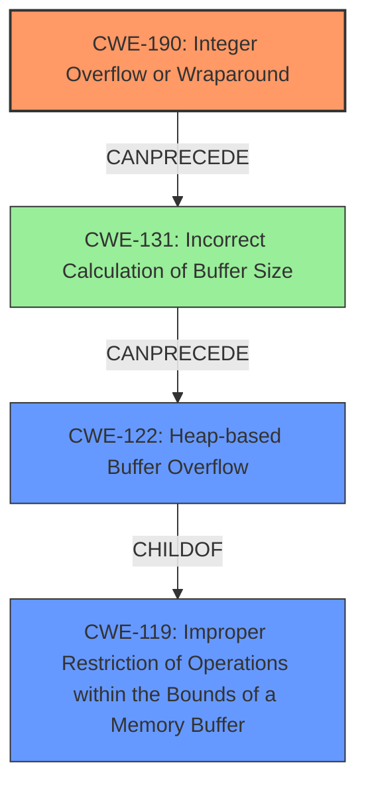

# Final Resolution for CVE-2022-2329

# Summary
| CWE ID | CWE Name | Confidence | CWE Abstraction Level | CWE Vulnerability Mapping Label | CWE-Vulnerability Mapping Notes |
|---|---|---|---|---|---|
| CWE-190 | **Integer Overflow or Wraparound** | 1.0 | Base | Primary | Allowed |
| CWE-122 | **Heap-based Buffer Overflow** | 0.7 | Variant | Secondary Candidate | Allowed |
| CWE-131 | **Incorrect Calculation of Buffer Size** | 0.4 | Base | Tertiary Candidate | Allowed |

## Evidence and Confidence

*   **Confidence Score:** 0.90
*   **Evidence Strength:** HIGH

## Relationship Analysis
The primary weakness is **CWE-190 (Integer Overflow or Wraparound)**, which can lead to **CWE-131 (Incorrect Calculation of Buffer Size)**. This incorrect calculation results in a smaller buffer being allocated than expected. Subsequently, this can lead to **CWE-122 (Heap-based Buffer Overflow)** when data is written beyond the allocated buffer's boundaries. CWE-122 is a variant of **CWE-119 (Improper Restriction of Operations within the Bounds of a Memory Buffer)**.

## Vulnerability Chain
The vulnerability chain begins with **CWE-190 (Integer Overflow or Wraparound)**, where an integer overflow occurs during a calculation. This overflow leads to **CWE-131 (Incorrect Calculation of Buffer Size)**, causing the program to allocate an insufficient amount of memory. Finally, when the program attempts to write more data than the allocated buffer can hold, it results in **CWE-122 (Heap-based Buffer Overflow)**. This buffer overflow can then lead to denial of service or potentially remote code execution.

## Summary of Analysis
The initial analysis correctly identified **CWE-190 (Integer Overflow or Wraparound)** as the primary **ROOTCAUSE**. The criticism suggested adding **CWE-131 (Incorrect Calculation of Buffer Size)**, which is a valid point as the integer overflow directly leads to an incorrect buffer size calculation. The vulnerability description clearly states that the integer overflow causes a heap-based buffer overflow, supporting the inclusion of **CWE-122 (Heap-based Buffer Overflow)** as a secondary weakness.

The graph relationships reinforce this analysis. **CWE-190** can precede **CWE-131**, which in turn can precede **CWE-122**. **CWE-122** is a variant of **CWE-119 (Improper Restriction of Operations within the Bounds of a Memory Buffer)**.

The selection of these CWEs is at the optimal level of specificity. **CWE-190** is a Base level weakness, representing the **ROOTCAUSE**. **CWE-122** is a Variant, detailing the specific type of buffer overflow. **CWE-131** clarifies the mechanism by which the overflow leads to the buffer overflow. Including these three CWEs provides a comprehensive understanding of the vulnerability.

The evidence from the vulnerability description supports this conclusion: "A **CWE-190 Integer Overflow or Wraparound** vulnerability exists that could cause heap-based buffer overflow."