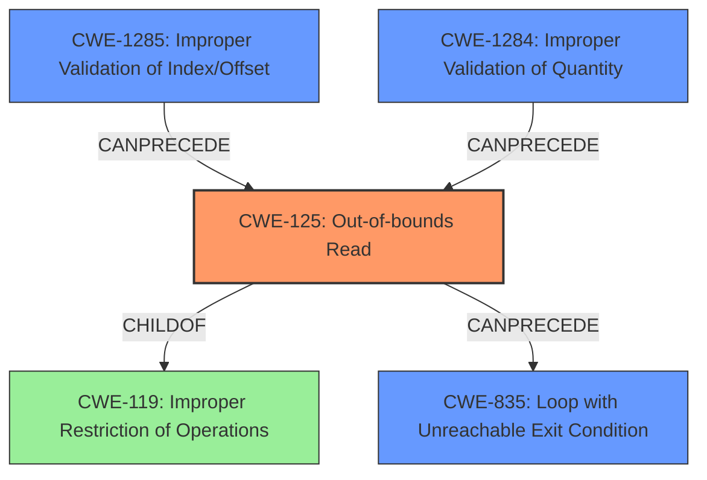

# Final Resolution for CVE-2022-23523

# Summary
| CWE ID | CWE Name | Confidence | CWE Abstraction Level | CWE Vulnerability Mapping Label | CWE-Vulnerability Mapping Notes |
|---|---|---|---|---|---|
| **CWE-125** | **Out-of-bounds Read** | 0.95 | Base | Allowed | Primary **WEAKNESS** |
| CWE-835 | Loop with Unreachable Exit Condition ('Infinite Loop') | 0.75 | Base | Allowed | Secondary Candidate - Impact |
| CWE-1285 | Improper Validation of Specified Index, Position, or Offset in Input | 0.70 | Base | Allowed | Secondary Candidate - Contributing Factor |
| CWE-1284 | Improper Validation of Specified Quantity in Input | 0.50 | Base | Allowed | Tertiary Candidate - Contributing Factor |

## Evidence and Confidence

*   **Confidence Score:** 0.90
*   **Evidence Strength:** HIGH

## Relationship Analysis
The primary **WEAKNESS** is **CWE-125 (Out-of-bounds Read)**, which is a child of **CWE-119 (Improper Restriction of Operations within the Bounds of a Memory Buffer)**. While **CWE-119** is broader, **CWE-125** is more specific and accurately reflects the vulnerability. **CWE-1285 (Improper Validation of Specified Index, Position, or Offset in Input)** and **CWE-1284 (Improper Validation of Specified Quantity in Input)** contribute to the vulnerability by failing to validate the ELF header's offsets and sizes, respectively. These improper validations can precede the **out-of-bounds read**. **CWE-835 (Loop with Unreachable Exit Condition ('Infinite Loop'))** is a consequence of the **out-of-bounds read**, representing the impact of the vulnerability. The abstraction levels (Base for all selected CWEs) ensure the classification is at an appropriate level of detail.

## Vulnerability Chain
The vulnerability chain starts with a malicious ELF header containing invalid offsets and sizes.

1.  **CWE-1285/CWE-1284 (Improper Validation of Input):** The `linux-loader` crate fails to validate the offsets and sizes specified in the ELF header.
2.  **CWE-125 (Out-of-bounds Read):** Using the unvalidated offsets and sizes, the crate attempts to read beyond the boundaries of the file.
3.  **CWE-835 (Infinite Loop):** The **out-of-bounds read** leads to an infinite loop due to an unreachable exit condition.

The **ROOTCAUSE** is the lack of proper input validation, which allows the **out-of-bounds read** to occur, ultimately leading to the denial-of-service condition.

## Summary of Analysis
The initial analysis correctly identified **CWE-125 (Out-of-bounds Read)** as the primary **WEAKNESS**. The criticism provided valuable suggestions for strengthening the analysis by considering additional CWEs and emphasizing mitigations. The analysis is based on the vulnerability description, which states, "If those offsets point beyond the end of the file this could lead to Virtual Machine Monitors using the `linux-loader` crate entering an infinite loop". This evidence supports the selection of **CWE-125** as the **ROOTCAUSE**. The graph relationships influenced the decision by highlighting the chain of events and the contributing factors (**CWE-1285** and **CWE-1284**). The selected CWEs are at the optimal level of specificity because they accurately represent the technical details of the vulnerability and are at the Base level of abstraction. The additional consideration of **CWE-1284** improves the overall assessment, although it's given a lower confidence due to it's impact being less direct than **CWE-1285**.