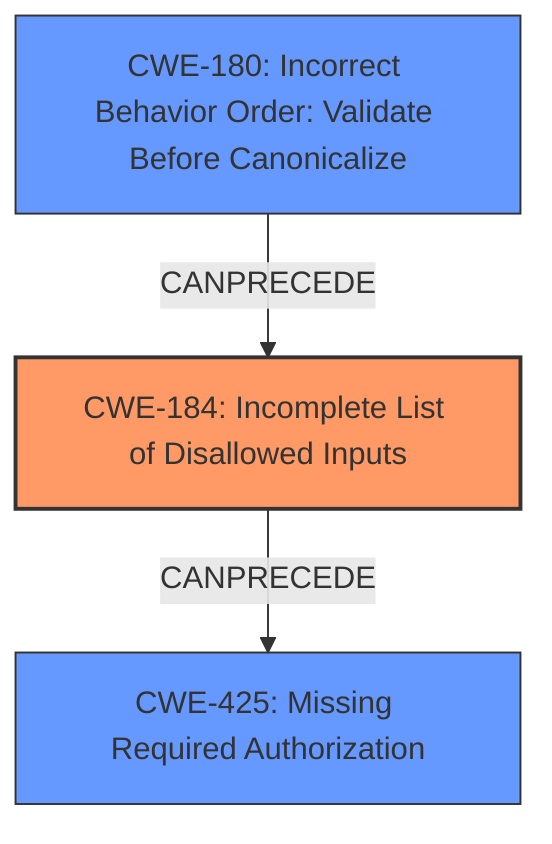

# Final Resolution for CVE-2022-23553

# Summary
| CWE ID | CWE Name | Confidence | CWE Abstraction Level | CWE Vulnerability Mapping Label | CWE-Vulnerability Mapping Notes |
|---|---|---|---|---|---|
| **CWE-184** | **Incomplete List of Disallowed Inputs** | 0.90 | Base | Allowed | The product implements a protection mechanism that relies on a list of inputs (or properties of inputs) that are not allowed by policy or otherwise require other action to neutralize before additional processing takes place, but the list is incomplete. The `startsWith` method does not properly account for path traversal sequences. |
| CWE-180 | Incorrect Behavior Order: Validate Before Canonicalize | 0.75 | Variant | Allowed | The product uses `startsWith` before normalizing the URL, making it possible to bypass the validation by using special characters to modify the URL. |
| CWE-425 | Missing Required Authorization | 0.60 | Base | Allowed | The URL access filter bypass ultimately leads to a failure in authorization, as restricted resources become accessible. However, this is a *consequence* of the input validation issue, not the root cause. |

## Evidence and Confidence

*   **Confidence Score:** 0.90
*   **Evidence Strength:** HIGH

## Relationship Analysis
The primary weakness is **CWE-184 (Incomplete List of Disallowed Inputs)** because the URL filter's use of `startsWith` without proper normalization is the core issue. **CWE-180 (Incorrect Behavior Order: Validate Before Canonicalize)** is a variant that explains why this is happening. The startsWith validation occurs before canonicalization, therefore the canonicalization step essentially bypasses the filtering. **CWE-425 (Missing Required Authorization)** describes a consequence of the bypass, but not the root cause.

## Vulnerability Chain
The vulnerability chain begins with the **ROOTCAUSE**, where the URL filter uses an incomplete list of disallowed inputs due to the `startsWith` method and lack of normalization (**CWE-184**). Due to the **WEAKNESS** of validating before canonicalization (**CWE-180**), the attacker is able to bypass the URL filter. This **WEAKNESS** then leads to an authorization bypass (**CWE-425**), where restricted resources become accessible to unauthorized users. The **IMPACT** of this is unauthorized access to protected resources.

## Summary of Analysis
The initial analysis correctly identifies **CWE-184 (Incomplete List of Disallowed Inputs)** as a primary issue. The use of `startsWith` for URL filtering without normalizing the request URI allows attackers to bypass the filters. The original analysis also points out that "The fact that it relies on startsWith, and doesn't normalize the URL prior to validation is evidence for this."

The criticism suggests that **CWE-180 (Incorrect Behavior Order: Validate Before Canonicalize)** should be included. This is a valid point, as the order of operations is critical.

The decision to include **CWE-184** as the primary CWE is based on its direct relevance to the vulnerability description, which highlights the **URL access filter bypass**. The evidence, "The `BlacklistUrlFilter` and `WhitelistUrlFilter` use the `startsWith` method for URL filtering, which doesn't normalize the request URI," provides strong support for this classification. **CWE-184** is at the optimal level of specificity because it describes the core **WEAKNESS** related to input validation. **CWE-180** is included to add additional context of *why* this validation can be bypassed, due to the incorrect order of validating before canonicalization.