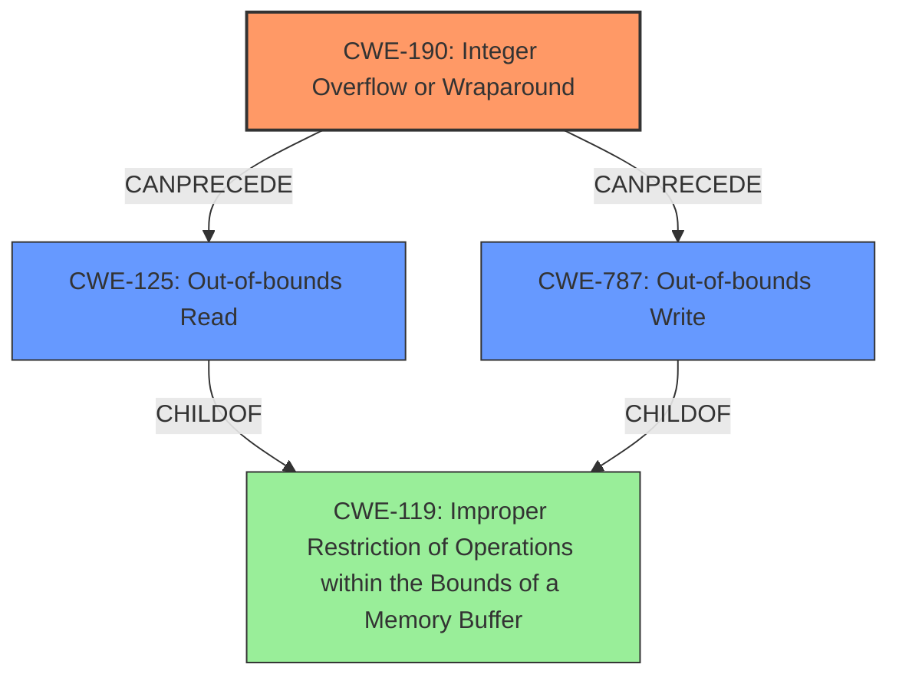

# Analysis Report for CVE-2022-23559

# Vulnerability Analysis Report: CVE-2022-23559

## Description

Tensorflow is an Open Source Machine Learning Framework. An attacker can craft a TFLite model that would cause an integer overflow in embedding lookup operations. Both `embedding_size` and `lookup_size` are products of values provided by the user. Hence, a malicious user could trigger overflows in the multiplication. In certain scenarios, this can then result in heap OOB read/write. Users are advised to upgrade to a patched version.

## Vulnerability Description Key Phrases

**Weakness:** ['integer overflow', 'heap OOB read/write']
**Impact:** heap OOB read/write
**Vector:** crafting a TFLite model
**Product:** Tensorflow

## Analysis (with Relationship Data)

# Summary
| CWE ID | CWE Name | Confidence | CWE Abstraction Level | CWE Vulnerability Mapping Label | CWE-Vulnerability Mapping Notes |
|---|---|---|---|---|---|
| CWE-190 | Integer Overflow or Wraparound | 0.95 | Base | Allowed | Primary |
| CWE-125 | Out-of-bounds Read | 0.75 | Base | Allowed | Secondary |
| CWE-787 | Out-of-bounds Write | 0.75 | Base | Allowed | Secondary |

## Evidence and Confidence

*   **Confidence Score:** 0.85
*   **Evidence Strength:** HIGH

- **Analysis and Justification:**  
  - *Explanation:* "The vulnerability description explicitly mentions an **integer overflow** when calculating `embedding_size` and `lookup_size` in TFLite models. Since these sizes are products of user-provided values, a malicious user can trigger the overflow. This aligns directly with CWE-190 (Integer Overflow or Wraparound), where a calculation produces a value exceeding the maximum, potentially wrapping around to a small or negative number. The CVE Reference Links Content Summary confirms this root cause: 'Integer overflow in the calculation of `embedding_size` and `lookup_size` due to multiplication of user-provided dimensions.'"
  - Subsequent to the integer overflow, a **heap out-of-bounds read/write** occurs. This is due to the incorrect size calculation from the integer overflow leading to accessing memory outside of the allocated buffer. CWE-125 (Out-of-bounds Read) and CWE-787 (Out-of-bounds Write) are appropriate for mapping to this consequence. The CVE Reference Links Content Summary confirms the impact: "Heap out-of-bounds read/write, potentially leading to arbitrary code execution or denial of service." Because the heap OOB read/write is a consequence of the integer overflow, CWE-190 is chosen as the primary weakness, and CWE-125 and CWE-787 are secondary weaknesses.

  - *Relationship Analysis:* "CWE-190 is related to CWE-128 (Wrap-around Error), and can lead to other memory corruption issues like CWE-125 and CWE-787. CWE-190 is a Base level CWE, which is the preferred level of abstraction. The relationship analysis shows that CWE-190 can precede CWE-125 and CWE-787, indicating that the integer overflow leads to the out-of-bounds access."

- **Confidence Score:**
  - Confidence: 0.95 (High confidence due to explicit mention of integer overflow and out-of-bounds access in the vulnerability description and CVE reference.)

## Criticism of Analysis

Okay, here's a review of the provided CWE analysis, incorporating the full CWE specifications:

**Overall Assessment**

The analysis is generally sound and well-reasoned. The primary CWE mapping of CWE-190 (Integer Overflow or Wraparound) is accurate and supported by the vulnerability description. The secondary mappings of CWE-125 (Out-of-bounds Read) and CWE-787 (Out-of-bounds Write) are also appropriate as consequences of the integer overflow. The confidence scores are justified.

**Detailed Review**

1.  **CWE-190: Integer Overflow or Wraparound (Primary Mapping)**

    *   **Confidence Level:** Justified at 0.95. The description explicitly mentions the integer overflow when calculating embedding and lookup sizes, making this a direct match. The CVE summary confirms the root cause.
    *   **CWE Specification Alignment:**
        *   The description of CWE-190 accurately reflects the vulnerability.  The user-provided dimensions, when multiplied, can exceed the maximum integer size, leading to wraparound.
        *   The *Relationships* section of CWE-190 correctly identifies that this can *CanPrecede* CWE-119 (Improper Restriction of Operations within the Bounds of a Memory Buffer), which is the parent of CWE-125 and CWE-787, strengthening the proposed chain.
        *   The *Mapping Guidance* is correctly followed: the tool is at the Base level of abstraction.
        *   The *Potential Mitigations* section suggests: "Use a language that does not allow this weakness to occur or provides constructs that make this weakness easier to avoid" or "Use libraries or frameworks that make it easier to handle numbers without unexpected consequences". This aligns with the general recommendations for preventing integer overflows which could include using safe integer libraries.
    *   **Observed Examples:** The provided examples from the CWE database are relevant, showcasing how integer overflows can lead to memory corruption (CWE-122, CWE-123) and out-of-bounds access (CWE-125, CWE-787).
    *   **Potential Improvements:**  It might be valuable to mention the possibility of integer *underflow* as well, even though the main problem is overflow. The products are dimension values, and it is less likely that those values can underflow, but it is still possible. It would show a more complete understanding of the problem.
    *   **Conclusion:** The mapping to CWE-190 is excellent.

2.  **CWE-125: Out-of-bounds Read (Secondary Mapping)**

    *   **Confidence Level:** Justified at 0.75. The heap OOB read is a direct consequence of the integer overflow, but it is not the primary cause of the vulnerability. It *results from* the incorrect size calculation.
    *   **CWE Specification Alignment:**
        *   The description of CWE-125 accurately reflects the vulnerability's impact. The incorrect buffer size leads to reading data outside the intended boundary.
        *   The *Relationships* section of CWE-125 correctly identifies that it *ChildOf* CWE-119 (Improper Restriction of Operations within the Bounds of a Memory Buffer), which fits the vulnerability description.
        *   The *Mapping Guidance* is correctly followed: the tool is at the Base level of abstraction.
        *   The *Potential Mitigations* section suggests "Assume all input is malicious. Use an "accept known good" input validation strategy". Since the overflow leads to an incorrect size, this highlights the importance of input validation to prevent calculations of sizes that exceed expected limits.
    *   **Observed Examples:** Relevant, showcasing out-of-bounds reads due to inconsistent length parameters ("Heartbleed").
    *   **Conclusion:** The mapping to CWE-125 is accurate.

3.  **CWE-787: Out-of-bounds Write (Secondary Mapping)**

    *   **Confidence Level:** Justified at 0.75. Similar to CWE-125, the heap OOB write is a consequence, not the initiating cause. It's a direct result of the integer overflow and subsequent memory access using the wrong size.
    *   **CWE Specification Alignment:**
        *   The description of CWE-787 accurately reflects the vulnerability's impact: the product writes data past the end of the intended buffer.
        *   The *Relationships* section of CWE-787 correctly identifies that it *ChildOf* CWE-119 (Improper Restriction of Operations within the Bounds of a Memory Buffer), which fits the vulnerability description.
        *   The *Mapping Guidance* is correctly followed: the tool is at the Base level of abstraction.
        *   The *Potential Mitigations* section suggests using languages or libraries that prevent out-of-bounds writes or using compiler-based buffer overflow detection mechanisms. These align with standard defensive programming practices to avoid buffer overflows.
    *   **Observed Examples:** Relevant, showing out-of-bounds writes due to insufficient input validation and heap corruption.
    *   **Conclusion:** The mapping to CWE-787 is accurate.

**Recommendations for Improvement**

*   **Relationship Clarity:** While the explanation mentions the relationship between the CWEs, it could be more explicit:
    *"The chain of events is: User-controlled input -> Integer Overflow (CWE-190) -> Incorrect buffer size calculation -> Out-of-bounds Read/Write (CWE-125, CWE-787)."*
*   **Alternative CWEs Considered:** Briefly mention CWE-119, Improper Restriction of Operations within the Bounds of a Memory Buffer, and explain why it *wasn't* chosen as the primary mapping (because it's too broad, and the root cause is the integer overflow).  This demonstrates a more comprehensive analysis.
*   **Input Validation Emphasis:**  While the CWE-190 mitigations are suitable, explicitly stating that validating the *size* of the input and the *result* of the multiplication is *critical* would strengthen the analysis.  This aligns with the CWE-125 and CWE-787 mitigations and highlights a practical remediation step.
*   **Heap vs. Stack:** Since the vulnerability involves a heap OOB read/write, briefly mentioning that the overflow occurs on the heap and not the stack (e.g., "This leads to a heap-based buffer overflow...") might provide additional clarity.
*   **CWE-680 Considered?** The compound CWE, "Integer Overflow to Buffer Overflow" might be considered; however, by mapping individually to CWE-190, CWE-125, and CWE-787, the analysis is more precise, and the mapping guidance suggests avoiding compound CWEs.

**Additional CWEs to Consider (Potentially)**

*   **CWE-1284: Improper Validation of Specified Quantity in Input:** This CWE might be relevant as a *contributing* factor. The sizes are user-provided. However, the core problem is *not* the lack of validation *directly*, but the integer overflow that happens during a calculation. If the system had checks against the final buffer size, but not the overflow, this would be applicable.
*   **CWE-789: Memory Allocation with Excessive Size Value:** Similar to the above, if excessive memory was the *goal*, not the under-allocation, this might be relevant.

**Summary of Changes**
The existing analysis is mostly correct. These are suggestions for better describing the analysis to show more understanding.

## Final Resolution

# Summary
| CWE ID | CWE Name | Confidence | CWE Abstraction Level | CWE Vulnerability Mapping Label | CWE-Vulnerability Mapping Notes |
|---|---|---|---|---|---|
| CWE-190 | Integer Overflow or Wraparound | 0.95 | Base | Allowed | Primary CWE |
| CWE-125 | Out-of-bounds Read | 0.75 | Base | Allowed | Secondary CWE |
| CWE-787 | Out-of-bounds Write | 0.75 | Base | Allowed | Secondary CWE |

## Evidence and Confidence

*   **Confidence Score:** 0.95
*   **Evidence Strength:** HIGH

## Relationship Analysis
The primary weakness is **CWE-190 (Integer Overflow or Wraparound)**, which occurs when the product of user-provided `embedding_size` and `lookup_size` exceeds the maximum integer value. This leads to an incorrect buffer size calculation, resulting in out-of-bounds memory access. Consequently, **CWE-125 (Out-of-bounds Read)** and **CWE-787 (Out-of-bounds Write)** manifest as secondary weaknesses. These three CWEs are related in a chain where CWE-190 *CanPrecede* CWE-125 and CWE-787. Also, CWE-125 and CWE-787 are *ChildOf* CWE-119 (Improper Restriction of Operations within the Bounds of a Memory Buffer), which confirms the relationship.
The abstraction levels are optimal, as CWE-190, CWE-125, and CWE-787 are all at the Base level.

## Vulnerability Chain
The vulnerability chain starts with user-controlled input used to calculate `embedding_size` and `lookup_size`. This calculation leads to an **Integer Overflow (CWE-190)**, which results in an incorrect buffer size. This incorrect buffer size is then used in memory access operations, leading to an **Out-of-bounds Read (CWE-125)** and/or **Out-of-bounds Write (CWE-787)**.

## Summary of Analysis
The initial analysis is accurate and well-supported by the vulnerability description. The primary weakness is correctly identified as **CWE-190 (Integer Overflow or Wraparound)**, which occurs when calculating `embedding_size` and `lookup_size` using user-provided values. The description explicitly states: "Both `embedding_size` and `lookup_size` are products of values provided by the user. Hence, a malicious user could trigger overflows in the multiplication." The secondary weaknesses, **CWE-125 (Out-of-bounds Read)** and **CWE-787 (Out-of-bounds Write)**, are a direct consequence of the integer overflow. This is supported by the statement: "In certain scenarios, this can then result in heap OOB read/write."

The graph relationships confirm this assessment, with CWE-190 *CanPrecede* CWE-125 and CWE-787, and both CWE-125 and CWE-787 being *ChildOf* CWE-119 (Improper Restriction of Operations within the Bounds of a Memory Buffer).

The selected CWEs are at the optimal level of specificity, as they are all Base-level CWEs. The mapping guidance supports this selection, with the Usage recommendation being "Allowed" for all three CWEs.

The suggestion in the criticism to consider **CWE-1284 (Improper Validation of Specified Quantity in Input)** is not directly applicable because the primary issue isn't the lack of input validation in isolation, but the integer overflow during the calculation of the buffer sizes. However, implementing input validation to prevent excessively large inputs could act as a mitigating control.
Also, although the criticism mentions **CWE-680 (Integer Overflow to Buffer Overflow)**, the individual mapping to CWE-190, CWE-125, and CWE-787 is more precise, and the mapping guidance suggests avoiding compound CWEs.

*Report generated on 2025-03-18 10:34:11*
