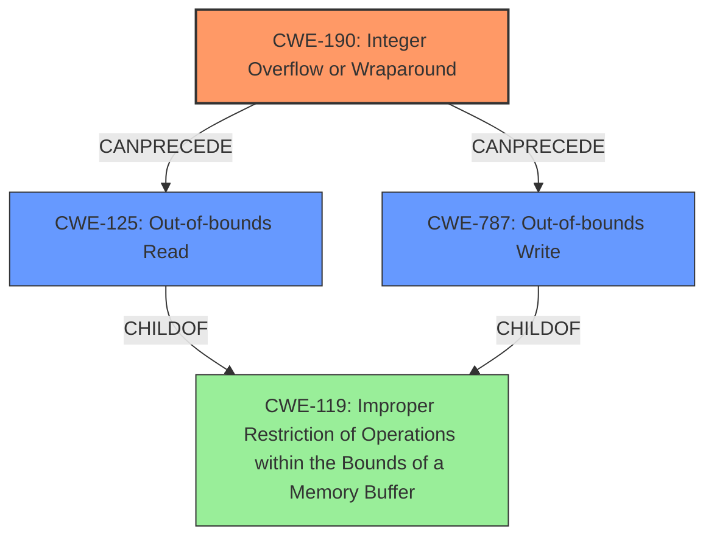

# Final Resolution for CVE-2022-23559

# Summary
| CWE ID | CWE Name | Confidence | CWE Abstraction Level | CWE Vulnerability Mapping Label | CWE-Vulnerability Mapping Notes |
|---|---|---|---|---|---|
| CWE-190 | Integer Overflow or Wraparound | 0.95 | Base | Allowed | Primary CWE |
| CWE-125 | Out-of-bounds Read | 0.75 | Base | Allowed | Secondary CWE |
| CWE-787 | Out-of-bounds Write | 0.75 | Base | Allowed | Secondary CWE |

## Evidence and Confidence

*   **Confidence Score:** 0.95
*   **Evidence Strength:** HIGH

## Relationship Analysis
The primary weakness is **CWE-190 (Integer Overflow or Wraparound)**, which occurs when the product of user-provided `embedding_size` and `lookup_size` exceeds the maximum integer value. This leads to an incorrect buffer size calculation, resulting in out-of-bounds memory access. Consequently, **CWE-125 (Out-of-bounds Read)** and **CWE-787 (Out-of-bounds Write)** manifest as secondary weaknesses. These three CWEs are related in a chain where CWE-190 *CanPrecede* CWE-125 and CWE-787. Also, CWE-125 and CWE-787 are *ChildOf* CWE-119 (Improper Restriction of Operations within the Bounds of a Memory Buffer), which confirms the relationship.
The abstraction levels are optimal, as CWE-190, CWE-125, and CWE-787 are all at the Base level.

## Vulnerability Chain
The vulnerability chain starts with user-controlled input used to calculate `embedding_size` and `lookup_size`. This calculation leads to an **Integer Overflow (CWE-190)**, which results in an incorrect buffer size. This incorrect buffer size is then used in memory access operations, leading to an **Out-of-bounds Read (CWE-125)** and/or **Out-of-bounds Write (CWE-787)**.

## Summary of Analysis
The initial analysis is accurate and well-supported by the vulnerability description. The primary weakness is correctly identified as **CWE-190 (Integer Overflow or Wraparound)**, which occurs when calculating `embedding_size` and `lookup_size` using user-provided values. The description explicitly states: "Both `embedding_size` and `lookup_size` are products of values provided by the user. Hence, a malicious user could trigger overflows in the multiplication." The secondary weaknesses, **CWE-125 (Out-of-bounds Read)** and **CWE-787 (Out-of-bounds Write)**, are a direct consequence of the integer overflow. This is supported by the statement: "In certain scenarios, this can then result in heap OOB read/write."

The graph relationships confirm this assessment, with CWE-190 *CanPrecede* CWE-125 and CWE-787, and both CWE-125 and CWE-787 being *ChildOf* CWE-119 (Improper Restriction of Operations within the Bounds of a Memory Buffer).

The selected CWEs are at the optimal level of specificity, as they are all Base-level CWEs. The mapping guidance supports this selection, with the Usage recommendation being "Allowed" for all three CWEs.

The suggestion in the criticism to consider **CWE-1284 (Improper Validation of Specified Quantity in Input)** is not directly applicable because the primary issue isn't the lack of input validation in isolation, but the integer overflow during the calculation of the buffer sizes. However, implementing input validation to prevent excessively large inputs could act as a mitigating control.
Also, although the criticism mentions **CWE-680 (Integer Overflow to Buffer Overflow)**, the individual mapping to CWE-190, CWE-125, and CWE-787 is more precise, and the mapping guidance suggests avoiding compound CWEs.