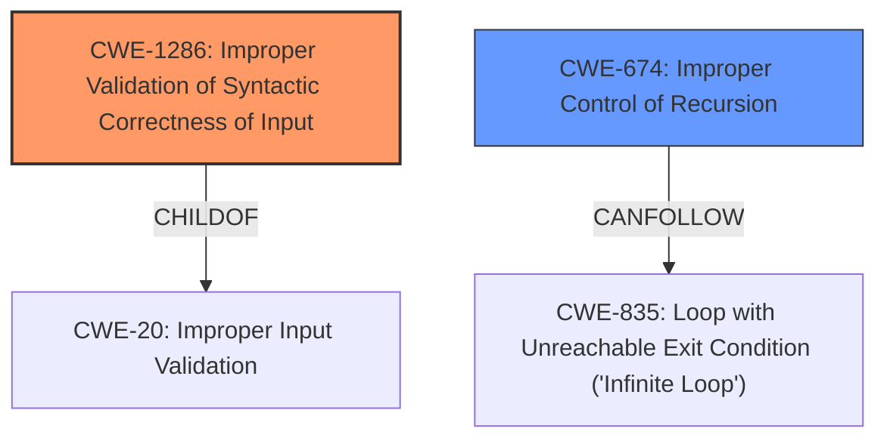

# Final Resolution for CVE-2022-23591

# Summary
| CWE ID   | CWE Name                                               | Confidence | CWE Abstraction Level | CWE Vulnerability Mapping Label | CWE-Vulnerability Mapping Notes                                                                                                                                      |
| :------- | :----------------------------------------------------- | :--------- | :---------------------- | :------------------------------ | :----------------------------------------------------------------------------------------------------------------------------------------------------------------- |
| CWE-1286 | Improper Validation of Syntactic Correctness of Input | 0.8        | Base                    | Primary                       | Best reflects the **root cause**: the lack of input validation on the GraphDef structure to prevent self-recursion.                                                      |
| CWE-674  | Improper Control of Recursion                          | 0.6        | Class                   | Secondary                     | Captures the direct consequence: uncontrolled recursion leading to a **stack overflow**. Use as a secondary CWE to emphasize the impact.                               |

## Evidence and Confidence

*   **Confidence Score:** 0.8
*   **Evidence Strength:** HIGH

## Relationship Analysis
The primary relationship that influenced the decision was the Parent-Child relationship between CWE-20 (Improper Input Validation) and CWE-1286 (Improper Validation of Syntactic Correctness of Input), and the observation that **stack overflow** can result from uncontrolled recursion. The decision favored the more specific CWE-1286 as it directly relates to the vulnerability's **root cause**: the lack of syntactic validation in the `GraphDef` format, which allows self-recursive functions. The relationship analysis also considered that CWE-674 (Improper Control of Recursion) is a class-level CWE, making CWE-1286 (a Base CWE) a more precise classification.

## Vulnerability Chain
The vulnerability chain starts with the **Improper Validation of Syntactic Correctness of Input (CWE-1286)**. Specifically, the `GraphDef` format is not validated to prevent self-recursive functions. This leads to **Improper Control of Recursion (CWE-674)**, where the amount of recursion is not properly managed. The consequence is a **stack overflow** during execution as the runtime attempts to resolve the self-recursive `NodeDef` instances. The lack of validation is the **root cause**, while the stack overflow is the impact.

## Summary of Analysis
The initial analysis correctly identified CWE-674 (Improper Control of Recursion) but at a higher level. The criticism pointed out the importance of identifying the **root cause** and suggested exploring more specific Base-level CWEs. The analysis of the retriever results identified CWE-1286 (Improper Validation of Syntactic Correctness of Input) as the most suitable primary CWE. This decision is based on the evidence that the vulnerability arises because the TensorFlow runtime doesn't properly validate the syntactic correctness of the `GraphDef` input, allowing self-recursive functions.

The vulnerability description states: "The `GraphDef` format in TensorFlow does not allow self recursive functions. The runtime assumes that this invariant is satisfied. However, a `GraphDef` containing a fragment such as the following can be consumed when loading a `SavedModel`. This would result in a stack overflow during execution".

This statement clearly indicates that the **root cause** is the lack of validation for self-recursive functions within the `GraphDef` format. Therefore, CWE-1286 is the optimal level of specificity because it directly addresses the lack of validation on the input syntax, which is the **root cause** of the vulnerability.