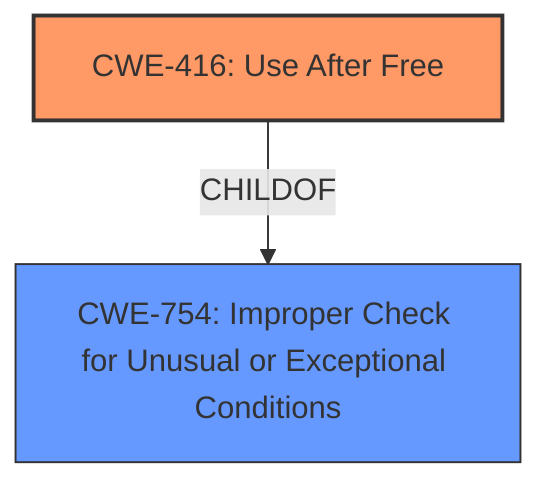

# Analysis Report for CVE-2022-23608

# Vulnerability Analysis Report: CVE-2022-23608

## Description

PJSIP is a free and open source multimedia communication library written in C language implementing standard based protocols such as SIP, SDP, RTP, STUN, TURN, and ICE. In versions up to and including 2.11.1 when in a dialog set (or forking) scenario, a hash key shared by multiple UAC dialogs can potentially be prematurely freed when one of the dialogs is destroyed . The issue may cause a dialog set to be registered in the hash table multiple times (with different hash keys) leading to undefined behavior such as dialog list collision which eventually leading to endless loop. A patch is available in commit db3235953baa56d2fb0e276ca510fefca751643f which will be included in the next release. There are no known workarounds for this issue.

## Vulnerability Description Key Phrases

**Rootcause:** hash key shared by multiple UAC dialogs can potentially be prematurely freed
**Impact:** undefined behavior such as dialog list collision which eventually leading to endless loop
**Vector:** dialog set (or forking) scenario
**Product:** PJSIP
**Version:** up to and including 2.11.1

## Analysis (with Relationship Data)

# Summary
| CWE ID | CWE Name | Confidence | CWE Abstraction Level | CWE Vulnerability Mapping Label | CWE-Vulnerability Mapping Notes |
|---|---|---|---|---|---|
| CWE-416 | Use After Free | 0.95 | Variant | Allowed | Primary CWE |

## Evidence and Confidence

*   **Confidence Score:** 0.95
*   **Evidence Strength:** HIGH

- **Analysis and Justification:**  
  - *Explanation:* "The vulnerability description clearly states that a **hash key shared by multiple UAC dialogs can potentially be prematurely freed**. The CVE Reference Links Content Summary confirms this, stating that the root cause is a **use-after-free condition** in PJSIP when handling dialog sets. This aligns directly with CWE-416 (Use After Free), which describes a scenario where memory is reused or referenced after it has been freed. The vulnerability details provided, including the impact of undefined behavior and potential denial-of-service, further support this classification. The Retriever Results also strongly suggest CWE-416 as a high-scoring candidate."
  
  - *Relationship Analysis:* "CWE-416 is a Variant-level CWE, which is appropriate given the specific nature of the vulnerability. While CWE-754 (Improper Check for Unusual or Exceptional Conditions) is a parent Class CWE, CWE-416 provides a more precise description of the **use-after-free** condition. The relationship graph for CWE-416 shows that it can follow other weaknesses and can precede other issues, but these are not directly relevant to the root cause itself in this case. Specifically, the analysis shows that a hash key can potentially be prematurely freed. The fix involved updating the hash key if the dialog being unregistered is used as a hash key and adding an assertion check to ensure the dlg_set to be removed is valid, showing that the memory associated with the key might be accessed after it has been freed."

- **Confidence Score:**  
  - *Example:* Confidence: 0.95 (High evidence from technical description, CVE reference materials, and retriever results)

## Criticism of Analysis

Okay, here's a review of the provided analysis, focusing on the CWE specifications and their implications:

**Overall Assessment:**

The primary CWE mapping to CWE-416 (Use After Free) is **accurate and well-justified.** The confidence score of 0.95 is appropriate, given the clear description of the vulnerability and the supporting information from the CVE reference links. The analysis also demonstrates a good understanding of the relationship between CWE-416 and related CWEs.

**Detailed Review:**

**1. CWE-416 (Use After Free): Primary Mapping**

*   **Strengths:**
    *   The analysis correctly identifies the core issue as a premature freeing of a hash key, leading to a use-after-free condition. This aligns perfectly with the CWE-416 description: "The product reuses or references memory after it has been freed."
    *   The analysis emphasizes the impact, including undefined behavior and potential denial of service, which are common consequences of use-after-free vulnerabilities.
    *   The analysis correctly notes the "Variant" level of abstraction is appropriate, and the provided reason why.

*   **Areas for potential improvement:**
    *   While the analysis mentions setting freed pointers to NULL as a mitigation, it could be slightly expanded to acknowledge the limitations of this approach in more complex data structures (as noted in the CWE-416 Potential Mitigations). This doesn't detract from the overall accuracy, but adds a bit more nuance. Consider: "While setting freed pointers to NULL is a common mitigation, its effectiveness can be limited in complex scenarios where multiple pointers may reference the same memory location."

**2. Consideration of Alternative CWEs and Retriever Results**

*   **CWE-770 (Allocation of Resources Without Limits or Throttling):** The high retriever score is interesting, but ultimately, this CWE is not the primary cause. While the *impact* of the use-after-free could *lead* to resource exhaustion (e.g., via an endless loop), the root cause is the incorrect memory management, *not* a failure to limit resource allocation. The analysis is correct in not prioritizing this.

*   **CWE-126 (Buffer Over-read):** Also a high retriever score. This is *possible* as a consequence of the UAF. However, there is no direct evidence from the vulnerability description that a buffer over-read occurs. The analysis is correct in not prioritizing this.

*   **CWE-476 (NULL Pointer Dereference):** This is *possible* as a consequence of a UAF if the memory region is reallocated and then contains a null pointer. However, the vulnerability description does not directly state this occurs.

*   **CWE-415 (Double Free):** While related, the description indicates a *single* premature free, not a double free. So this is not appropriate.

*   **CWE-754 (Improper Check for Unusual or Exceptional Conditions):** The analysis correctly identified this as a possible, but less precise, classification. A key aspect of CWE-754 is the *lack* of checking. While the UAF *could* be caused by a missing check, the core issue is the memory management error itself. Also, CWE-754's mapping guidance says "Examine children of this entry to see if there is a better fit" which points to CWE-416.

*   **CWE-667 (Improper Locking):** The analysis is correct in that there is no clear evidence of a concurrency or locking issue being the direct cause.

*    **CWE-190 (Integer Overflow or Wraparound)** There is no indication of an integer overflow.

**3. Use of CWE Specifications:**

*   The analysis references the "Relationships" sections of the CWE specifications, particularly `CanFollow` and `CanPrecede`, which is a good practice for understanding the potential context and consequences of the vulnerability.
*   The analysis doesn't explicitly mention the "Potential Mitigations" sections of the CWEs. For CWE-416, it might be beneficial to briefly acknowledge mitigations like using languages with automatic memory management. Something like: "Mitigations for CWE-416 include choosing languages with automatic memory management and ensuring pointers are set to NULL after freeing, although the latter's effectiveness can be limited in complex data structures."

**4. CWE Examples:**

*   The analysis includes a list of "Observed Examples" for CWE-416. While this provides context, it's important to note that the *specific* circumstances of those CVEs may differ from the PJSIP vulnerability. The examples are more for illustrating the *types* of scenarios that can lead to a use-after-free, rather than being directly comparable.

**Recommendations:**

1.  **Minor Enhancement to CWE-416 Mitigation Discussion:** Add a sentence acknowledging the limitations of the "set freed pointers to NULL" mitigation in complex data structure scenarios.
2.  **Acknowledge Potential Mitigations from CWE Specifications:** Briefly mention the potential mitigations described in the CWE specifications in the Explanation. This will show a more complete understanding of the vulnerability and potential defenses.
3.  **Clarify CWE Example Context:** When presenting the "Observed Examples," emphasize that they are illustrative and that the specific details of those CVEs may not directly align with the analyzed vulnerability.

In summary, the analysis is solid and accurately identifies CWE-416 as the primary weakness. Incorporating the minor suggestions above would further strengthen the analysis and demonstrate a deeper engagement with the CWE specifications.

## Final Resolution

# Summary
| CWE ID | CWE Name | Confidence | CWE Abstraction Level | CWE Vulnerability Mapping Label | CWE-Vulnerability Mapping Notes |
|---|---|---|---|---|---|
| CWE-416 | Use After Free | 0.95 | Variant | Primary | Allowed |

## Evidence and Confidence

*   **Confidence Score:** 0.95
*   **Evidence Strength:** HIGH

## Relationship Analysis
The primary relationship considered was the hierarchical structure, specifically ensuring that CWE-416 (Use After Free) was the most specific and appropriate classification compared to its parent classes like CWE-754 (Improper Check for Unusual or Exceptional Conditions). The analysis also considered the "CanFollow" relationships of CWE-416, recognizing potential consequences but focusing on the root cause.

## Vulnerability Chain
The vulnerability chain starts with a premature freeing of a hash key shared by multiple UAC dialogs in PJSIP. This leads to a **use-after-free** condition (CWE-416), which results in the dialog set being registered multiple times in the hash table. The consequence of this registration is a dialog list collision, eventually leading to an endless loop. The **root cause** is the improper memory management, specifically the premature free.

## Summary of Analysis
The initial analysis correctly identified CWE-416 (Use After Free) as the primary weakness. This assessment is strongly supported by the vulnerability description, which states that a hash key is prematurely freed, leading to the described behavior. The evidence is clear: "a hash key shared by multiple UAC dialogs can potentially be prematurely freed when one of the dialogs is destroyed".

The criticism correctly points out the importance of considering alternative CWEs like CWE-770 (Allocation of Resources Without Limits or Throttling), CWE-126 (Buffer Over-read), CWE-476 (NULL Pointer Dereference), CWE-415 (Double Free), and CWE-754 (Improper Check for Unusual or Exceptional Conditions). However, it also appropriately concludes that these are either consequences of the UAF or less precise descriptions of the **root cause**.

The graph relationships influenced the decision by highlighting the importance of choosing the most specific CWE. While CWE-754 could be considered a contributing factor, CWE-416 provides a more precise and direct mapping to the **use-after-free** condition described in the vulnerability.

The selected CWE is at the optimal level of specificity because it directly addresses the **premature memory freeing** issue, which is the **root cause** of the vulnerability. Choosing a more general CWE like CWE-754 would obscure the specific nature of the flaw.

*Report generated on 2025-03-18 10:35:44*
