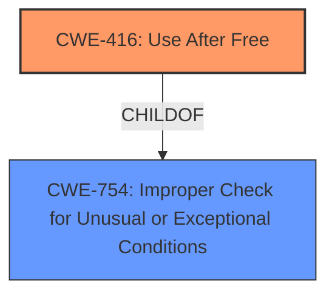

# Final Resolution for CVE-2022-23608

# Summary
| CWE ID | CWE Name | Confidence | CWE Abstraction Level | CWE Vulnerability Mapping Label | CWE-Vulnerability Mapping Notes |
|---|---|---|---|---|---|
| CWE-416 | Use After Free | 0.95 | Variant | Primary | Allowed |

## Evidence and Confidence

*   **Confidence Score:** 0.95
*   **Evidence Strength:** HIGH

## Relationship Analysis
The primary relationship considered was the hierarchical structure, specifically ensuring that CWE-416 (Use After Free) was the most specific and appropriate classification compared to its parent classes like CWE-754 (Improper Check for Unusual or Exceptional Conditions). The analysis also considered the "CanFollow" relationships of CWE-416, recognizing potential consequences but focusing on the root cause.

## Vulnerability Chain
The vulnerability chain starts with a premature freeing of a hash key shared by multiple UAC dialogs in PJSIP. This leads to a **use-after-free** condition (CWE-416), which results in the dialog set being registered multiple times in the hash table. The consequence of this registration is a dialog list collision, eventually leading to an endless loop. The **root cause** is the improper memory management, specifically the premature free.

## Summary of Analysis
The initial analysis correctly identified CWE-416 (Use After Free) as the primary weakness. This assessment is strongly supported by the vulnerability description, which states that a hash key is prematurely freed, leading to the described behavior. The evidence is clear: "a hash key shared by multiple UAC dialogs can potentially be prematurely freed when one of the dialogs is destroyed".

The criticism correctly points out the importance of considering alternative CWEs like CWE-770 (Allocation of Resources Without Limits or Throttling), CWE-126 (Buffer Over-read), CWE-476 (NULL Pointer Dereference), CWE-415 (Double Free), and CWE-754 (Improper Check for Unusual or Exceptional Conditions). However, it also appropriately concludes that these are either consequences of the UAF or less precise descriptions of the **root cause**.

The graph relationships influenced the decision by highlighting the importance of choosing the most specific CWE. While CWE-754 could be considered a contributing factor, CWE-416 provides a more precise and direct mapping to the **use-after-free** condition described in the vulnerability.

The selected CWE is at the optimal level of specificity because it directly addresses the **premature memory freeing** issue, which is the **root cause** of the vulnerability. Choosing a more general CWE like CWE-754 would obscure the specific nature of the flaw.