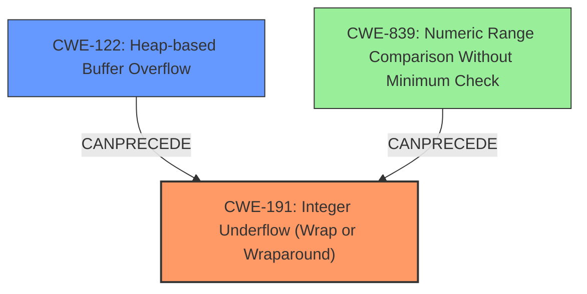

# Final Resolution for CVE-2022-23613

# Summary
| CWE ID  | CWE Name  | Confidence | CWE Abstraction Level | CWE Vulnerability Mapping Label | CWE-Vulnerability Mapping Notes |
|---|---|---|---|---|---|
| CWE-191 | Integer Underflow (Wrap or Wraparound) | 1.00 | Base | Allowed | Primary CWE: The root cause is an integer underflow when validating the size of incoming data. |
| CWE-122 | Heap-based Buffer Overflow | 0.90 | Variant | Allowed | Secondary CWE: The integer underflow leads to an incorrect buffer size, resulting in a heap overflow during data processing. |
| CWE-839 | Numeric Range Comparison Without Minimum Check | 0.6 | Base | Allowed | Contributory CWE: The original code lacked a minimum size check, enabling the integer underflow. |

## Evidence and Confidence

*   **Confidence Score:** 0.95
*   **Evidence Strength:** HIGH

## Relationship Analysis
The primary relationship is that **CWE-191** **Integer Underflow** directly leads to **CWE-122** **Heap-based Buffer Overflow**. **CWE-839** **Numeric Range Comparison Without Minimum Check** is included because it contributes to the vulnerability by not preventing the underflow in the first place. **CWE-191** can precede **CWE-122**. All three CWEs are at appropriate abstraction levels: Base for **CWE-191** and **CWE-839**, and Variant for **CWE-122**.

## Vulnerability Chain
The vulnerability chain starts with insufficient validation of the input size, specifically the lack of a minimum check (**CWE-839**). This allows an **integer underflow** to occur during size validation (**CWE-191**). The underflow results in a smaller-than-expected buffer size being used for heap allocation. Consequently, a subsequent write operation overflows the allocated buffer, leading to a **heap-based buffer overflow** (**CWE-122**), enabling arbitrary code execution.

## Summary of Analysis
The initial analysis correctly identifies the primary **WEAKNESS**es. The vulnerability description clearly states "an **integer underflow** leading to a **heap overflow**". The criticism provided valuable suggestions for additional CWEs to consider and ways to improve the analysis.

The final decision is to keep **CWE-191** **Integer Underflow** as the primary **ROOTCAUSE**, with **CWE-122** **Heap-based Buffer Overflow** as the secondary CWE representing the direct consequence. **CWE-839** is added as a contributory factor because a missing minimum check allows the underflow to occur.

The selected CWEs are at the optimal level of specificity. **CWE-191** is a Base CWE and accurately describes the integer underflow. **CWE-122** is a Variant CWE, specifying that the overflow occurs on the heap. **CWE-839** is a Base CWE which adds context to the **ROOTCAUSE**. The evidence and relationship analysis strongly support this classification.