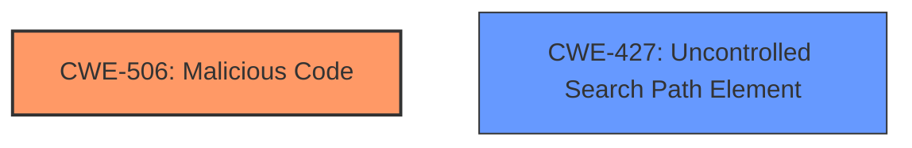

# Final Resolution for CVE-2022-23812

# Summary
| CWE ID | CWE Name | Confidence | CWE Abstraction Level | CWE Vulnerability Mapping Label | CWE-Vulnerability Mapping Notes |
|---|---|---|---|---|---|
| CWE-506 | Malicious Code | 0.95 | Class | Primary CWE | Allowed-with-Review |
| CWE-427 | Uncontrolled Search Path Element | 0.3 | Base | Secondary Candidate | Allowed |

## Evidence and Confidence

*   **Confidence Score:** 0.8
*   **Evidence Strength:** MEDIUM

## Relationship Analysis
The primary relationship considered was the parent-child relationship and the abstraction level. CWE-506 is a class, and while more specific children might exist, none perfectly capture the intent of the malicious code injection. CWE-427 was considered due to the package installation process, but its connection is weak as the core issue is the malicious content, not the search path itself. I am reducing the confidence score for CWE-427.

## Vulnerability Chain
The vulnerability chain starts with the injection of **malicious code** (CWE-506) into the node-ipc package. This package is then made available on the npm registry. When users install the compromised package, the **malicious code** executes, overwriting files on systems located in Russia or Belarus with a heart emoji. The **root cause** is the presence of **malicious code**, and the impact is file overwriting and potential system disruption for targeted users. The potential for an Uncontrolled Search Path Element (CWE-427) contributes to the likelihood of the **malicious code** being executed, but it's not a direct link in the main chain.

## Summary of Analysis
The initial analysis and the criticism both agree that CWE-506 is the most appropriate primary CWE. The vulnerability description explicitly states "This package contains malicious code". This is direct evidence supporting CWE-506.

The criticism correctly points out that the justification for including CWE-427 as a secondary weakness is weaker. The connection between the npm repository as a "search path" and the vulnerability is tenuous. While package managers are mentioned in the extended description of CWE-427, the core issue is the malicious content itself.

Based on the criticism, I am reducing the confidence score for CWE-427 to 0.3. While it might contribute to the attack, it is not a direct or accurate representation of the **root cause**. The primary driver is the presence of the **malicious code**.

CWE-506 is at the optimal level of specificity, given the high-level nature of the vulnerability. While a more specific child CWE might exist, none perfectly capture the overall intent and impact of the **malicious code** injection.