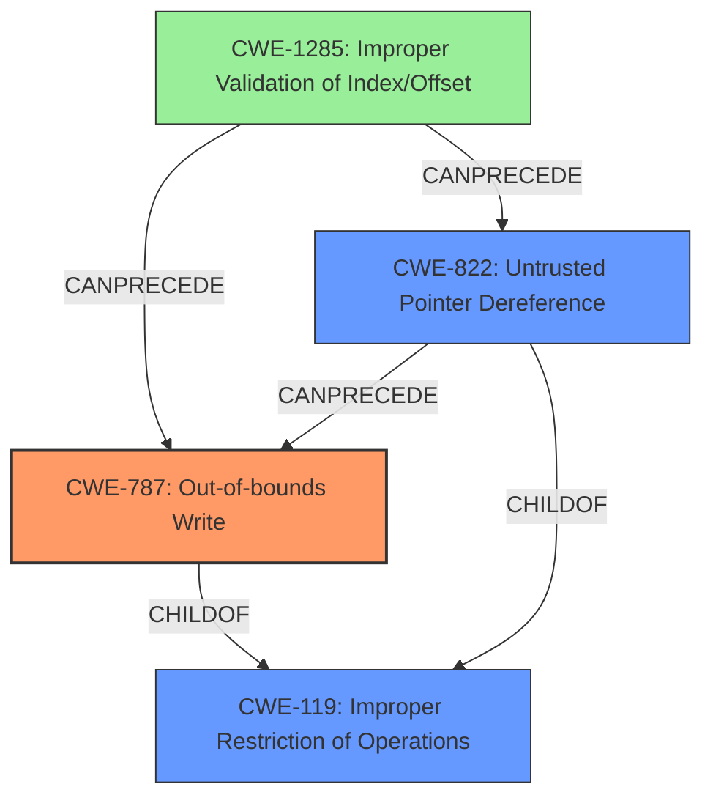

# Analysis Report for CVE-2022-24030

# Vulnerability Analysis Report: CVE-2022-24030

## Description

An issue was discovered in AhciBusDxe in Insyde InsydeH2O with kernel 5.1 through 5.5. An SMM memory corruption vulnerability allows an attacker to write fixed or predictable data to SMRAM. Exploiting this issue could lead to escalating privileges to SMM.

## Vulnerability Description Key Phrases

**Rootcause:** SMM memory corruption vulnerability
**Impact:** escalating privileges to SMM
**Vector:** write fixed or predictable data to SMRAM
**Attacker:** attacker
**Product:** Insyde InsydeH2O
**Version:** kernel 5.1 through 5.5
**Component:** AhciBusDxe

## Analysis (with Relationship Data)

# Summary
| CWE ID | CWE Name | Confidence | CWE Abstraction Level | CWE Vulnerability Mapping Label | CWE-Vulnerability Mapping Notes |
|---|---|---|---|---|---|
| CWE-787 | Out-of-bounds Write | 0.95 | Base | Allowed | Primary CWE. Matches the description of writing data past the end of the intended buffer. |
| CWE-822 | Untrusted Pointer Dereference | 0.80 | Base | Allowed | Secondary candidate. The description refers to the issue as an "Untrusted Pointer Dereference", indicating that the driver might be using a pointer to memory in SMM without validating if it's a legitimate or safe address. |

## Evidence and Confidence

*   **Confidence Score:** 0.90
*   **Evidence Strength:** HIGH

- **Analysis and Justification:**  
  - *Explanation:* The vulnerability description states that it is an "**SMM memory corruption vulnerability**" that allows writing fixed or predictable data to SMRAM, potentially escalating privileges to SMM. The CVE Reference Links Content Summary confirms this, stating that the core weakness is the ability to corrupt SMM memory by writing arbitrary data to it, due to insufficient checks or validation on the data being written to the SMRAM. CWE-787 (Out-of-bounds Write) accurately represents this **memory corruption** due to writing data past the end, or before the beginning, of the intended buffer. The retriever results also strongly suggest CWE-787.

  - *Relationship Analysis:* CWE-787 is a child of CWE-119 (Improper Restriction of Operations within the Bounds of a Memory Buffer), but CWE-787 is more specific and therefore more appropriate.

- **Confidence Score:**  
  - Confidence: 0.95 (High evidence from technical description, CVE reference materials, and retriever results)

---

- **Analysis and Justification:**  
  - *Explanation:* The CVE Reference Links Content Summary mentions that some descriptions refer to the issue as an "Untrusted Pointer Dereference," indicating that the driver might be using a pointer to memory in SMM without validating if it's a legitimate or safe address. This can lead to corruption by writing data to an arbitrary location in SMM. CWE-822 (Untrusted Pointer Dereference) aligns with this description, which involves obtaining a value from an untrusted source, converting it to a pointer, and dereferencing the resulting pointer. The retriever results also suggest CWE-822 as a potential candidate.

  - *Relationship Analysis:* CWE-822 is a child of CWE-119 (Improper Restriction of Operations within the Bounds of a Memory Buffer), but CWE-822 is more specific and therefore more appropriate when there is evidence of untrusted pointer dereference.

- **Confidence Score:**  
  - Confidence: 0.80 (Moderate evidence from CVE reference materials and retriever results)

## Criticism of Analysis

Okay, here's a review of the provided analysis, incorporating the full CWE specifications.

**Overall Assessment**

The analysis is generally good, providing a solid justification for selecting CWE-787 and CWE-822. The evidence is well-presented, and the confidence levels are reasonable. The analysis correctly identifies that CWE-119 is too general and that the more specific children are preferred.

**Specific Comments and Suggestions**

1.  **CWE-787 (Out-of-bounds Write) - Primary CWE**

    *   **Accuracy:** The selection of CWE-787 as the primary weakness is appropriate and justified. The core issue is the ability to write data outside of the intended memory buffer in SMRAM. The description accurately reflects this. The retriever results support it as well.
    *   **Confidence:** The high confidence score (0.95) is well-supported by the information provided.
    *   **Mitigation Considerations:** Knowing that CWE-787 is the primary issue, consider mitigations. For example, the environment hardening mitigation offered in the CWE could be helpful in providing defense in depth.
    *   **Relationships:** It's worth noting that CWE-787 can *follow* CWE-822, meaning that the vulnerability could manifest itself as a combination of the two.

2.  **CWE-822 (Untrusted Pointer Dereference) - Secondary Candidate**

    *   **Accuracy:** The inclusion of CWE-822 is also reasonable, especially given the mention of "Untrusted Pointer Dereference" in some vulnerability descriptions.  If the code is taking a value (potentially controlled by an attacker), treating it as a pointer, and writing to that memory location without proper validation, then CWE-822 is a good fit.
    *   **Confidence:** The confidence score (0.80) is appropriate, as the evidence for CWE-822 is not as direct or definitive as the evidence for CWE-787.  It's a contributing factor or potential mechanism, but not necessarily the primary one.
    *   **Mitigation Considerations:**
        *   The key mitigation for CWE-822 is rigorous input validation to ensure the pointer value is within acceptable bounds *before* dereferencing it. However, in the SMM context, it's more about *knowing* that the pointer came from a trusted source and is pointing to a valid memory location within SMRAM. This might mean ensuring the pointer was created by a trusted SMM handler.
    *   **Relationships:** The analysis correctly identifies the relationship between CWE-822 and CWE-119. It also correctly identified that CWE-822 can precede CWE-787.

3.  **General Comments and Suggestions:**

    *   **CWE-119 is correctly avoided:**. The analysis does well to identify that while memory corruption exists (and therefore CWE-119 is relevant), it is too broad. The more specific children provide more actionable information.
    *   **Chains:** Consider the possibility of chains. While CWE-787 and CWE-822 are reasonable primary CWEs, a more complete analysis might consider vulnerabilities that contribute to the root cause of these issues. For example, the following chain is possible: `CWE-20 -> CWE-787`. In this case, if the out-of-bounds write is caused by not properly validating a user supplied value, then the root cause is CWE-20. Similarly, the chain `CWE-20 -> CWE-822` is applicable if the untrusted pointer comes from not validating input.
    *   **Lack of validation:** It might be helpful to explicitly state the *type* of validation that is missing/incorrect. For example, if the issue stems from an index to a buffer not being checked against the buffer size, mentioning CWE-129 (Improper Validation of Array Index) might add more granularity. Similarly, it is possible that the size of the buffer itself is improperly calculated, which would relate to CWE-131.
    *   **Defensive Layers:** The advisories highlight mitigations involving language selection and compiler options. Mentioning these could be valuable, even if these changes are more difficult to implement in existing codebases.
    *   **Review Retriever Results:** While the analysis doesn't *have* to address every retriever result, it's good to briefly consider why some of the other highly-ranked CWEs were rejected.  For example, CWE-1285 (Improper Validation of Specified Index, Position, or Offset in Input) could be relevant if an offset or index used in the memory access is not validated.
    *   **SMM Context:** The fact that this occurs in SMM (System Management Mode) is significant. Highlight the implications of SMM compromise more prominently. SMM has the highest privilege level on the system, and a compromise often means complete system takeover, BIOS-level malware, and persistence that is extremely difficult to remove.
    *   **Attack Vector Specifics:** Be more specific about the attack vector.  "Local access" is true, but what *specifically* allows the attacker to interact with the SMM driver?  Is it through a malicious driver, a vulnerability in a system service, or something else? While the exact exploit details might not be fully known, providing more context is useful.

**Revised Summary Table (Incorporating Suggestions)**

| CWE ID | CWE Name | Confidence | CWE Abstraction Level | CWE Vulnerability Mapping Label | CWE-Vulnerability Mapping Notes |
|---|---|---|---|---|---|
| CWE-787 | Out-of-bounds Write | 0.95 | Base | Allowed | Primary CWE. Matches the description of writing data past the end of the intended buffer in SMRAM. |
| CWE-822 | Untrusted Pointer Dereference | 0.80 | Base | Allowed | Secondary candidate. The driver might be using a pointer to memory in SMM without validating if it's a legitimate or safe address. Contributes to CWE-787 |
| CWE-20 | Improper Input Validation | 0.60 | Class | Allowed | Contributing factor. If input isn't validated before being used in a memory operation, it can lead to CWE-787 or CWE-822. Consider if CWE-1285 and/or CWE-131 are relevant. |

**In conclusion:** The analysis is solid.  Adding more detail about the specific missing validation (potentially linking to CWE-1285 or 131), emphasizing the SMM context, and briefly considering the rejected retriever results would make it even stronger.

## Final Resolution

# Summary
| CWE ID | CWE Name | Confidence | CWE Abstraction Level | CWE Vulnerability Mapping Label | CWE-Vulnerability Mapping Notes |
|---|---|---|---|---|---|
| CWE-787 | Out-of-bounds Write | 0.95 | Base | Allowed | Primary CWE. Matches the description of writing data past the end of the intended buffer in SMRAM. |
| CWE-822 | Untrusted Pointer Dereference | 0.80 | Base | Allowed | Secondary candidate. The driver might be using a pointer to memory in SMM without validating if it's a legitimate or safe address. Contributes to CWE-787 |
| CWE-1285 | Improper Validation of Specified Index, Position, or Offset in Input | 0.60 | Base | Allowed | Contributing factor. An index, position, or offset used in the memory access is not validated. Leads to CWE-787 or CWE-822. |

## Evidence and Confidence

*   **Confidence Score:** 0.92
*   **Evidence Strength:** HIGH

## Relationship Analysis
The primary weakness is **CWE-787 (Out-of-bounds Write)**, which describes the core issue of writing data outside the intended memory buffer. **CWE-822 (Untrusted Pointer Dereference)** is a contributing factor if the code takes a value and treats it as a pointer without proper validation. **CWE-1285 (Improper Validation of Specified Index, Position, or Offset in Input)** is added as a potential root cause if the offset used for the write is not properly validated. These relationships help clarify the vulnerability chain and improve specificity.

## Vulnerability Chain
The vulnerability chain starts with **CWE-1285 (Improper Validation of Specified Index, Position, or Offset in Input)**, where an index or offset used for memory access is not validated. This can lead to **CWE-822 (Untrusted Pointer Dereference)** if an attacker-controlled value is used as a pointer without validation. Both of these can lead to **CWE-787 (Out-of-bounds Write)**, where data is written outside the intended buffer, causing memory corruption and potentially escalating privileges to SMM.

## Summary of Analysis
The initial analysis correctly identified **CWE-787 (Out-of-bounds Write)** as the primary issue and **CWE-822 (Untrusted Pointer Dereference)** as a contributing factor. The criticism suggested considering the possibility of chains and vulnerabilities that contribute to the root cause. Based on this, **CWE-1285 (Improper Validation of Specified Index, Position, or Offset in Input)** is added to represent the missing validation of an index or offset used in memory access. This addition clarifies the chain of events leading to the **out-of-bounds write** and provides a more complete picture of the vulnerability. The selected CWEs are at the optimal level of specificity, providing actionable information for mitigation.

The evidence for **CWE-787** is strong, as the vulnerability description explicitly mentions writing data outside the intended memory buffer. The evidence for **CWE-822** is moderate, based on the mention of "Untrusted Pointer Dereference" in some descriptions. The evidence for **CWE-1285** is inferred from the context, as the lack of validation on the index or offset is a likely cause of the **out-of-bounds write**.

The graph relationships influenced the final selection by highlighting the potential chain of events leading to the vulnerability. The addition of **CWE-1285** helps to complete the chain and provides a more comprehensive understanding of the vulnerability.

*Report generated on 2025-03-18 10:37:57*
