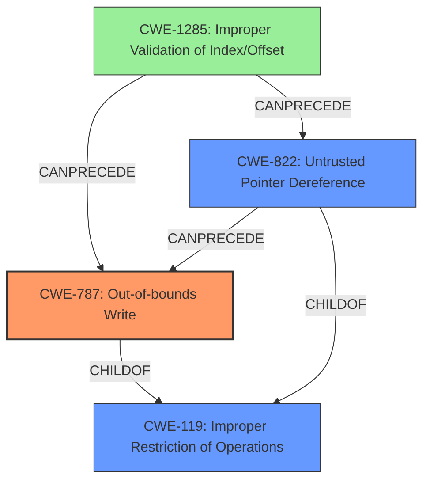

# Final Resolution for CVE-2022-24030

# Summary
| CWE ID | CWE Name | Confidence | CWE Abstraction Level | CWE Vulnerability Mapping Label | CWE-Vulnerability Mapping Notes |
|---|---|---|---|---|---|
| CWE-787 | Out-of-bounds Write | 0.95 | Base | Allowed | Primary CWE. Matches the description of writing data past the end of the intended buffer in SMRAM. |
| CWE-822 | Untrusted Pointer Dereference | 0.80 | Base | Allowed | Secondary candidate. The driver might be using a pointer to memory in SMM without validating if it's a legitimate or safe address. Contributes to CWE-787 |
| CWE-1285 | Improper Validation of Specified Index, Position, or Offset in Input | 0.60 | Base | Allowed | Contributing factor. An index, position, or offset used in the memory access is not validated. Leads to CWE-787 or CWE-822. |

## Evidence and Confidence

*   **Confidence Score:** 0.92
*   **Evidence Strength:** HIGH

## Relationship Analysis
The primary weakness is **CWE-787 (Out-of-bounds Write)**, which describes the core issue of writing data outside the intended memory buffer. **CWE-822 (Untrusted Pointer Dereference)** is a contributing factor if the code takes a value and treats it as a pointer without proper validation. **CWE-1285 (Improper Validation of Specified Index, Position, or Offset in Input)** is added as a potential root cause if the offset used for the write is not properly validated. These relationships help clarify the vulnerability chain and improve specificity.

## Vulnerability Chain
The vulnerability chain starts with **CWE-1285 (Improper Validation of Specified Index, Position, or Offset in Input)**, where an index or offset used for memory access is not validated. This can lead to **CWE-822 (Untrusted Pointer Dereference)** if an attacker-controlled value is used as a pointer without validation. Both of these can lead to **CWE-787 (Out-of-bounds Write)**, where data is written outside the intended buffer, causing memory corruption and potentially escalating privileges to SMM.

## Summary of Analysis
The initial analysis correctly identified **CWE-787 (Out-of-bounds Write)** as the primary issue and **CWE-822 (Untrusted Pointer Dereference)** as a contributing factor. The criticism suggested considering the possibility of chains and vulnerabilities that contribute to the root cause. Based on this, **CWE-1285 (Improper Validation of Specified Index, Position, or Offset in Input)** is added to represent the missing validation of an index or offset used in memory access. This addition clarifies the chain of events leading to the **out-of-bounds write** and provides a more complete picture of the vulnerability. The selected CWEs are at the optimal level of specificity, providing actionable information for mitigation.

The evidence for **CWE-787** is strong, as the vulnerability description explicitly mentions writing data outside the intended memory buffer. The evidence for **CWE-822** is moderate, based on the mention of "Untrusted Pointer Dereference" in some descriptions. The evidence for **CWE-1285** is inferred from the context, as the lack of validation on the index or offset is a likely cause of the **out-of-bounds write**.

The graph relationships influenced the final selection by highlighting the potential chain of events leading to the vulnerability. The addition of **CWE-1285** helps to complete the chain and provides a more comprehensive understanding of the vulnerability.